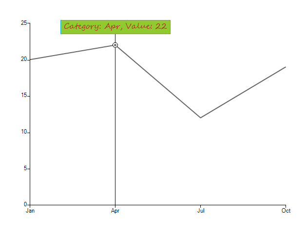

# Formatting Trackball Labels


This article demonstrates how to customize the trackball labels text and styles. This can be achieved in the __TextNeeded__ event of the trackball controller. This event is fired when the user hover over a particular data point with the mouse and can be used to set any styles and text, depending on your preferences.

## 

1\. You should subscribe to the __TextNeeded__ event and add the __ChartTrackballController__ to the chart as follows. 
2\. Now, you can use the TextNeeded and change any properties you desire.
 
{{source=..\SamplesCS\ChartView\Customization\FormattingSeriesAndTrackballLabels.cs region=Trackball}} 
{{source=..\SamplesVB\ChartView\Customization\FormattingSeriesAndTrackballLabels.vb region=Trackball}} 

````C#
ChartTrackballController controler = new ChartTrackballController();
controler.TextNeeded += controler_TextNeeded;
radChartView1.Controllers.Add(controler);

````
````VB.NET
Dim controler As New ChartTrackballController()
AddHandler controler.TextNeeded, AddressOf controler_TextNeeded
RadChartView1.Controllers.Add(controler)

````

{{endregion}} 

3\. Now, you can use the __TextNeeded__ and change any properties you desire. 
	
{{source=..\SamplesCS\ChartView\Customization\FormattingSeriesAndTrackballLabels.cs region=TextNeeded}} 
{{source=..\SamplesVB\ChartView\Customization\FormattingSeriesAndTrackballLabels.vb region=TextNeeded}} 

````C#
private Font font = new Font("Segoe Script", 12, FontStyle.Regular);
private void controler_TextNeeded(object sender, TextNeededEventArgs e)
{
    e.Element.BackColor = ColorTranslator.FromHtml("#91c930");
    e.Element.ForeColor = ColorTranslator.FromHtml("#bb2525");
    e.Element.BorderColor = ColorTranslator.FromHtml("#00Bde7");
    e.Element.Font = font;
    e.Element.NumberOfColors = 1;
    e.Element.BorderGradientStyle = Telerik.WinControls.GradientStyles.Solid;
    CategoricalDataPoint dataPoint = e.Points[0].DataPoint as CategoricalDataPoint;
    e.Text = string.Format("Category: {0}, Value: {1}", dataPoint.Category, dataPoint.Value);
}

````
````VB.NET
Private font As New Font("Segoe Script", 12, FontStyle.Regular)
Private Sub controler_TextNeeded(sender As Object, e As TextNeededEventArgs)
    e.Element.BackColor = ColorTranslator.FromHtml("#91c930")
    e.Element.ForeColor = ColorTranslator.FromHtml("#bb2525")
    e.Element.BorderColor = ColorTranslator.FromHtml("#00Bde7")
    e.Element.Font = font
    e.Element.NumberOfColors = 1
    e.Element.BorderGradientStyle = Telerik.WinControls.GradientStyles.Solid
    Dim dataPoint As CategoricalDataPoint = TryCast(e.Points(0).DataPoint, CategoricalDataPoint)
    e.Text = String.Format("Category: {0}, Value: {1}", dataPoint.Category, dataPoint.Value)
End Sub

````

{{endregion}}  

>important The code for getting the current data point can depend on the used series type. For example if you use scatter chart, you should use __ScatterDataPoint__ type.
>

