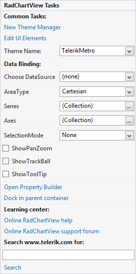

# Design time

In this article we will describe the design time abilities of RadChartView. Here is how the control's SmartTag looks like:

## 

The SmartTag contains most of the controls specific properties. Here is a list of the, describing the purpose of each one:

* __AreaType__ – allows you to switch between the three area types – Cartesian, Polar and Pie
            

* __Axes__  - a collection of Axes
            

* __SelectionMode__ – allows you to define the desired selection mode – None, SingleDataPoint or MultipleDataPoints
            

* __Series__ – a collection of ChartSeries – Area, SplineArea, Bar, Line, Spline, Scatter point, Combined series
            

* __ShowToolTip__ – defines whether tooltips should be shown
            

* __ShowTrackBall__ – defines whether trackball should be enabled
            

All of these properties are also available in the Properties window of Visual Studio.
