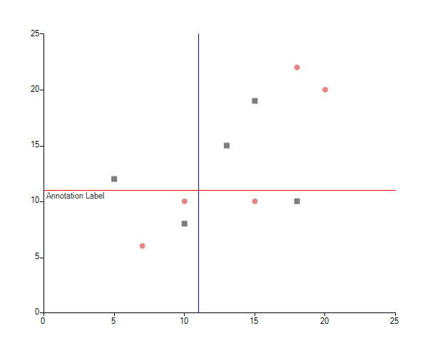

# Grid line

GridLine annotations are lines or circles that cross the chart grid at location on the axis, specified by their __Value__ property.
      

## Cartesian GridLine Annotation

In the case of the CartesianChart, the GridLine represents a vertical or horizontal line that crosses the entire plot area.
      

Here is what __CartesianGridLineAnnotation__ looks like:
      

#### __[C#] __

{{source=..\SamplesCS\ChartView\Annotations\GridLine.cs region=CartesianGridLine}}
	            CartesianGridLineAnnotation annotation1 = new CartesianGridLineAnnotation();
	            annotation1.Axis = this.radChartView1.Axes[1] as CartesianAxis;
	            annotation1.Value = 5.8;
	            annotation1.BorderColor = Color.Red;
	            annotation1.BorderDashStyle = DashStyle.Solid;
	            annotation1.BorderWidth = 1;
	            this.radChartView1.Annotations.Add(annotation1);
	
	            CartesianGridLineAnnotation annotation2 = new CartesianGridLineAnnotation();
	            annotation2.Axis = this.radChartView1.Axes[0] as CartesianAxis;
	            annotation2.Value = 2.9;
	            annotation2.BorderColor = Color.Blue;
	            annotation2.BorderDashStyle = DashStyle.Solid;
	            annotation2.BorderWidth = 1;
	            this.radChartView1.Annotations.Add(annotation2);
	{{endregion}}

#### __[VB] __

{{source=..\SamplesVB\ChartView\Annotations\GridLine.vb region=CartesianGridLine}}
	        Dim annotation1 As New CartesianGridLineAnnotation()
	        annotation1.Axis = TryCast(Me.radChartView1.Axes(1), CartesianAxis)
	        annotation1.Value = 5.8
	        annotation1.BorderColor = Color.Red
	        annotation1.BorderDashStyle = DashStyle.Solid
	        annotation1.BorderWidth = 1
	        Me.radChartView1.Annotations.Add(annotation1)
	
	        Dim annotation2 As New CartesianGridLineAnnotation()
	        annotation2.Axis = TryCast(Me.radChartView1.Axes(0), CartesianAxis)
	        annotation2.Value = 2.9
	        annotation2.BorderColor = Color.Blue
	        annotation2.BorderDashStyle = DashStyle.Solid
	        annotation2.BorderWidth = 1
	        Me.radChartView1.Annotations.Add(annotation2)
	        '#End Region
	    End Sub
	
	    Private Sub PolarAxisGridLine()
	        Me.radChartView1.AreaType = ChartAreaType.Polar
	
	        Dim series As New PolarPointSeries()
	        series.DataPoints.Add(New PolarDataPoint(2, 30))
	        series.DataPoints.Add(New PolarDataPoint(7, 90))
	        series.DataPoints.Add(New PolarDataPoint(10, 230))
	        Me.radChartView1.Series.Add(series)
	        series.BackColor = Color.FromArgb(37, 160, 219)
	        series.PointSize = New SizeF(10, 10)
	
	        '#Region "PolarGridLine"
	        Dim annotation1 As New PolarAxisGridLineAnnotation()
	        annotation1.Value = 2
	        annotation1.BorderColor = Color.Red
	        annotation1.BorderDashStyle = DashStyle.Solid
	        annotation1.BorderWidth = 1
	        Me.radChartView1.Annotations.Add(annotation1)
	
	        Dim annotation2 As New PolarAxisGridLineAnnotation()
	        annotation2.Value = 7
	        annotation2.BorderColor = Color.LightGreen
	        annotation2.BorderDashStyle = DashStyle.Solid
	        annotation2.BorderWidth = 1
	        Me.radChartView1.Annotations.Add(annotation2)
	
	        Dim annotation3 As New PolarAxisGridLineAnnotation()
	        annotation3.Value = 8
	        annotation3.BorderColor = Color.LightBlue
	        annotation3.BorderDashStyle = DashStyle.Solid
	        annotation3.BorderWidth = 1
	        Me.radChartView1.Annotations.Add(annotation3)
	        '#End Region
	    End Sub
	
	    Private Sub RadialAxisGridLine()
	        Me.radChartView1.AreaType = ChartAreaType.Polar
	
	        Dim series As New PolarPointSeries()
	        series.DataPoints.Add(New PolarDataPoint(2, 30))
	        series.DataPoints.Add(New PolarDataPoint(7, 90))
	        series.DataPoints.Add(New PolarDataPoint(10, 230))
	        Me.radChartView1.Series.Add(series)
	        series.BackColor = Color.FromArgb(37, 160, 219)
	        series.PointSize = New SizeF(10, 10)
	
	        '#Region "RadialGridLine"
	        Dim annotation1 As New RadialAxisGridLineAnnotation()
	        annotation1.Value = 30
	        annotation1.BorderColor = Color.Red
	        annotation1.BorderDashStyle = DashStyle.Solid
	        annotation1.BorderWidth = 2
	        Me.radChartView1.Annotations.Add(annotation1)
	
	        Dim annotation2 As New RadialAxisGridLineAnnotation()
	        annotation2.Value = 75
	        annotation2.BorderColor = Color.LightGreen
	        annotation2.BorderDashStyle = DashStyle.Solid
	        annotation2.BorderWidth = 2
	        Me.radChartView1.Annotations.Add(annotation2)
	
	        Dim annotation3 As New RadialAxisGridLineAnnotation()
	        annotation3.Value = 135
	        annotation3.BorderColor = Color.LightBlue
	        annotation3.BorderDashStyle = DashStyle.Solid
	        annotation3.BorderWidth = 2
	        Me.radChartView1.Annotations.Add(annotation3)
	        '#End Region
	    End Sub
	
	End Class

## Polar Axis GridLine Annotation

Polar Axis GridLines represent concentric circles that cross the polar axis at the corresponding __Value__.
      

Here is what __PolarAxisGridLineAnnotation__ looks like:
      

#### __[C#] __

{{source=..\SamplesCS\ChartView\Annotations\GridLine.cs region=PolarGridLine}}
	            PolarAxisGridLineAnnotation annotation1 = new PolarAxisGridLineAnnotation();
	            annotation1.Value = 2;
	            annotation1.BorderColor = Color.Red;
	            annotation1.BorderDashStyle = DashStyle.Solid;
	            annotation1.BorderWidth = 1;
	            this.radChartView1.Annotations.Add(annotation1);
	
	            PolarAxisGridLineAnnotation annotation2 = new PolarAxisGridLineAnnotation();
	            annotation2.Value = 7;
	            annotation2.BorderColor = Color.LightGreen;
	            annotation2.BorderDashStyle = DashStyle.Solid;
	            annotation2.BorderWidth = 1;
	            this.radChartView1.Annotations.Add(annotation2);
	
	            PolarAxisGridLineAnnotation annotation3 = new PolarAxisGridLineAnnotation();
	            annotation3.Value = 8;
	            annotation3.BorderColor = Color.LightBlue;
	            annotation3.BorderDashStyle = DashStyle.Solid;
	            annotation3.BorderWidth = 1;
	            this.radChartView1.Annotations.Add(annotation3);
	{{endregion}}

#### __[VB] __

{{source=..\SamplesVB\ChartView\Annotations\GridLine.vb region=PolarGridLine}}
	        Dim annotation1 As New PolarAxisGridLineAnnotation()
	        annotation1.Value = 2
	        annotation1.BorderColor = Color.Red
	        annotation1.BorderDashStyle = DashStyle.Solid
	        annotation1.BorderWidth = 1
	        Me.radChartView1.Annotations.Add(annotation1)
	
	        Dim annotation2 As New PolarAxisGridLineAnnotation()
	        annotation2.Value = 7
	        annotation2.BorderColor = Color.LightGreen
	        annotation2.BorderDashStyle = DashStyle.Solid
	        annotation2.BorderWidth = 1
	        Me.radChartView1.Annotations.Add(annotation2)
	
	        Dim annotation3 As New PolarAxisGridLineAnnotation()
	        annotation3.Value = 8
	        annotation3.BorderColor = Color.LightBlue
	        annotation3.BorderDashStyle = DashStyle.Solid
	        annotation3.BorderWidth = 1
	        Me.radChartView1.Annotations.Add(annotation3)
	        '#End Region
	    End Sub
	
	    Private Sub RadialAxisGridLine()
	        Me.radChartView1.AreaType = ChartAreaType.Polar
	
	        Dim series As New PolarPointSeries()
	        series.DataPoints.Add(New PolarDataPoint(2, 30))
	        series.DataPoints.Add(New PolarDataPoint(7, 90))
	        series.DataPoints.Add(New PolarDataPoint(10, 230))
	        Me.radChartView1.Series.Add(series)
	        series.BackColor = Color.FromArgb(37, 160, 219)
	        series.PointSize = New SizeF(10, 10)
	
	        '#Region "RadialGridLine"
	        Dim annotation1 As New RadialAxisGridLineAnnotation()
	        annotation1.Value = 30
	        annotation1.BorderColor = Color.Red
	        annotation1.BorderDashStyle = DashStyle.Solid
	        annotation1.BorderWidth = 2
	        Me.radChartView1.Annotations.Add(annotation1)
	
	        Dim annotation2 As New RadialAxisGridLineAnnotation()
	        annotation2.Value = 75
	        annotation2.BorderColor = Color.LightGreen
	        annotation2.BorderDashStyle = DashStyle.Solid
	        annotation2.BorderWidth = 2
	        Me.radChartView1.Annotations.Add(annotation2)
	
	        Dim annotation3 As New RadialAxisGridLineAnnotation()
	        annotation3.Value = 135
	        annotation3.BorderColor = Color.LightBlue
	        annotation3.BorderDashStyle = DashStyle.Solid
	        annotation3.BorderWidth = 2
	        Me.radChartView1.Annotations.Add(annotation3)
	        '#End Region
	    End Sub
	
	End Class

## Radial Axis GridLine Annotation

Radial Axis GridLines basically represent the radius of the PolarChart.
      

Here is what __RadialAxisGridLineAnnotation__ looks like:
      

#### __[C#] __

{{source=..\SamplesCS\ChartView\Annotations\GridLine.cs region=RadialGridLine}}
	            RadialAxisGridLineAnnotation annotation1 = new RadialAxisGridLineAnnotation();            
	            annotation1.Value = 30;
	            annotation1.BorderColor = Color.Red;
	            annotation1.BorderDashStyle = DashStyle.Solid;
	            annotation1.BorderWidth = 2;
	            this.radChartView1.Annotations.Add(annotation1);
	
	            RadialAxisGridLineAnnotation annotation2 = new RadialAxisGridLineAnnotation();
	            annotation2.Value = 75;
	            annotation2.BorderColor = Color.LightGreen;
	            annotation2.BorderDashStyle = DashStyle.Solid;
	            annotation2.BorderWidth = 2;
	            this.radChartView1.Annotations.Add(annotation2);
	
	            RadialAxisGridLineAnnotation annotation3 = new RadialAxisGridLineAnnotation();
	            annotation3.Value = 135;
	            annotation3.BorderColor = Color.LightBlue;
	            annotation3.BorderDashStyle = DashStyle.Solid;
	            annotation3.BorderWidth = 2;
	            this.radChartView1.Annotations.Add(annotation3);
	{{endregion}}

#### __[VB] __

{{source=..\SamplesVB\ChartView\Annotations\GridLine.vb region=RadialGridLine}}
	        Dim annotation1 As New RadialAxisGridLineAnnotation()
	        annotation1.Value = 30
	        annotation1.BorderColor = Color.Red
	        annotation1.BorderDashStyle = DashStyle.Solid
	        annotation1.BorderWidth = 2
	        Me.radChartView1.Annotations.Add(annotation1)
	
	        Dim annotation2 As New RadialAxisGridLineAnnotation()
	        annotation2.Value = 75
	        annotation2.BorderColor = Color.LightGreen
	        annotation2.BorderDashStyle = DashStyle.Solid
	        annotation2.BorderWidth = 2
	        Me.radChartView1.Annotations.Add(annotation2)
	
	        Dim annotation3 As New RadialAxisGridLineAnnotation()
	        annotation3.Value = 135
	        annotation3.BorderColor = Color.LightBlue
	        annotation3.BorderDashStyle = DashStyle.Solid
	        annotation3.BorderWidth = 2
	        Me.radChartView1.Annotations.Add(annotation3)
	        '#End Region
	    End Sub
	
	End Class

## Properties

Common:
      

* __DashStyle__

* __BorderColor__

* __BorderWidth__

Cartesian:
      

* __Axis__ The Cartesian GridLine Annotation needs to be associated with horizontal or vertical axis explicitly.
          

* __Value__ (of type object) the place on the associated axis where the annotation crosses it. When the associated axis is numerical (Linear or Logarithmic) a numeric value is expected and when it is a CategoricalAxis - a category.
          

Polar:
    

* __Value__ (of type double) Specifies the location on the polar axis (the radius), where the grid line will cross.
        

Radial:
      

* __Value__ (of type object) specifies the location on the radial axis, where the grid line will cross. When the radial axis is NumericRadialAxis a numeric value is expected and when it is a CategoricalRadialAxis - a category.
          
