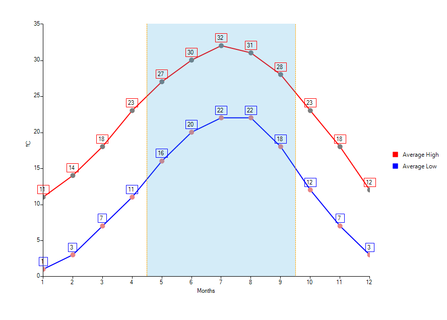

# Marked zone

The CartesianMarkedzoneAnnotation is a rectangle defined by the __HorizontalFrom/To__ and __VerticalFrom/To__ properties.
      

## Properties

Besides the __HorizontalFrom/To__ and __VerticalFrom/To__ properties that are used for defining the rectangle, the __CartesianMarkedzoneAnnotation__ exposes the following properties:
      

* __HorizontalAxis__ and __VerticalAxis__ are used for associating the annotation with the chart axes.
          

* __BackColor__ Specifies the fill of the marked zone.
          

* __BorderColor__ Specifies the fill of the marked zone.
          

* __BorderWidth__ Specifies the fill of the marked zone.
          

## Examples

A __CartesianMarkedZoneAnnotation__ is defined like this:
      

#### __[C#] __

{{source=..\SamplesCS\ChartView\Annotations\MarkedZones.cs region=CartesianMarkedZone}}
	            CartesianMarkedZoneAnnotation annotation1 = new CartesianMarkedZoneAnnotation();
	            annotation1.HorizontalFrom = 0;
	            annotation1.HorizontalTo = 0.5;
	            annotation1.VerticalFrom = 3.5;
	            annotation1.VerticalTo = 4;
	            this.radChartView1.Annotations.Add(annotation1);
	
	            CartesianMarkedZoneAnnotation annotation2 = new CartesianMarkedZoneAnnotation();
	            annotation2.HorizontalFrom = 2;
	            annotation2.HorizontalTo = 4;
	            annotation2.VerticalFrom = 0.8;
	            annotation2.VerticalTo = 1.3;
	            annotation2.BackColor = Color.CornflowerBlue;
	            annotation2.BorderDashStyle = DashStyle.Custom;
	            annotation2.BorderDashPattern = new float[] { 9, 3, 2, 4 };
	            annotation2.BorderColor = Color.Orange;
	            annotation2.BorderWidth = 3;
	            this.radChartView1.Annotations.Add(annotation2);
	{{endregion}}

#### __[VB] __

{{source=..\SamplesVB\ChartView\Annotations\MarkedZones.vb region=CartesianMarkedZone}}
	        Dim annotation1 As New CartesianMarkedZoneAnnotation()
	        annotation1.HorizontalFrom = 0
	        annotation1.HorizontalTo = 0.5
	        annotation1.VerticalFrom = 3.5
	        annotation1.VerticalTo = 4
	        Me.radChartView1.Annotations.Add(annotation1)
	
	        Dim annotation2 As New CartesianMarkedZoneAnnotation()
	        annotation2.HorizontalFrom = 2
	        annotation2.HorizontalTo = 4
	        annotation2.VerticalFrom = 0.8
	        annotation2.VerticalTo = 1.3
	        annotation2.BackColor = Color.CornflowerBlue
	        annotation2.BorderDashStyle = DashStyle.[Custom]
	        annotation2.BorderDashPattern = New Single() {9, 3, 2, 4}
	        annotation2.BorderColor = Color.Orange
	        annotation2.BorderWidth = 3
	        Me.radChartView1.Annotations.Add(annotation2)
	        '#End Region
	    End Sub
	
	    Private Sub CartesianMarkedZones2()
	        Me.radChartView1.AreaType = ChartAreaType.Cartesian
	
	        Dim series As New ScatterSeries()
	        series.DataPoints.Add(New ScatterDataPoint(0.5, 0.5))
	        series.DataPoints.Add(New ScatterDataPoint(1, 1.5))
	        series.DataPoints.Add(New ScatterDataPoint(2, 1.5))
	        series.DataPoints.Add(New ScatterDataPoint(2, 3))
	        series.DataPoints.Add(New ScatterDataPoint(3, 2.8))
	        series.DataPoints.Add(New ScatterDataPoint(4, 3.5))
	        Me.radChartView1.Series.Add(series)
	        series.BackColor = Color.FromArgb(37, 160, 219)
	        series.PointSize = New SizeF(10, 10)
	
	        '#Region "CartesianMarkedZone2"
	        Dim annotation1 As New CartesianMarkedZoneAnnotation()
	        annotation1.HorizontalFrom = 0
	        'annotation1.HorizontalTo = 0.5;
	        annotation1.VerticalFrom = 3.5
	        annotation1.VerticalTo = 4
	        Me.radChartView1.Annotations.Add(annotation1)
	
	        Dim annotation2 As New CartesianMarkedZoneAnnotation()
	        annotation2.HorizontalFrom = 2
	        annotation2.HorizontalTo = 4
	        'annotation2.VerticalFrom = 0.8;
	        annotation2.VerticalTo = 1.3
	        annotation2.BackColor = Color.CornflowerBlue
	        annotation2.BorderDashStyle = DashStyle.[Custom]
	        annotation2.BorderDashPattern = New Single() {9, 3, 2, 4}
	        annotation2.BorderColor = Color.Orange
	        annotation2.BorderWidth = 3
	        Me.radChartView1.Annotations.Add(annotation2)
	        '#End Region
	    End Sub
	
	End Class

By default, the __BackColor__ of the MarkedZone is *#33666666* and the __BorderColor__ is not set. You can see this in the first CartesianMarkedZoneAnnotation declaration.
      

The second declaration shows that you can use the __BorderDashPattern__ property to create an interesting dash pattern.
      

The flexible design of the MarkedZone annotation allows the user to omit one (or more) of the four Horizontal/VerticalFrom/To properties. 
        The following table details relationship between the specified properties and the occupied interval on the axis:
      
<table><tr><td>

Specified Properties
              </td><td>

Occupied interval
              </td></tr><tr><td>

Both From and To
            </td><td>

[Min(From,To), Max(From,To)]
            </td></tr><tr><td>

Only From
            </td><td>

[From,+∞]
            </td></tr><tr><td>

Only To
            </td><td>

[-∞, To]
            </td></tr></table>

Here is the previous example with some of the settings commented
      

#### __[C#] __

{{source=..\SamplesCS\ChartView\Annotations\MarkedZones.cs region=CartesianMarkedZone2}}
	            CartesianMarkedZoneAnnotation annotation1 = new CartesianMarkedZoneAnnotation();
	            annotation1.HorizontalFrom = 0;
	            //annotation1.HorizontalTo = 0.5;
	            annotation1.VerticalFrom = 3.5;
	            annotation1.VerticalTo = 4;
	            this.radChartView1.Annotations.Add(annotation1);
	
	            CartesianMarkedZoneAnnotation annotation2 = new CartesianMarkedZoneAnnotation();
	            annotation2.HorizontalFrom = 2;
	            annotation2.HorizontalTo = 4;
	            //annotation2.VerticalFrom = 0.8;
	            annotation2.VerticalTo = 1.3;
	            annotation2.BackColor = Color.CornflowerBlue;
	            annotation2.BorderDashStyle = DashStyle.Custom;
	            annotation2.BorderDashPattern = new float[] { 9, 3, 2, 4 };
	            annotation2.BorderColor = Color.Orange;
	            annotation2.BorderWidth = 3;
	            this.radChartView1.Annotations.Add(annotation2);
	{{endregion}}

#### __[VB] __

{{source=..\SamplesVB\ChartView\Annotations\MarkedZones.vb region=CartesianMarkedZone2}}
	        Dim annotation1 As New CartesianMarkedZoneAnnotation()
	        annotation1.HorizontalFrom = 0
	        'annotation1.HorizontalTo = 0.5;
	        annotation1.VerticalFrom = 3.5
	        annotation1.VerticalTo = 4
	        Me.radChartView1.Annotations.Add(annotation1)
	
	        Dim annotation2 As New CartesianMarkedZoneAnnotation()
	        annotation2.HorizontalFrom = 2
	        annotation2.HorizontalTo = 4
	        'annotation2.VerticalFrom = 0.8;
	        annotation2.VerticalTo = 1.3
	        annotation2.BackColor = Color.CornflowerBlue
	        annotation2.BorderDashStyle = DashStyle.[Custom]
	        annotation2.BorderDashPattern = New Single() {9, 3, 2, 4}
	        annotation2.BorderColor = Color.Orange
	        annotation2.BorderWidth = 3
	        Me.radChartView1.Annotations.Add(annotation2)
	        '#End Region
	    End Sub
	
	End Class

