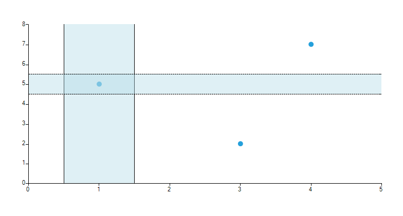
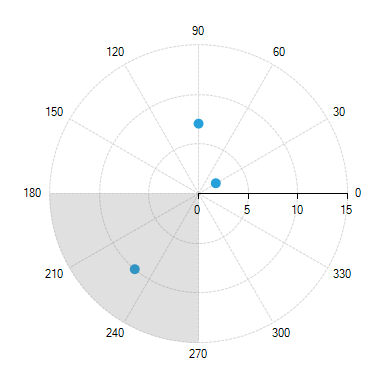

# Plot band

Plot Band Annotation is a stripe, crossing its corresponding axis, specified by the __From__ and __To__ properties.
      

## Cartesian PlotBand Annotation

Cartesian PlotBand annotation is either a horizontal or a vertical stripe that crosses from start to end the vertical or the horizontal axis respectively.
      

Here is what __CartesianPlotBandAnnotation__ looks like:
      

#### __[C#] __

{{source=..\SamplesCS\ChartView\Annotations\PlotBand.cs region=CartesianPlotBand}}
	            CartesianPlotBandAnnotation annotation1 = new CartesianPlotBandAnnotation();
	            annotation1.Axis = this.radChartView1.Axes[0] as CartesianAxis;
	            annotation1.From = 0.5;
	            annotation1.To = 1.5;
	            annotation1.BackColor = Color.FromArgb(100, Color.LightBlue);
	            annotation1.BorderColor = Color.Black;
	            annotation1.BorderWidth = 1;
	            this.radChartView1.Annotations.Add(annotation1);
	
	            CartesianPlotBandAnnotation annotation2 = new CartesianPlotBandAnnotation();
	            annotation2.Axis = this.radChartView1.Axes[1] as CartesianAxis;
	            annotation2.From = 4.5;
	            annotation2.To = 5.5;
	            annotation2.BackColor = Color.FromArgb(100, Color.LightBlue);
	            annotation2.BorderColor = Color.Black;
	            annotation2.BorderWidth = 1;
	            this.radChartView1.Annotations.Add(annotation2);
	{{endregion}}

#### __[VB] __

{{source=..\SamplesVB\ChartView\Annotations\PlotBand.vb region=CartesianPlotBand}}
	        Dim annotation1 As New CartesianPlotBandAnnotation()
	        annotation1.Axis = TryCast(Me.radChartView1.Axes(0), CartesianAxis)
	        annotation1.From = 0.5
	        annotation1.[To] = 1.5
	        annotation1.BackColor = Color.FromArgb(100, Color.LightBlue)
	        annotation1.BorderColor = Color.Black
	        annotation1.BorderWidth = 1
	        Me.radChartView1.Annotations.Add(annotation1)
	
	        Dim annotation2 As New CartesianPlotBandAnnotation()
	        annotation2.Axis = TryCast(Me.radChartView1.Axes(1), CartesianAxis)
	        annotation2.From = 4.5
	        annotation2.[To] = 5.5
	        annotation2.BackColor = Color.FromArgb(100, Color.LightBlue)
	        annotation2.BorderColor = Color.Black
	        annotation2.BorderWidth = 1
	        Me.radChartView1.Annotations.Add(annotation2)
	        '#End Region
	    End Sub
	
	    Private Sub PolarAxisPlotBand()
	        Me.radChartView1.AreaType = ChartAreaType.Polar
	
	        Dim series As New PolarPointSeries()
	        series.DataPoints.Add(New PolarDataPoint(2, 30))
	        series.DataPoints.Add(New PolarDataPoint(7, 90))
	        series.DataPoints.Add(New PolarDataPoint(10, 230))
	        Me.radChartView1.Series.Add(series)
	        series.BackColor = Color.FromArgb(37, 160, 219)
	        series.PointSize = New SizeF(10, 10)
	
	        '#Region "PolarPlotBand"
	        Dim annotation1 As New PolarAxisPlotBandAnnotation()
	        annotation1.From = 6
	        annotation1.[To] = 8
	        annotation1.BackColor = Color.FromArgb(100, Color.LightBlue)
	        annotation1.BorderColor = Color.Black
	        annotation1.BorderWidth = 1
	        annotation1.BorderDashStyle = DashStyle.Solid
	        Me.radChartView1.Annotations.Add(annotation1)
	        '#End Region
	    End Sub
	
	    Private Sub RadialAxisPlotBand1()
	        Me.radChartView1.AreaType = ChartAreaType.Polar
	
	        Dim series As New PolarPointSeries()
	        series.DataPoints.Add(New PolarDataPoint(2, 30))
	        series.DataPoints.Add(New PolarDataPoint(7, 90))
	        series.DataPoints.Add(New PolarDataPoint(10, 230))
	        Me.radChartView1.Series.Add(series)
	        series.BackColor = Color.FromArgb(37, 160, 219)
	        series.PointSize = New SizeF(10, 10)
	
	        '#Region "RadialPlotBand1"
	        Dim annotation1 As New RadialAxisPlotBandAnnotation()
	        annotation1.From = 180
	        annotation1.[To] = 270
	        Me.radChartView1.Annotations.Add(annotation1)
	        '#End Region
	    End Sub
	
	    Private Sub RadialAxisPlotBand2()
	        Me.radChartView1.AreaType = ChartAreaType.Polar
	
	        Dim series As New PolarPointSeries()
	        series.DataPoints.Add(New PolarDataPoint(2, 30))
	        series.DataPoints.Add(New PolarDataPoint(7, 90))
	        series.DataPoints.Add(New PolarDataPoint(10, 230))
	        Me.radChartView1.Series.Add(series)
	        series.BackColor = Color.FromArgb(37, 160, 219)
	        series.PointSize = New SizeF(10, 10)
	
	        '#Region "RadialPlotBand2"
	        Dim annotation1 As New RadialAxisPlotBandAnnotation()
	        annotation1.From = 270
	        annotation1.[To] = 180
	        Me.radChartView1.Annotations.Add(annotation1)
	        '#End Region
	    End Sub
	
	End Class

## Polar Axis PlotBand Annotation

The Polar axis PlotBand annotation resembles a donut.
      

Here is what __PolarAxisPlotBandAnnotation__ looks like:
      

#### __[C#] __

{{source=..\SamplesCS\ChartView\Annotations\PlotBand.cs region=PolarPlotBand}}
	            PolarAxisPlotBandAnnotation annotation1 = new PolarAxisPlotBandAnnotation();
	            annotation1.From = 6;
	            annotation1.To = 8;
	            annotation1.BackColor = Color.FromArgb(100, Color.LightBlue);
	            annotation1.BorderColor = Color.Black;
	            annotation1.BorderWidth = 1;
	            annotation1.BorderDashStyle = DashStyle.Solid;
	            this.radChartView1.Annotations.Add(annotation1);
	{{endregion}}

#### __[VB] __

{{source=..\SamplesVB\ChartView\Annotations\PlotBand.vb region=PolarPlotBand}}
	        Dim annotation1 As New PolarAxisPlotBandAnnotation()
	        annotation1.From = 6
	        annotation1.[To] = 8
	        annotation1.BackColor = Color.FromArgb(100, Color.LightBlue)
	        annotation1.BorderColor = Color.Black
	        annotation1.BorderWidth = 1
	        annotation1.BorderDashStyle = DashStyle.Solid
	        Me.radChartView1.Annotations.Add(annotation1)
	        '#End Region
	    End Sub
	
	    Private Sub RadialAxisPlotBand1()
	        Me.radChartView1.AreaType = ChartAreaType.Polar
	
	        Dim series As New PolarPointSeries()
	        series.DataPoints.Add(New PolarDataPoint(2, 30))
	        series.DataPoints.Add(New PolarDataPoint(7, 90))
	        series.DataPoints.Add(New PolarDataPoint(10, 230))
	        Me.radChartView1.Series.Add(series)
	        series.BackColor = Color.FromArgb(37, 160, 219)
	        series.PointSize = New SizeF(10, 10)
	
	        '#Region "RadialPlotBand1"
	        Dim annotation1 As New RadialAxisPlotBandAnnotation()
	        annotation1.From = 180
	        annotation1.[To] = 270
	        Me.radChartView1.Annotations.Add(annotation1)
	        '#End Region
	    End Sub
	
	    Private Sub RadialAxisPlotBand2()
	        Me.radChartView1.AreaType = ChartAreaType.Polar
	
	        Dim series As New PolarPointSeries()
	        series.DataPoints.Add(New PolarDataPoint(2, 30))
	        series.DataPoints.Add(New PolarDataPoint(7, 90))
	        series.DataPoints.Add(New PolarDataPoint(10, 230))
	        Me.radChartView1.Series.Add(series)
	        series.BackColor = Color.FromArgb(37, 160, 219)
	        series.PointSize = New SizeF(10, 10)
	
	        '#Region "RadialPlotBand2"
	        Dim annotation1 As New RadialAxisPlotBandAnnotation()
	        annotation1.From = 270
	        annotation1.[To] = 180
	        Me.radChartView1.Annotations.Add(annotation1)
	        '#End Region
	    End Sub
	
	End Class

## Radial Axis PlotBand Annotation

Radial Axis PlotBand annotations represent visually a sector of the circle (pie slice).
      

A plotband starting from *180* degrees and ending in *270* degrees will look like this:
      

#### __[C#] __

{{source=..\SamplesCS\ChartView\Annotations\PlotBand.cs region=RadialPlotBand1}}
	            RadialAxisPlotBandAnnotation annotation1 = new RadialAxisPlotBandAnnotation();
	            annotation1.From = 180;
	            annotation1.To = 270;
	            this.radChartView1.Annotations.Add(annotation1);
	{{endregion}}

#### __[VB] __

{{source=..\SamplesVB\ChartView\Annotations\PlotBand.vb region=RadialPlotBand1}}
	        Dim annotation1 As New RadialAxisPlotBandAnnotation()
	        annotation1.From = 180
	        annotation1.[To] = 270
	        Me.radChartView1.Annotations.Add(annotation1)
	        '#End Region
	    End Sub
	
	    Private Sub RadialAxisPlotBand2()
	        Me.radChartView1.AreaType = ChartAreaType.Polar
	
	        Dim series As New PolarPointSeries()
	        series.DataPoints.Add(New PolarDataPoint(2, 30))
	        series.DataPoints.Add(New PolarDataPoint(7, 90))
	        series.DataPoints.Add(New PolarDataPoint(10, 230))
	        Me.radChartView1.Series.Add(series)
	        series.BackColor = Color.FromArgb(37, 160, 219)
	        series.PointSize = New SizeF(10, 10)
	
	        '#Region "RadialPlotBand2"
	        Dim annotation1 As New RadialAxisPlotBandAnnotation()
	        annotation1.From = 270
	        annotation1.[To] = 180
	        Me.radChartView1.Annotations.Add(annotation1)
	        '#End Region
	    End Sub
	
	End Class

If you wonder how to annotate the bigger segment from the image above, then you should switch the __From__ and __To__ values.
      

#### __[C#] __

{{source=..\SamplesCS\ChartView\Annotations\PlotBand.cs region=RadialPlotBand2}}
	            RadialAxisPlotBandAnnotation annotation1 = new RadialAxisPlotBandAnnotation();
	            annotation1.From = 270;
	            annotation1.To = 180;
	            this.radChartView1.Annotations.Add(annotation1);
	{{endregion}}

#### __[VB] __

{{source=..\SamplesVB\ChartView\Annotations\PlotBand.vb region=RadialPlotBand2}}
	        Dim annotation1 As New RadialAxisPlotBandAnnotation()
	        annotation1.From = 270
	        annotation1.[To] = 180
	        Me.radChartView1.Annotations.Add(annotation1)
	        '#End Region
	    End Sub
	
	End Class

## Properties

Common:
      

* __BackColor__

* __BorderDashStyle__

* __BorderColor__

* __BorderWidth__

Cartesian:
      

* __Axis__ The Cartesian PlotBand annotation needs to be associated with horizontal or vertical axis explicitly.
          

* __From__ (of type object) the starting point for the plot band. When the associated axis is numerical (Linear or Logarithmic) a numeric value is expected and when it is a CategoricalAxis - a category.
          

* __To__ (of type object) the ending point for the plot band.*When the associated axis is numerical (Linear or Logarithmic) a numeric value is expected and when it is a CategoricalAxis - a category.
          

Polar:
      

* __From__ (of type double) the starting point for the plot band. To (of type double) the ending point for the plot band.
          

Radial:
      

* __From__ (of type object) the starting point for the plot band. When the radial axis is NumericRadialAxis a numeric value is expected and when it is a CategoricalRadialAxis - a category.
          

* __To__ (of type object) the ending point for the plot band. When the radial axis is NumericRadialAxis a numeric value is expected and when it is a CategoricalRadialAxis - a category.
          
