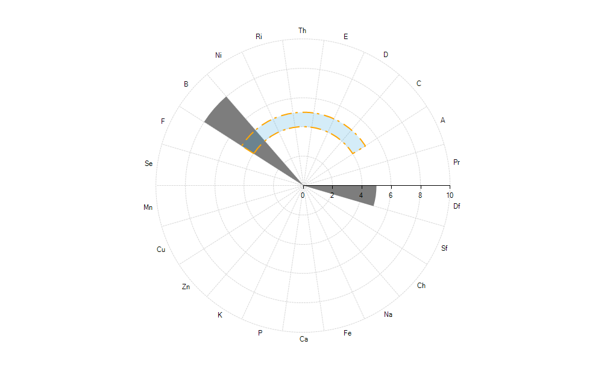
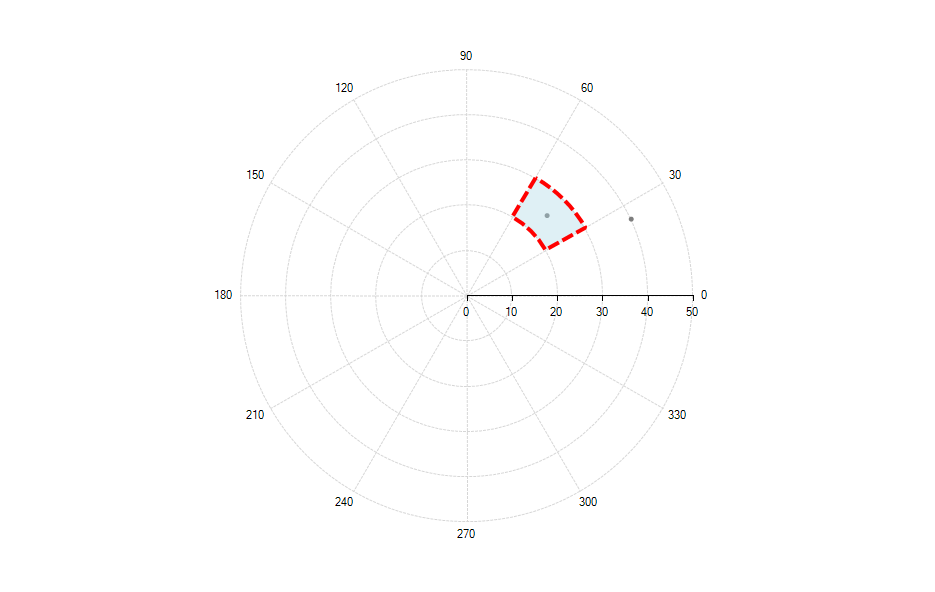

# Marked Zone

The Marked Zone annotation defines a closed figure plotted on the view-port. Its boundaries are set according to properties defining values along two axes of the series. There are two marked zone annotation: **CartesianMarkedZoneAnnotation** and **PolarMarkedZoneAnnotation**.

Common properties to the two types of annotations include:

* **BackColor**: Sets the back color of the annotation.

* **BorderDashStyle**: Defines the dash style of the border of the annotation.

* **BorderDashPattern**: Defines the dash pattern of the border of the annotation.

* **BorderColor**: Sets the color of the border of the annotation.

* **BorderWidth**: Specifies the width of the border of the annotation.

## Cartesian Marked Zone Annotation

The __CartesianMarkedzoneAnnotation__ is a rectangle defined by the __HorizontalFrom/To__ and __VerticalFrom/To__ properties.

>caption Figure 1: Marked Annotation


### Properties

Besides the __HorizontalFrom/To__ and __VerticalFrom/To__ properties that are used for defining the rectangle, the __CartesianMarkedzoneAnnotation__ exposes the following properties:      

* __HorizontalAxis__ and __VerticalAxis:__ Used for associating the annotation with the chart axes.          

* __BackColorL:__  Defines the back color of the marked zone.
          
* __BorderColorL__ Specifies the border color of the marked zone.
          
* __BorderWidth:__ Sets the border width of the marked zone.
          
### Examples

In the following example additional styling is applied to the default look of the annotation.

>caption Figure 2: Annotation With All Bounds Set


#### Define Annotation

{{source=..\SamplesCS\ChartView\Annotations\MarkedZones.cs region=CartesianMarkedZone}} 
{{source=..\SamplesVB\ChartView\Annotations\MarkedZones.vb region=CartesianMarkedZone}} 

````C#
CartesianMarkedZoneAnnotation annotation = new CartesianMarkedZoneAnnotation();
annotation.HorizontalFrom = 4;
annotation.HorizontalTo = 9;
annotation.VerticalFrom = 10;
annotation.VerticalTo = 35;
annotation.BackColor = Color.FromArgb(50, 37, 160, 219);
annotation.BorderDashStyle = DashStyle.Custom;
annotation.BorderDashPattern = new float[] { 9, 3, 2, 4 };
annotation.BorderColor = Color.Orange;
annotation.BorderWidth = 3;
this.radChartView1.Annotations.Add(annotation);

````
````VB.NET
Dim annotation As New CartesianMarkedZoneAnnotation()
annotation.HorizontalFrom = 4
annotation.HorizontalTo = 9
annotation.VerticalFrom = 10
annotation.VerticalTo = 35
annotation.BackColor = Color.FromArgb(50, 37, 160, 219)
annotation.BorderDashStyle = DashStyle.[Custom]
annotation.BorderDashPattern = New Single() {9, 3, 2, 4}
annotation.BorderColor = Color.Orange
annotation.BorderWidth = 3
Me.radChartView1.Annotations.Add(annotation)

````

{{endregion}}

The flexible design of the marked zone annotation allows the user to omit one (or more) of the four __HorizontalFrom/To__ and __VerticalFrom/To__ properties. The following table details the relationship between the specified properties and the occupied interval on the axis:

|  __Specified Properties__  |  __Occupied interval__  |
| ------ | ------ |
| __Both From and To__ |[Min(From,To), Max(From,To)]|
| __Only From__ |[From,+∞]|
| __Only To__ |[-∞, To]|

Here is the previous example with some of the settings commented

#### Horizontally Defined Marked Zone

{{source=..\SamplesCS\ChartView\Annotations\MarkedZones.cs region=CartesianMarkedZone2}} 
{{source=..\SamplesVB\ChartView\Annotations\MarkedZones.vb region=CartesianMarkedZone2}} 

````C#
CartesianMarkedZoneAnnotation annotation = new CartesianMarkedZoneAnnotation();
annotation.HorizontalFrom = 4;
annotation.HorizontalTo = 9;
//annotation.VerticalFrom = 10;
//annotation.VerticalTo = 35;
annotation.BackColor = Color.FromArgb(50, 37, 160, 219);
//annotation.BorderDashStyle = DashStyle.Custom;
//annotation.BorderDashPattern = new float[] { 9, 3, 2, 4 };
annotation.BorderColor = Color.Orange;
annotation.BorderWidth = 1;
this.radChartView1.Annotations.Add(annotation);

````
````VB.NET
Dim annotation As New CartesianMarkedZoneAnnotation()
annotation.HorizontalFrom = 4
annotation.HorizontalTo = 9
'annotation.VerticalFrom = 10;
'annotation.VerticalTo = 35;
annotation.BackColor = Color.FromArgb(50, 37, 160, 219)
'annotation.BorderDashStyle = DashStyle.Custom;
'annotation.BorderDashPattern = new float[] { 9, 3, 2, 4 };
annotation.BorderColor = Color.Orange
annotation.BorderWidth = 1
Me.radChartView1.Annotations.Add(annotation)

````

{{endregion}} 

>caption Figure 3: Horizontally Defined Marked Zone


## Polar Marked Zone Annotation

The **PolarMarkedZoneAnnotation** defines a pie arc segment painted on a *Polar* area. This annotation is compatible for series using a *Polar* coordinate system: **RadarColumnSeries**, **RadarPointSeries**, and **PolarPointSeries**.

>caption Figure 4: Polar Marked Zone Annotation in Combination with a RadarColumnSeries


### Properties

Four properties need to be set for a polar marked zone annotation.      

* **PolarFrom**: Gets or sets the starting point on the Polar axis.         

* **PolarTo**:  Gets or sets the ending point on the Polar axis.
          
* **RadialFrom**: Gets or sets the starting point on the Radial axis.
          
* **RadialTo**: Gets or sets the ending point on the Radial axis.

>note The values set to the **RadialFrom** and **RadialTo** properties need to correspond to the type of the series. In the case of Radar series, one needs to use categories as values and in the case of a Polar series one needs to use angles.  

### Example

The example below adds a **PolarMarkedZoneAnnotation** to a **PolarPointSeries**.

>caption Figure 5: PolarPointSeries and Markzed Zone


#### Polar Marked Zone Settings

{{source=..\SamplesCS\ChartView\Annotations\MarkedZones.cs region=PolarMarkedZone}} 
{{source=..\SamplesVB\ChartView\Annotations\MarkedZones.vb region=PolarMarkedZone}}
````C#
this.radChartView1.AreaType = ChartAreaType.Polar;
PolarPointSeries polarPointSeries = new PolarPointSeries();
PolarDataPoint dataPoint = new PolarDataPoint();
dataPoint.Value = 40;
dataPoint.Angle = 25;
polarPointSeries.DataPoints.Add(dataPoint);
dataPoint = new PolarDataPoint();
dataPoint.Value = 25;
dataPoint.Angle = 45;
polarPointSeries.DataPoints.Add(dataPoint);
this.radChartView1.AreaType = ChartAreaType.Polar;
this.radChartView1.Series.Add(polarPointSeries);
PolarMarkedZoneAnnotation annotation = new PolarMarkedZoneAnnotation();
annotation.BorderWidth = 4;
annotation.BackColor = Color.FromArgb(100, Color.LightBlue);
annotation.BorderColor = Color.Red;
annotation.PolarFrom = 20;
annotation.PolarTo = 30;
annotation.RadialFrom = 30;
annotation.RadialTo = 60;
this.radChartView1.Annotations.Add(annotation);

````
````VB.NET
Me.radChartView1.AreaType = ChartAreaType.Polar
Dim polarPointSeries As PolarPointSeries = New PolarPointSeries()
Dim dataPoint As PolarDataPoint = New PolarDataPoint()
dataPoint.Value = 40
dataPoint.Angle = 25
polarPointSeries.DataPoints.Add(dataPoint)
dataPoint = New PolarDataPoint()
dataPoint.Value = 25
dataPoint.Angle = 45
polarPointSeries.DataPoints.Add(dataPoint)
Me.radChartView1.AreaType = ChartAreaType.Polar
Me.radChartView1.Series.Add(polarPointSeries)
Dim annotation As PolarMarkedZoneAnnotation = New PolarMarkedZoneAnnotation()
annotation.BorderWidth = 4
annotation.BackColor = Color.FromArgb(100, Color.LightBlue)
annotation.BorderColor = Color.Red
annotation.PolarFrom = 20
annotation.PolarTo = 30
annotation.RadialFrom = 30
annotation.RadialTo = 60
Me.radChartView1.Annotations.Add(annotation)

```` 


{{endregion}} 

# See Also

* [Annotations]()
* [Axes]()
* [Series Types]()
* [Populating with Data]()