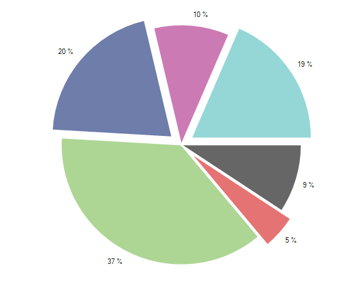

# Selection

## 

This help topic will demonstrate how you can make your charts more interactive
          by adding a selection behavior.
        

In order to utilize this behavior users simply have to add it to the
          chart's __Controllers__ collection. For example:
        

#### __[C#] __

{{source=..\SamplesCS\ChartView\Features\ChartSelection.cs region=controller}}
	            radChartView1.Controllers.Add(new ChartSelectionController());
	            radChartView1.SelectionMode = ChartSelectionMode.SingleDataPoint;
	            radChartView1.SelectedPointChanged += new ChartViewSelectedChangedEventHandler(radChartView1_SelectedPointChanged);
	{{endregion}}

#### __[VB.NET] __

{{source=..\SamplesVB\ChartView\Features\ChartSelection.vb region=controller}}
	        RadChartView1.Controllers.Add(New ChartSelectionController())
	        RadChartView1.SelectionMode = ChartSelectionMode.SingleDataPoint
	        AddHandler RadChartView1.SelectedPointChanged, AddressOf RadChartView1_SelectedPointChanged
	
	        '#End Region
	
	        '#Region "selectionMode"
	        radChartView1.SelectionMode = ChartSelectionMode.SingleDataPoint
	        radChartView1.SelectionMode = ChartSelectionMode.MultipleDataPoints
	        '#End Region
	    End Sub
	
	End Class

The ChartSelectionController will be added automatically if the
          __SelectionMode__ property of RadChartView control is set to one of available options.
        

#### __[C#] __

{{source=..\SamplesCS\ChartView\Features\ChartSelection.cs region=selectionMode}}
	            radChartView1.SelectionMode = ChartSelectionMode.SingleDataPoint;
	            radChartView1.SelectionMode = ChartSelectionMode.MultipleDataPoints;
	{{endregion}}

#### __[VB.NET] __

{{source=..\SamplesVB\ChartView\Features\ChartSelection.vb region=selectionMode}}
	        radChartView1.SelectionMode = ChartSelectionMode.SingleDataPoint
	        radChartView1.SelectionMode = ChartSelectionMode.MultipleDataPoints
	        '#End Region
	    End Sub
	
	End Class

Here is a sample using PieSeries and multiple selection. When a slice is selected, it is being offsetted from the center:
        

#### __[C#] __

{{source=..\SamplesCS\ChartView\Features\ChartSelection.cs region=example}}
	        public ChartSelection()
	        {
	            InitializeComponent();
	
	            radChartView1.AreaType = ChartAreaType.Pie;
	            PieSeries pieSeries = new PieSeries();
	            pieSeries.ShowLabels = true;
	            pieSeries.PointSize = new SizeF(15, 15);
	            pieSeries.DataPoints.Add(new PieDataPoint(10));
	            pieSeries.DataPoints.Add(new PieDataPoint(5));
	            pieSeries.DataPoints.Add(new PieDataPoint(40));
	            pieSeries.DataPoints.Add(new PieDataPoint(22));
	            pieSeries.DataPoints.Add(new PieDataPoint(11));
	            pieSeries.DataPoints.Add(new PieDataPoint(20));
	            radChartView1.Series.Add(pieSeries);
	
	            radChartView1.Controllers.Add(new ChartSelectionController());
	            radChartView1.SelectionMode = ChartSelectionMode.MultipleDataPoints;
	            radChartView1.SelectedPointChanged += new ChartViewSelectedChangedEventHandler(radChartView1_SelectedPointChanged);
	        }
	
	        void radChartView1_SelectedPointChanged(object sender, ChartViewSelectedPointChangedEventArgs args)
	        {
	            if (args.NewSelectedPoint != null)
	            {
	                UpdateSelectedPoint(args.NewSelectedPoint);
	            }
	            if (args.OldSelectedPoint != null)
	            {
	                UpdateSelectedPoint(args.OldSelectedPoint);
	            }
	        }
	
	        void UpdateSelectedPoint(DataPoint point)
	        {
	            PieDataPoint pieDataPoint = point as PieDataPoint;
	            if (pieDataPoint != null)
	            {
	                if (pieDataPoint.IsSelected)
	                {
	                    pieDataPoint.OffsetFromCenter = 0.1;
	                }
	                else
	                {
	                    pieDataPoint.OffsetFromCenter = 0;
	                }
	            }
	        }
	{{endregion}}

#### __[VB.NET] __

{{source=..\SamplesVB\ChartView\Features\ChartSelection.vb region=example}}
	    Public Sub New()
	        InitializeComponent()
	
	        radChartView1.AreaType = ChartAreaType.Pie
	        Dim pieSeries As New PieSeries()
	        pieSeries.ShowLabels = True
	        pieSeries.PointSize = New SizeF(15, 15)
	        pieSeries.DataPoints.Add(New PieDataPoint(10))
	        pieSeries.DataPoints.Add(New PieDataPoint(5))
	        pieSeries.DataPoints.Add(New PieDataPoint(40))
	        pieSeries.DataPoints.Add(New PieDataPoint(22))
	        pieSeries.DataPoints.Add(New PieDataPoint(11))
	        pieSeries.DataPoints.Add(New PieDataPoint(20))
	        radChartView1.Series.Add(pieSeries)
	
	        RadChartView1.Controllers.Add(New ChartSelectionController())
	        RadChartView1.SelectionMode = ChartSelectionMode.MultipleDataPoints
	        AddHandler RadChartView1.SelectedPointChanged, AddressOf RadChartView1_SelectedPointChanged
	
	    End Sub
	
	    Private Sub RadChartView1_SelectedPointChanged(sender As Object, args As ChartViewSelectedPointChangedEventArgs)
	        If args.NewSelectedPoint IsNot Nothing Then
	            UpdateSelectedPoint(args.NewSelectedPoint)
	        End If
	        If args.OldSelectedPoint IsNot Nothing Then
	            UpdateSelectedPoint(args.OldSelectedPoint)
	        End If
	    End Sub
	
	    Private Sub UpdateSelectedPoint(point As DataPoint)
	        Dim pieDataPoint As PieDataPoint = TryCast(point, PieDataPoint)
	        If pieDataPoint IsNot Nothing Then
	            If pieDataPoint.IsSelected Then
	                pieDataPoint.OffsetFromCenter = 0.1
	            Else
	                pieDataPoint.OffsetFromCenter = 0
	            End If
	        End If
	    End Sub
	#End Region
	
	    Private Sub snippets()
	        '#Region "controller"
	        RadChartView1.Controllers.Add(New ChartSelectionController())
	        RadChartView1.SelectionMode = ChartSelectionMode.SingleDataPoint
	        AddHandler RadChartView1.SelectedPointChanged, AddressOf RadChartView1_SelectedPointChanged
	
	        '#End Region
	
	        '#Region "selectionMode"
	        radChartView1.SelectionMode = ChartSelectionMode.SingleDataPoint
	        radChartView1.SelectionMode = ChartSelectionMode.MultipleDataPoints
	        '#End Region
	    End Sub
	
	End Class

