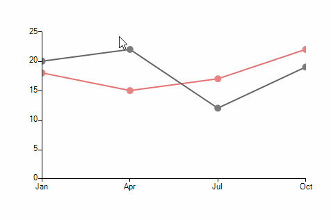

# Lasso Selection

**RadChartView** provides lasso selection functionality allowing data points to be selected upon creating a lasso rectangle with the mouse. The functionality is defined in the **LassoSelectionController** class and it is only supported in the *Cartesian Area*.

>caption Figure 1: Selecting Data Points


#### Add Sample Data and a Controller

{{source=..\SamplesCS\ChartView\Features\LassoSelection.cs region=SetupLassoSelection}} 
{{source=..\SamplesVB\ChartView\Features\LassoSelection.vb region=SetupLassoSelection}}
````C#
private void AddLassoSelectionController()
{
    LineSeries lineSeries = new LineSeries() { Name = "San Diego"};
    lineSeries.DataPoints.Add(new CategoricalDataPoint(20, "Jan"));
    lineSeries.DataPoints.Add(new CategoricalDataPoint(22, "Apr"));
    lineSeries.DataPoints.Add(new CategoricalDataPoint(12, "Jul"));
    lineSeries.DataPoints.Add(new CategoricalDataPoint(19, "Oct"));
    lineSeries.PointSize = new SizeF(10, 10);
    this.radChartView1.Series.Add(lineSeries);
    LineSeries lineSeries2 = new LineSeries() { Name = "L.A." }; ;
    lineSeries2.DataPoints.Add(new CategoricalDataPoint(18, "Jan"));
    lineSeries2.DataPoints.Add(new CategoricalDataPoint(15, "Apr"));
    lineSeries2.DataPoints.Add(new CategoricalDataPoint(17, "Jul"));
    lineSeries2.DataPoints.Add(new CategoricalDataPoint(22, "Oct"));
    lineSeries2.PointSize = new SizeF(10, 10);
    this.radChartView1.Series.Add(lineSeries2);
    LassoSelectionController lassoSelectionController = new LassoSelectionController();
    lassoSelectionController.LassoSelectedPointsChanged += LassoSelectionController_LassoSelectedPointsChanged;
    this.radChartView1.Controllers.Add(lassoSelectionController);
}

````
````VB.NET
Private Sub AddLassoSelectionController()
    Dim lineSeries As LineSeries = New LineSeries() With {
        .Name = "San Diego"
    }
    lineSeries.DataPoints.Add(New CategoricalDataPoint(20, "Jan"))
    lineSeries.DataPoints.Add(New CategoricalDataPoint(22, "Apr"))
    lineSeries.DataPoints.Add(New CategoricalDataPoint(12, "Jul"))
    lineSeries.DataPoints.Add(New CategoricalDataPoint(19, "Oct"))
    lineSeries.PointSize = New SizeF(10, 10)
    Me.RadChartView1.Series.Add(lineSeries)
    Dim lineSeries2 As LineSeries = New LineSeries() With {
        .Name = "L.A."
    }
    lineSeries2.DataPoints.Add(New CategoricalDataPoint(18, "Jan"))
    lineSeries2.DataPoints.Add(New CategoricalDataPoint(15, "Apr"))
    lineSeries2.DataPoints.Add(New CategoricalDataPoint(17, "Jul"))
    lineSeries2.DataPoints.Add(New CategoricalDataPoint(22, "Oct"))
    lineSeries2.PointSize = New SizeF(10, 10)
    Me.RadChartView1.Series.Add(lineSeries2)
    Dim lassoSelectionController As LassoSelectionController = New LassoSelectionController()
    AddHandler lassoSelectionController.LassoSelectedPointsChanged, AddressOf LassoSelectionController_LassoSelectedPointsChanged
    Me.RadChartView1.Controllers.Add(lassoSelectionController)
End Sub

````


{{endregion}}

The **LassoSelectionController** exposes a **LassoSelectedPointsChanged** event providing access to the data points within the bounds of the selection rectangle. In a scenario with multiple series, each of the series can be extracted from the **Presenter** property of the data point object   

#### The LassoSelectedPointsChanged Event

{{source=..\SamplesCS\ChartView\Features\LassoSelection.cs region=LassoSelectedPointsChangedEvent}} 
{{source=..\SamplesVB\ChartView\Features\LassoSelection.vb region=LassoSelectedPointsChangedEvent}}
````C#
private void LassoSelectionController_LassoSelectedPointsChanged(object sender, ChartDataPointsEventArgs args)
{
    StringBuilder sb = new StringBuilder();
    foreach (DataPoint dp in args.SelectedDataPoints)
    {
        CategoricalDataPoint categoricalData = dp as CategoricalDataPoint;
        if (dp == null)
        {
            continue;
        }
        CartesianSeries series = dp.Presenter as CartesianSeries;
        sb.AppendLine("Series: " + series.Name);
        sb.AppendLine("Data Point: " + categoricalData.Value);
    }
    RadMessageBox.Show(sb.ToString());
}

````
````VB.NET
Private Sub LassoSelectionController_LassoSelectedPointsChanged(ByVal sender As Object, ByVal args As ChartDataPointsEventArgs)
    Dim sb As StringBuilder = New StringBuilder()
    For Each dp As DataPoint In args.SelectedDataPoints
        Dim categoricalData As CategoricalDataPoint = TryCast(dp, CategoricalDataPoint)
        If dp Is Nothing Then
            Continue For
        End If
        Dim series As CartesianSeries = TryCast(dp.Presenter, CartesianSeries)
        sb.AppendLine("Series: " & series.Name)
        sb.AppendLine("Data Point: " & categoricalData.Value)
    Next
    RadMessageBox.Show(sb.ToString())
End Sub

```` 


{{endregion}}

>tip The controllers added in **RadChartView** are invoked in the order at which they have been added. In case a **LassoZoomController** is to be used together with a **LassoSelectionController**, the selection controller needs to be added first. 

>caption Figure 2: Lasso and Zoom


#### Lasso and Zoom Selection Controllers

{{source=..\SamplesCS\ChartView\Features\LassoSelection.cs region=SetupLassoZoomControllers}} 
{{source=..\SamplesVB\ChartView\Features\LassoSelection.vb region=SetupLassoZoomControllers}}
````C#
private void AddLassoZoomControllers()
{
    //Setup series
    LassoSelectionController lassoSelectionController = new LassoSelectionController();
    lassoSelectionController.LassoSelectedPointsChanged += LassoSelectionController_LassoSelectedPointsChanged;
    this.radChartView1.Controllers.Add(lassoSelectionController);
    LassoZoomController lassoZoomController = new LassoZoomController();
    this.radChartView1.Controllers.Add(lassoZoomController);
}

````
````VB.NET
Private Sub AddLassoZoomControllers()
    Dim lassoSelectionController As LassoSelectionController = New LassoSelectionController()
    AddHandler lassoSelectionController.LassoSelectedPointsChanged, AddressOf LassoSelectionController_LassoSelectedPointsChanged
    Me.RadChartView1.Controllers.Add(lassoSelectionController)
    Dim lassoZoomController As LassoZoomController = New LassoZoomController()
    Me.RadChartView1.Controllers.Add(lassoZoomController)
End Sub

````


{{endregion}}
Using this approach you can zoom any area in the chart using the 0-100 percentage scale.

# See Also

* [Axes]()
* [Series Types]()
* [Populating with Data]()
* [Customization]()
* [Printing]()
* [Integrating PanZoom, TrackBall and LassoZoom Controllers in RadChartView](http://www.telerik.com/support/kb/winforms/details/integrating-panzoom-trackball-and-lassozoom-controllers-in-radchartview)
