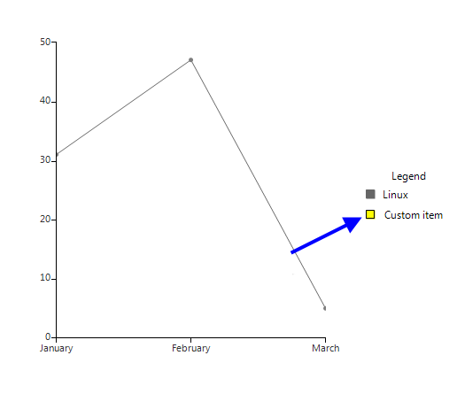

# Legend


RadChartView has built-in support for legends – descriptions about the charts on the plot. The items displayed in the legend are series specific i.e. for the pie chart the data points are shown in the legend, whereas for line series only one item is shown for each series. 

## Show Legend
      

The __ShowLegend__ property of RadChartView controls whether the legend is visible or not. The default value is *false*. The legend supports showing a legend title, which text can be set via the __LegendTitle__ property. 

{{source=..\SamplesCS\ChartView\Features\ChartViewLegend.cs region=ShowLegend}} 
{{source=..\SamplesVB\ChartView\Features\ChartViewLegend.vb region=ShowLegend}} 

````C#
this.radChartView1.ShowLegend = true;
this.radChartView1.LegendTitle = "Legend";
//

````
````VB.NET
Me.RadChartView1.ShowLegend = True
Me.RadChartView1.LegendTitle = "Legend"

````

{{endregion}} 


##  Customize legend
      

The location of the title can be modified by the __TitlePosition__ property. Additional modification of the title can be introduced by using the __TitleElement__: 

{{source=..\SamplesCS\ChartView\Features\ChartViewLegend.cs region=CustomizeLegendTitle}} 
{{source=..\SamplesVB\ChartView\Features\ChartViewLegend.vb region=CustomizeLegendTitle}} 

````C#
this.radChartView1.ChartElement.LegendElement.TitlePosition = TitlePosition.Bottom;
this.radChartView1.ChartElement.LegendElement.TitleElement.Font = new Font("Arial", 12, FontStyle.Italic);
this.radChartView1.ChartElement.LegendElement.TitleElement.ForeColor = Color.Red;
//

````
````VB.NET
Me.RadChartView1.ChartElement.LegendElement.TitlePosition = TitlePosition.Bottom
Me.RadChartView1.ChartElement.LegendElement.TitleElement.Font = New Drawing.Font("Arial", 12, Drawing.FontStyle.Italic)
Me.RadChartView1.ChartElement.LegendElement.TitleElement.ForeColor = Drawing.Color.Red

````

{{endregion}} 


You can dock the legend to each of the four sides of the control by setting the __LegendPosition__ property. 


{{source=..\SamplesCS\ChartView\Features\ChartViewLegend.cs region=LegendPositionBottom}} 
{{source=..\SamplesVB\ChartView\Features\ChartViewLegend.vb region=LegendPositionBottom}} 

````C#
this.radChartView1.ChartElement.LegendPosition = LegendPosition.Bottom;
//

````
````VB.NET
Me.RadChartView1.ChartElement.LegendPosition = LegendPosition.Bottom

````

{{endregion}} 


Alternatively, you can set it to float over the chart view. Here is how to set the legend to stay at position  *200 , 0* over the chart area.
        

>note The __LegendOffset__ property is only taken into consideration when the __LegendPosition__ is set to *“Float”* .
> 


{{source=..\SamplesCS\ChartView\Features\ChartViewLegend.cs region=LegendPositionFloat}} 
{{source=..\SamplesVB\ChartView\Features\ChartViewLegend.vb region=LegendPositionFloat}} 

````C#
this.radChartView1.ChartElement.LegendPosition = LegendPosition.Float;
this.radChartView1.ChartElement.LegendOffset = new Point(200, 0);
//

````
````VB.NET
Me.RadChartView1.ChartElement.LegendPosition = LegendPosition.Float
Me.RadChartView1.ChartElement.LegendOffset = New Point(200, 0)

````

{{endregion}} 


## Setup LegendItem
      

The elements that provide legend items in the case of the Pie chart are the individual data points. In all other cases it is the series that provide legend items. You can set two properties to each provider which controls their representation in the legend. These two properties are __IsVisibleInLegend__ and __LegendTitle__. 

{{source=..\SamplesCS\ChartView\Features\ChartViewLegend.cs region=LegendProperties}} 
{{source=..\SamplesVB\ChartView\Features\ChartViewLegend.vb region=LegendProperties}} 

````C#
LineSeries line = new LineSeries();
line.IsVisibleInLegend = true;
line.LegendTitle = "Windows 8";
//

````
````VB.NET
Dim line As New LineSeries()
line.IsVisibleInLegend = True
line.LegendTitle = "Windows 8"

````

{{endregion}} 


## Modify LegendItem title
      

You have access to the items displayed in the legend through the __Items__ property of the chart legend. This collection gives you access to the actual legend items that the provider creates. This means that if you change the text in the legend item, the text in the provider (data point or series), will also change. Let’s say you have added the line series from the previous example to the chart and you change the title of the legend item through the legend’s __Items__ collection with the following code, this will actually change the value in the series legend item: 

{{source=..\SamplesCS\ChartView\Features\ChartViewLegend.cs region=ChangeLegendItemText}} 
{{source=..\SamplesVB\ChartView\Features\ChartViewLegend.vb region=ChangeLegendItemText}} 

````C#
this.radChartView1.ChartElement.LegendElement.Items[0].Title = "Linux";
//

````
````VB.NET
Me.RadChartView1.ChartElement.LegendElement.Items(0).Title = "Linux"

````

{{endregion}} 


## Add/Remove LegendItems
      

You can add and remove items from the legend through the __Items__ collection. You have to create a new instance of __LegendItem__ which you will add to the __Items__ collection. You can set the desired style of the marker through the __Element__ property of the __LegendItem__. 

{{source=..\SamplesCS\ChartView\Features\ChartViewLegend.cs region=AddLegendItem}} 
{{source=..\SamplesVB\ChartView\Features\ChartViewLegend.vb region=AddLegendItem}} 

````C#
LegendItem item = new LegendItem();
item.Element.BorderColor = Color.Black;
item.Element.BackColor = Color.Yellow;
item.Title = "Custom item";
this.radChartView1.ChartElement.LegendElement.Items.Add(item);
//

````
````VB.NET
Dim item As New LegendItem()
item.Element.BorderColor = Color.Black
item.Element.BackColor = Color.Yellow
item.Title = "Custom item"
Me.RadChartView1.ChartElement.LegendElement.Items.Add(item)

````

{{endregion}} 




## Custom Legend item
      

You can use your own legend item elements by handling the __VisualItemCreating__ event of the legend. This allows you to change the way legend items are represented in the legend:  

{{source=..\SamplesCS\ChartView\Features\ChartViewLegend.cs region=CustomLegendItem1}} 
{{source=..\SamplesVB\ChartView\Features\ChartViewLegend.vb region=CustomLegendItem1}} 

````C#
this.radChartView1.ChartElement.LegendElement.VisualItemCreating +=new LegendItemElementCreatingEventHandler(LegendElement_VisualItemCreating);
//

````
````VB.NET
AddHandler Me.RadChartView1.ChartElement.LegendElement.VisualItemCreating, AddressOf LegendElement_VisualItemCreating

````

{{endregion}} 

#### Custom LegendItemElement implementation:

{{source=..\SamplesCS\ChartView\Features\ChartViewLegend.cs region=CustomLegendItem2}} 
{{source=..\SamplesVB\ChartView\Features\ChartViewLegend.vb region=CustomLegendItem2}} 

````C#
public class CustomLegendItemElement : LegendItemElement
{
    public CustomLegendItemElement(LegendItem item)
        : base(item)
    {
        this.Children.Remove(this.MarkerElement);
        this.TitleElement.DrawFill = true;
        this.TitleElement.DrawBorder = true;
        this.StretchHorizontally = true;
    }
    protected override void Synchronize()
    {
        base.Synchronize();
        this.SyncVisualStyleProperties(this.LegendItem.Element, this.TitleElement);
        this.TitleElement.ForeColor = Color.White;
    }
}
private void LegendElement_VisualItemCreating(object sender, LegendItemElementCreatingEventArgs e)
{
    e.ItemElement = new CustomLegendItemElement(e.LegendItem);
}
//

````
````VB.NET
Public Class CustomLegendItemElement
    Inherits LegendItemElement
    Public Sub New(item As LegendItem)
        MyBase.New(item)
        Me.Children.Remove(Me.MarkerElement)
        Me.TitleElement.DrawFill = True
        Me.TitleElement.DrawBorder = True
        Me.StretchHorizontally = True
    End Sub
    Protected Overrides Sub Synchronize()
        MyBase.Synchronize()
        Me.SyncVisualStyleProperties(Me.LegendItem.Element, Me.TitleElement)
        Me.TitleElement.ForeColor = Color.White
    End Sub
End Class
Private Sub LegendElement_VisualItemCreating(sender As Object, e As LegendItemElementCreatingEventArgs)
    e.ItemElement = New CustomLegendItemElement(e.LegendItem)
End Sub

````

{{endregion}} 


