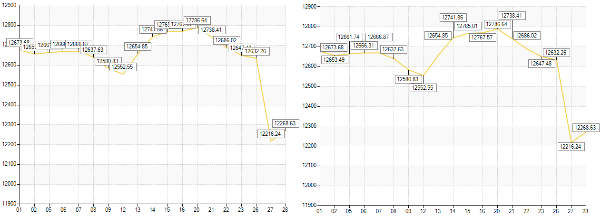
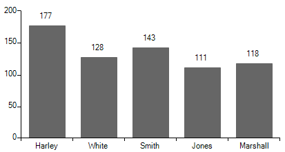
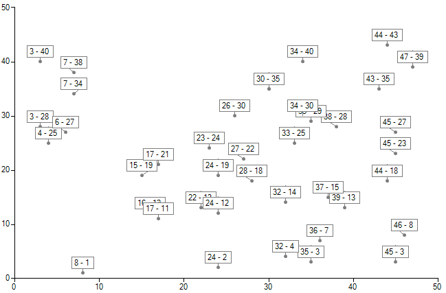

# Smart labels

__RadChartView__ provides a built-in mechanism for resolving labels overlapping with the __SmartLabelsController__. You can add the controller to the __Controllers__ collection of __RadChartView__ and it will optimize the arrangement of the labels in a way that there will be less overlaps.

#### Add Controller

{{source=..\SamplesCS\ChartView\Features\SmartLabels.cs region=AddSmartLabelsController}} 
{{source=..\SamplesVB\ChartView\Features\SmartLabels.vb region=AddSmartLabelsController}} 

````C#
this.radChartView1.Controllers.Add(new SmartLabelsController());

````
````VB.NET
Me.radChartView1.Controllers.Add(New SmartLabelsController())

````

{{endregion}}  

Alternatively, you can leave __RadChartView__ do this for you by setting the __ShowSmartLabels__ property: 

#### Set Property

{{source=..\SamplesCS\ChartView\Features\SmartLabels.cs region=EnableSmartLabels}} 
{{source=..\SamplesVB\ChartView\Features\SmartLabels.vb region=EnableSmartLabels}} 

````C#
this.radChartView1.ShowSmartLabels = true;

````
````VB.NET
Me.radChartView1.ShowSmartLabels = True

````

{{endregion}}
 
Automatic label placement is one the most complex and time consuming operations in a chart that is NP-hard ([http://en.wikipedia.org/wiki/NP-Hard](http://en.wikipedia.org/wiki/NP-Hard)). There is no universal solution for all chart types and there is no solution that can guarantee solution for 100% of the label collisions in every case.

>caption Figure 1: Without Smart Labels


>caption Figure 2: With Smart Labels


__RadChartView__’s __SmartLabelsController__ uses strategies specific to different chart types to resolve label overlaps. Since label overlapping can be quite time consuming with more generalized methods, the more concrete a strategy is the better the performance that can be expected out of it. You do not need to be concerned with the strategy, __RadChartView__ will choose the best of the built-in strategies to be used in your chart.

>caption Figure 3: Without Smart Labels


>caption Figure 4: With Smart Labels


>caption Figure 5: Without Smart Labels


>caption Figure 6: With Smart Labels


# Custom labels strategy

In a specific scenario you may need to control the labels' position. For this purpose, create a derivative of the __SmartLabelsStrategyBase__ class and override its __CalculateLocations__ method. Then, you should use this custom logic in the __SmartLabelsController__. You can find below a sample code snippet demonstrating how you can position the labels in the top part of the chart:

#### Custom SmartLabelsStrategy 

{{source=..\SamplesCS\ChartView\Features\SmartLabels.cs region=CustomSmartLabelsStrategy}} 
{{source=..\SamplesVB\ChartView\Features\SmartLabels.vb region=CustomSmartLabelsStrategy}} 

````C#
public class MyStrategy : SmartLabelsStrategyBase
{
    public override void CalculateLocations(Telerik.WinControls.UI.ChartSeriesCollection series, Rectangle plotArea)
    {
        List<LabelElement> labels = new List<LabelElement>();
        List<int> overlaps = new List<int>();

        int x = 70;
        int y = 30;
        int spacing = 6;
        foreach (Telerik.WinControls.UI.ChartSeries chartSeries in series)
        {
            if (!chartSeries.ShowLabels || !chartSeries.IsVisible)
            {
                continue;
            }

            foreach (DataPointElement point in chartSeries.Children)
            {
                LabelElement label = (LabelElement)point.Children[0];
                Rectangle labelRect = ChartRenderer.ToRectangle(label.GetLayoutSlot());

                var newRect = new Rectangle(x, y, labelRect.Width, labelRect.Height);

                x += spacing + labelRect.Width;
                if (x + spacing + labelRect.Width > plotArea.Width - 100)
                {
                    y += spacing + labelRect.Height;
                    x = 70;
                }

                label.SmartRectangle = newRect;
                labels.Add(label);
            }
        }
    }
}

public class MySmartLabelsController : SmartLabelsController
{
    public override void CalculateLabelsPositions(Telerik.WinControls.UI.ChartSeriesCollection series, Rectangle plotArea)
    {
        if (this.Strategy != null)
        {
            this.Strategy.CalculateLocations(series, plotArea);
        }
    }
}

````
````VB.NET
Public Class MyStrategy
    Inherits SmartLabelsStrategyBase
    Public Overrides Sub CalculateLocations(series As Telerik.WinControls.UI.ChartSeriesCollection, plotArea As Rectangle)
        Dim labels As New List(Of LabelElement)()
        Dim overlaps As New List(Of Integer)()
        Dim x As Integer = 70
        Dim y As Integer = 30
        Dim spacing As Integer = 6
        For Each chartSeries As Telerik.WinControls.UI.ChartSeries In series
            If Not chartSeries.ShowLabels OrElse Not chartSeries.IsVisible Then
                Continue For
            End If
            For Each point As DataPointElement In chartSeries.Children
                Dim label As LabelElement = DirectCast(point.Children(0), LabelElement)
                Dim labelRect As Rectangle = ChartRenderer.ToRectangle(label.GetLayoutSlot())
                Dim newRect = New Rectangle(x, y, labelRect.Width, labelRect.Height)
                x += spacing + labelRect.Width
                If x + spacing + labelRect.Width > plotArea.Width - 100 Then
                    y += spacing + labelRect.Height
                    x = 70
                End If
                label.SmartRectangle = newRect
                labels.Add(label)
            Next
        Next
    End Sub
  
End Class
Public Class MySmartLabelsController
    Inherits SmartLabelsController
    Public Overrides Sub CalculateLabelsPositions(series As Telerik.WinControls.UI.ChartSeriesCollection, plotArea As Rectangle)
        If Me.Strategy IsNot Nothing Then
            Me.Strategy.CalculateLocations(series, plotArea)
        End If
    End Sub
End Class

````

{{endregion}} 


You must apply the custom __SmartLabelsController__ to __RadChartView__:

#### Apply custom strategy

{{source=..\SamplesCS\ChartView\Features\SmartLabels.cs region=ApplyCustomStrategy}} 
{{source=..\SamplesVB\ChartView\Features\SmartLabels.vb region=ApplyCustomStrategy}} 

````C#
MySmartLabelsController controler = new MySmartLabelsController();
controler.Strategy = new MyStrategy();
this.radChartView1.Controllers.Add(controler);

````
````VB.NET
Dim controler As New MySmartLabelsController()
controler.Strategy = New MyStrategy()
Me.radChartView1.Controllers.Add(controler)

````

{{endregion}} 

|Before|After|
|----|----|
|||

# See Also

* [Axes]()
* [Series Types]()
* [Populating with Data]()
* [Customization]()
* [Printing]()