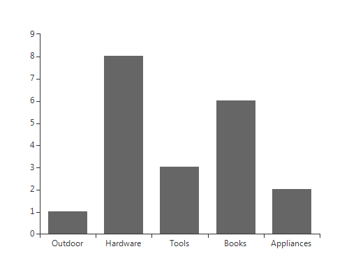

# Binding to BindingList

BindingList is a generic list type, that provides additional control over list items, i.e. the items in __RadChartView__ can be easily edited, removed or added. BindingList also surfaces events that notify when the list has been changed. The example below creates a list of MyCustomObject, initializes the list and assigns it to the __BarSeries__ object in __RadChartView__. 

{{source=..\SamplesCS\ChartView\DataBinding\ChartViewDataBindingToBindingList.cs region=binding}} 
{{source=..\SamplesVB\ChartView\DataBinding\ChartViewDataBindingToBindingList.vb region=binding}} 

````C#
BindingList<MyCustomObject> myList;
protected override void OnLoad(EventArgs e)
{
    base.OnLoad(e);
    myList = new BindingList<MyCustomObject>();
    myList = new BindingList<MyCustomObject>();
    myList.Add(new MyCustomObject(1, "Outdoor"));
    myList.Add(new MyCustomObject(8, "Hardware"));
    myList.Add(new MyCustomObject(3, "Tools"));
    myList.Add(new MyCustomObject(6, "Books"));
    myList.Add(new MyCustomObject(2, "Appliances"));
    BarSeries barSeria = new BarSeries();
    radChartView1.Series.Add(barSeria);
    barSeria.DataSource = myList;
    barSeria.ValueMember = "MyInt";
    barSeria.CategoryMember = "MyString";
}

````
````VB.NET
Private myList As BindingList(Of MyCustomObject)
Public Sub New()
    InitializeComponent()
    myList = New BindingList(Of MyCustomObject)()
    myList = New BindingList(Of MyCustomObject)()
    myList.Add(New MyCustomObject(1, "Outdoor"))
    myList.Add(New MyCustomObject(8, "Hardware"))
    myList.Add(New MyCustomObject(3, "Tools"))
    myList.Add(New MyCustomObject(6, "Books"))
    myList.Add(New MyCustomObject(2, "Appliances"))
    Dim barSeria As New BarSeries()
    RadChartView1.Series.Add(barSeria)
    barSeria.DataSource = myList
    barSeria.ValueMember = "MyInt"
    barSeria.CategoryMember = "MyString"
End Sub

````

{{endregion}} 

>caption Figure 1: Binding to BindingList


In order to allow __RadChartView__ to automatically reflect changes in the data source, your object should implement the INotifyPropertyChanged interface: 

#### Binding to BindingList

{{source=..\SamplesCS\ChartView\DataBinding\ChartViewDataBindingToBindingList.cs region=customClass}} 
{{source=..\SamplesVB\ChartView\DataBinding\ChartViewDataBindingToBindingList.vb region=customClass}} 

````C#
public class MyCustomObject : INotifyPropertyChanged
{
    private int _myInt;
    private string _myString;
    public MyCustomObject(int myInt, string myString)
    {
        _myInt = myInt;
        _myString = myString;
    }
    public int MyInt
    {
        get { return _myInt; }
        set
        {
            _myInt = value;
            OnPropertyChanged("MyInt");
        }
    }
    public string MyString
    {
        get { return _myString; }
        set
        {
            _myString = value;
            OnPropertyChanged("MyString");
        }
    }
    public event PropertyChangedEventHandler PropertyChanged;
    protected virtual void OnPropertyChanged(string propertyName)
    {
        if (PropertyChanged != null)
        {
            PropertyChanged(this, new PropertyChangedEventArgs(propertyName));
        }
    }
}

````
````VB.NET
Public Class MyCustomObject
    Implements INotifyPropertyChanged
    Private _myInt As Integer
    Private _myString As String
    Public Sub New(myInt As Integer, myString As String)
        _myInt = myInt
        _myString = myString
    End Sub
    Public Property MyInt() As Integer
        Get
            Return _myInt
        End Get
        Set(value As Integer)
            _myInt = value
            OnPropertyChanged("MyInt")
        End Set
    End Property
    Public Property MyString() As String
        Get
            Return _myString
        End Get
        Set(value As String)
            _myString = value
            OnPropertyChanged("MyString")
        End Set
    End Property
    Public Event PropertyChanged As PropertyChangedEventHandler Implements INotifyPropertyChanged.PropertyChanged
    Protected Overridable Sub OnPropertyChanged(propertyName As String)
        RaiseEvent PropertyChanged(Me, New PropertyChangedEventArgs(propertyName))
    End Sub
End Class

````

{{endregion}} 


Once the interface is implemented and your collection implement IBindingList, just like the BindingList does, changes are automatically reflected. Here is a sample of adding a new record: 

#### Add Item

{{source=..\SamplesCS\ChartView\DataBinding\ChartViewDataBindingToBindingList.cs region=addingNewRecord}} 
{{source=..\SamplesVB\ChartView\DataBinding\ChartViewDataBindingToBindingList.vb region=addingNewRecord}} 

````C#
private void radButton1_Click(object sender, EventArgs e)
{
    myList.Add(new MyCustomObject(10, "Plants"));
}

````
````VB.NET
Private Sub RadButton1_Click(sender As System.Object, e As System.EventArgs) Handles RadButton1.Click
    myList.Add(New MyCustomObject(10, "Plants"))
End Sub

````

{{endregion}} 

>caption Figure 2: Reflect Object Changes


# See Also

* [Getting Started]()
* [Binding to DataTable]()

