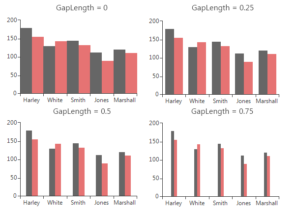

# Bar


## 

BarSeries are used to visualize data points as bar blocks where the height of each bar denotes the magnitude of its value.
          As a descendant of Categorical series, Bars require one categorical and one numerical axis. The following snippet demonstrates
          how to manually populate two BarSeries:
        #_[C#] _

	


{{source=..\SamplesCS\ChartView\Series\BarSeriesForm.cs region=bar}} 
{{source=..\SamplesVB\ChartView\Series\BarSeriesForm.vb region=bar}} 

````C#
            BarSeries barSeries = new BarSeries("Performance", "RepresentativeName");
            barSeries.Name = "Q1";
            barSeries.DataPoints.Add(new CategoricalDataPoint(177, "Harley"));
            barSeries.DataPoints.Add(new CategoricalDataPoint(128, "White"));
            barSeries.DataPoints.Add(new CategoricalDataPoint(143, "Smith"));
            barSeries.DataPoints.Add(new CategoricalDataPoint(111, "Jones"));
            barSeries.DataPoints.Add(new CategoricalDataPoint(118, "Marshall")); 
            this.radChartView1.Series.Add(barSeries);

            BarSeries barSeries2 = new BarSeries("Performance", "RepresentativeName");
            barSeries2.Name = "Q2";
            barSeries2.DataPoints.Add(new CategoricalDataPoint(153, "Harley"));
            barSeries2.DataPoints.Add(new CategoricalDataPoint(141, "White"));
            barSeries2.DataPoints.Add(new CategoricalDataPoint(130, "Smith"));
            barSeries2.DataPoints.Add(new CategoricalDataPoint(88, "Jones"));
            barSeries2.DataPoints.Add(new CategoricalDataPoint(109, "Marshall"));
            this.radChartView1.Series.Add(barSeries2);
````
````VB.NET
        Dim barSeries As New Telerik.WinControls.UI.BarSeries("Performance", "RepresentativeName")
        barSeries.Name = "Q1"
        barSeries.DataPoints.Add(New CategoricalDataPoint(177, "Harley"))
        barSeries.DataPoints.Add(New CategoricalDataPoint(128, "White"))
        barSeries.DataPoints.Add(New CategoricalDataPoint(143, "Smith"))
        barSeries.DataPoints.Add(New CategoricalDataPoint(111, "Jones"))
        barSeries.DataPoints.Add(New CategoricalDataPoint(118, "Marshall"))
        Me.RadChartView1.Series.Add(barSeries)

        Dim barSeries2 As New Telerik.WinControls.UI.BarSeries("Performance", "RepresentativeName")
        barSeries2.Name = "Q2"
        barSeries2.DataPoints.Add(New CategoricalDataPoint(153, "Harley"))
        barSeries2.DataPoints.Add(New CategoricalDataPoint(141, "White"))
        barSeries2.DataPoints.Add(New CategoricalDataPoint(130, "Smith"))
        barSeries2.DataPoints.Add(New CategoricalDataPoint(88, "Jones"))
        barSeries2.DataPoints.Add(New CategoricalDataPoint(109, "Marshall"))
        Me.RadChartView1.Series.Add(barSeries2)
        '
````

{{endregion}} 


BarSeries could be customized using the following properties:
        

* __ShowLabels__ – a Boolean property that indicates whether
              the labels of each bar should be displayed.
              The specific position of the labels is determined by the orientation (vertical
              or horizontal) and the CombineMode (None, Cluster, Stack, Stack100) of the bars.
            

* __CombineMode__ – a common property for all categorical series,
              which introduces a mechanism for combining data points that reside in different
              series but have the same category. The combine mode can be
              __None__, __Cluster__,
              __Stack__ and __Stack100__.
              __None__ means that the series will be plotted independently of each other,
              so that they are overlapping. __Cluster__ displays data points in the same category
              huddled close together. __Stack__ plots the points on top of
              each other and __Stack100__
              will display the value as percent. The combine mode is best described by a picture
              (Left - Stack, Right – Stack100):
            

* __GapLength__ – a property exposed by both __CategoricalAxis__
              and __DateTimeContinuousAxis__, which controls the distance between bar groups as
              percent. Note that the value should be between 0 and 1, where a value of 0 means
              that a bar would take the entire space between two ticks, while a value of 1 means
              the bar will have zero width as all the space should appear as gap. Here is how to
              set the GapLength:
            #_[C#] _

	


{{source=..\SamplesCS\ChartView\Series\BarSeriesForm.cs region=gapLength}} 
{{source=..\SamplesVB\ChartView\Series\BarSeriesForm.vb region=gapLength}} 

````C#
            (barSeries.HorizontalAxis as CategoricalAxis).GapLength = 0.75;
````
````VB.NET
        TryCast(barSeries.HorizontalAxis, CategoricalAxis).GapLength = 0.75
        '
````

{{endregion}} 


The following image demonstrates how different values of the __GapLength__ property
              change the BarSeries:
            

* __StackGroupKey__ all cartesian series that support stacking can be grouped in separate stacks.
            Here are four BarSeries stacked into two groups:
            To achieve this add four BarSeries and set the __StackGroupKey__ property of two of them to 1.
            
