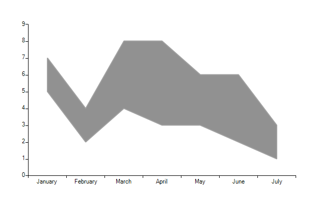

# Range and RangeBar

## Range series

The __Range__ series allows you to a define range with each data point. 
        

You can use the following code to display a simple RangeSeries

#### __[C#] __

{{region Range}}
	            RangeSeries rangeSeries = new RangeSeries();
	            rangeSeries.DataPoints.Add(new RangeDataPoint(9, 5, "January"));
	            rangeSeries.DataPoints.Add(new RangeDataPoint(7, 2, "February"));
	            rangeSeries.DataPoints.Add(new RangeDataPoint(6, 4, "March"));
	            rangeSeries.DataPoints.Add(new RangeDataPoint(8, 5, "April"));
	            rangeSeries.DataPoints.Add(new RangeDataPoint(4, 3, "May"));
	            rangeSeries.DataPoints.Add(new RangeDataPoint(9, 7, "June"));
	            rangeSeries.DataPoints.Add(new RangeDataPoint(3, 1, "July"));
	            radChartView1.Series.Add(rangeSeries);
	{{endregion}}

#### __[VB.NET] __

{{region Range}}
	        Dim rangeSeries As New RangeSeries()
	        rangeSeries.DataPoints.Add(New RangeDataPoint(5, 9, "January"))
	        rangeSeries.DataPoints.Add(New RangeDataPoint(7, 2, "February"))
	        rangeSeries.DataPoints.Add(New RangeDataPoint(6, 4, "March"))
	        rangeSeries.DataPoints.Add(New RangeDataPoint(8, 5, "April"))
	        rangeSeries.DataPoints.Add(New RangeDataPoint(4, 3, "May"))
	        rangeSeries.DataPoints.Add(New RangeDataPoint(9, 7, "June"))
	        rangeSeries.DataPoints.Add(New RangeDataPoint(3, 1, "July"))
	        radChartView1.Series.Add(rangeSeries)
	        '#End Region 
	        '#Region "Bar"
	        Dim rangeBarSeries As New RangeBarSeries()
	        rangeBarSeries.DataPoints.Add(New RangeDataPoint(7, 5, "January"))
	        rangeBarSeries.DataPoints.Add(New RangeDataPoint(4, 2, "February"))
	        rangeBarSeries.DataPoints.Add(New RangeDataPoint(8, 4, "March"))
	        rangeBarSeries.DataPoints.Add(New RangeDataPoint(8, 3, "April"))
	        rangeBarSeries.DataPoints.Add(New RangeDataPoint(6, 3, "May"))
	        rangeBarSeries.DataPoints.Add(New RangeDataPoint(6, 2, "June"))
	        rangeBarSeries.DataPoints.Add(New RangeDataPoint(3, 1, "July"))
	        radChartView1.Series.Add(rangeBarSeries)
	        '#End Region
	
	    End Sub
	End Class
	

## RangeBar series

This series is visualized on the screen as separate rectangles representing each of the DataPoints. 
       

You can use the following code to display a simple RangeBarSeries

#### __[C#] __

{{region Bar}}
	            RangeBarSeries rangeBarSeries = new RangeBarSeries();
	            rangeBarSeries.DataPoints.Add(new RangeDataPoint(7, 5, "January"));
	            rangeBarSeries.DataPoints.Add(new RangeDataPoint(4, 2, "February"));
	            rangeBarSeries.DataPoints.Add(new RangeDataPoint(8, 4, "March"));
	            rangeBarSeries.DataPoints.Add(new RangeDataPoint(8, 3, "April"));
	            rangeBarSeries.DataPoints.Add(new RangeDataPoint(6, 3, "May"));
	            rangeBarSeries.DataPoints.Add(new RangeDataPoint(6, 2, "June"));
	            rangeBarSeries.DataPoints.Add(new RangeDataPoint(3, 1, "July"));
	            radChartView1.Series.Add(rangeBarSeries);
	{{endregion}}

#### __[VB.NET] __

{{region Bar}}
	        Dim rangeBarSeries As New RangeBarSeries()
	        rangeBarSeries.DataPoints.Add(New RangeDataPoint(7, 5, "January"))
	        rangeBarSeries.DataPoints.Add(New RangeDataPoint(4, 2, "February"))
	        rangeBarSeries.DataPoints.Add(New RangeDataPoint(8, 4, "March"))
	        rangeBarSeries.DataPoints.Add(New RangeDataPoint(8, 3, "April"))
	        rangeBarSeries.DataPoints.Add(New RangeDataPoint(6, 3, "May"))
	        rangeBarSeries.DataPoints.Add(New RangeDataPoint(6, 2, "June"))
	        rangeBarSeries.DataPoints.Add(New RangeDataPoint(3, 1, "July"))
	        radChartView1.Series.Add(rangeBarSeries)
	        '#End Region
	
	    End Sub
	End Class
	

