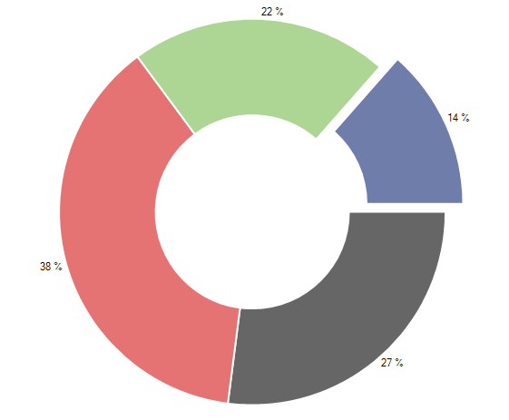

# Donut

## 

Similarly to Pie series, Donut series do not use axes. They visualize each data point as a slice with arc size directly proportional to the
          magnitude of the raw data point’s value. It is important to note that the donut series are valid only in the context of Pie AreaType.
          Donut pieces represent data in one dimension contrasting with the other series which represent data in two dimensions. Here is an example
          of how to create donut series populated with data:
        

#### __[C#] __

{{source=..\SamplesCS\ChartView\Series\DonutSeriesForm.cs region=donut}}
	            this.radChartView1.AreaType = ChartAreaType.Pie;
	            DonutSeries series = new DonutSeries();
	            series.DataPoints.Add(new PieDataPoint(50, "Germany"));
	            series.DataPoints.Add(new PieDataPoint(70, "United States"));
	            series.DataPoints.Add(new PieDataPoint(40, "France"));
	            series.DataPoints.Add(new PieDataPoint(25, "United Kingdom"));
	            series.ShowLabels = true;
	            this.radChartView1.Series.Add(series);
	{{endregion}}

#### __[VB.NET] __

{{source=..\SamplesVB\ChartView\Series\DonutSeriesForm.vb region=donut}}
	        Me.RadChartView1.AreaType = ChartAreaType.Pie
	        Dim series As New DonutSeries()
	        series.DataPoints.Add(New PieDataPoint(50, "Germany"))
	        series.DataPoints.Add(New PieDataPoint(70, "United States"))
	        series.DataPoints.Add(New PieDataPoint(40, "France"))
	        series.DataPoints.Add(New PieDataPoint(25, "United Kingdom"))
	        series.ShowLabels = True
	        Me.RadChartView1.Series.Add(series)
	{{endregion}}

DonutSeries can be customized using the following properties:

* __Range__ - the property consists of two parameters __StartAngle__
              and __SweepAngle__. __StartAngle__ sets the angle in degrees from
              which the drawing of the pie segments will begin. Note that pie slices are always rendered in counter-clockwise direction.
              __SweepAngle__ determines if the chart will appear as a full circle or a partial circle.
              The snippet below illustrates DonutSeries how to set the __Range__ property:
            

#### __[C#] __

{{source=..\SamplesCS\ChartView\Series\DonutSeriesForm.cs region=donutAngleRange}}
	            AngleRange range = new AngleRange(270, 300);
	            series.Range = range;
	{{endregion}}

#### __[VB.NET] __

{{source=..\SamplesVB\ChartView\Series\DonutSeriesForm.vb region=donutAngleRange}}
	        Dim range As New AngleRange(270, 300)
	        series.Range = range
	{{endregion}}

* __ShowLabels__ - the property determines whether the labels above each point will be visible;
            

* __RadiusFactor__ - the property can increase and decrease the diameter of the series. Setting the
              __RadiusFactor__ to *0.9* will decrease the radius of the series by *10 percent*.
              Similarly, the value *1.1* will increase it. Leaving the property with value *1*
              will make the donut fill the available space.
            

* __InnerRadiusFactor__ - – the property is used to determine the inner radius of the donut series.
              Like __RadiusFactor__, its value is used as a percentage of the whole radius.
            

Additionally, DonutSeries allows offsetting a pie segment from the rest of the slices. This is achieved through
          the __OffsetFromCenter__ property of the individual __PieDataPoint__.
          The following snippet demonstrates how to shift the first pie piece:
        

#### __[C#] __

{{source=..\SamplesCS\ChartView\Series\DonutSeriesForm.cs region=donutOffset}}
	            PieDataPoint point = series.DataPoints[3] as PieDataPoint;
	            if (point != null)
	            {
	                point.OffsetFromCenter = 0.1;
	            }
	{{endregion}}

#### __[VB.NET] __

{{source=..\SamplesVB\ChartView\Series\DonutSeriesForm.vb region=donutOffset}}
	        Dim point As PieDataPoint = TryCast(series.DataPoints(3), PieDataPoint)
	        If point IsNot Nothing Then
	            point.OffsetFromCenter = 0.1
	        End If
	{{endregion}}

