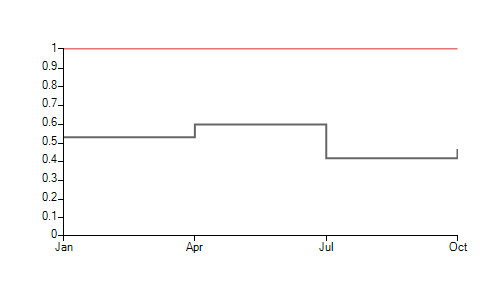

# Stepline

__SteplineSeries__ plot their Categorical data points on Cartesian Area using one categorical and one numerical axis. Points are connected with two straight lines one horizontal and one vertical with an 90° angle between them. Here is how to set up two stepline series:
      

#### __[C#]__

{{region Initialize}}
	            SteplineSeries lineSeries = new SteplineSeries();
	            lineSeries.DataPoints.Add(new CategoricalDataPoint(20, "Jan"));
	            lineSeries.DataPoints.Add(new CategoricalDataPoint(22, "Apr"));
	            lineSeries.DataPoints.Add(new CategoricalDataPoint(12, "Jul"));
	            lineSeries.DataPoints.Add(new CategoricalDataPoint(19, "Oct"));
	            this.radChartView1.Series.Add(lineSeries);
	
	            SteplineSeries lineSeries2 = new SteplineSeries();
	            lineSeries2.DataPoints.Add(new CategoricalDataPoint(18, "Jan"));
	            lineSeries2.DataPoints.Add(new CategoricalDataPoint(15, "Apr"));
	            lineSeries2.DataPoints.Add(new CategoricalDataPoint(17, "Jul"));
	            lineSeries2.DataPoints.Add(new CategoricalDataPoint(22, "Oct"));
	            this.radChartView1.Series.Add(lineSeries2);
	{{endregion}}

#### __[VB]__

{{region Initialize}}
	        Dim lineSeries As New SteplineSeries()
	        lineSeries.DataPoints.Add(New CategoricalDataPoint(20, "Jan"))
	        lineSeries.DataPoints.Add(New CategoricalDataPoint(22, "Apr"))
	        lineSeries.DataPoints.Add(New CategoricalDataPoint(12, "Jul"))
	        lineSeries.DataPoints.Add(New CategoricalDataPoint(19, "Oct"))
	        Me.RadChartView1.Series.Add(lineSeries)
	
	        Dim lineSeries2 As New SteplineSeries()
	        lineSeries2.DataPoints.Add(New CategoricalDataPoint(18, "Jan"))
	        lineSeries2.DataPoints.Add(New CategoricalDataPoint(15, "Apr"))
	        lineSeries2.DataPoints.Add(New CategoricalDataPoint(17, "Jul"))
	        lineSeries2.DataPoints.Add(New CategoricalDataPoint(22, "Oct"))
	        Me.RadChartView1.Series.Add(lineSeries2)
	{{endregion}}

## 

The essential properties of SteplineSeries are:

* __BorderWidth__ - the property determines the thickness of the lines
            

* __PointSize__ - the property denotes the size of the points
            

* __ShowLabels__ - the property determines whether the labels above each point will be visible
            

* __CombineMode__ - a common property for all categorical series, which introduces a mechanism for combining data points that reside in different series but have the same category. The combine mode can be None, __Cluster__, __Stack__ and __Stack100__. In the case of stepline series, __None__ and __Cluster__ mean that the series will be plotted independently of each other, so that they are overlapping. __Stack__ plots the points on top of each other and __Stack100__ presents the values of one series as a percentage of the other series. The combine mode is best described by a picture:
            

None/Cluster

Stack

Stack100
