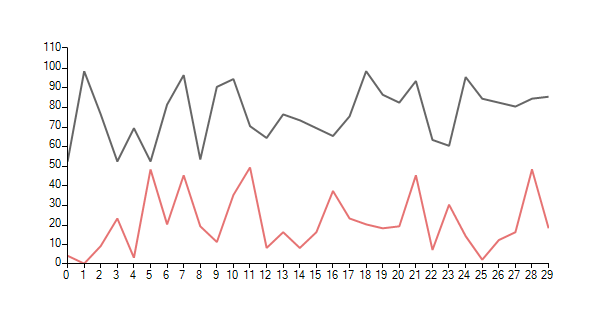

# FastLine

__FastLineSeries__ is inheriting the default line series but the performance is considerably improved. This type of series can be used for system performance monitoring or with chart than need to display thousands data points. The cost of the improved performance is that you cannot display labels or plot points.

The following code snipped shows how you can add __FastLineSeries__ to __RadChartView__.

#### Initial Setup

{{source=..\SamplesCS\ChartView\Series\LineSeriesForm.cs region=fast}} 
{{source=..\SamplesVB\ChartView\Series\LineSeriesForm.vb region=fast}} 

````C#
Random rnd = new Random();
FastLineSeries series = new FastLineSeries();
FastLineSeries series1 = new FastLineSeries();
for (int i = 0; i < 50; i++)
{
    series.DataPoints.Add(new CategoricalDataPoint(rnd.Next(50, 100), i));
    series1.DataPoints.Add(new CategoricalDataPoint(rnd.Next(50), i));
}
radChartView1.Series.Add(series);
radChartView1.Series.Add(series1);

````
````VB.NET
Dim rnd As New Random()
Dim series As New FastLineSeries()
Dim series1 As New FastLineSeries()
For i As Integer = 0 To 49
    series.DataPoints.Add(New CategoricalDataPoint(rnd.Next(50, 100), i))
    series1.DataPoints.Add(New CategoricalDataPoint(rnd.Next(50), i))
Next i
RadChartView1.Series.Add(series)
RadChartView1.Series.Add(series1)

````

{{endregion}}

>caption Figure 1: Initial Setup


# See Also

* [Series Types]()
* [Populating with Data]()