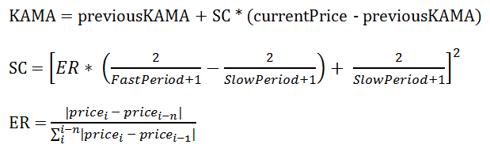
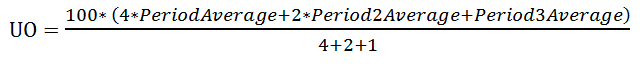

# Supported Indicators

The article provides a brief description and a list of the important properties of each indicator supported by __RadChartView__. The indicators are divided in the following groups: Moving Average, Bands, Momentum and Volatility.

## Moving Average Indicators

* __Moving Average (MA), aka Simple Moving Average (SMA)__, provides an average value of the past N-days data. Its __Period__ property defines __N__ – the number of past days it uses to calculate its current value.

* __Exponential Moving Average (EMA)__ is calculated on three stages: (1) calculate the simple moving average, (2) calculate the weighting multiplier, and (3) calculate the exponential moving average. The formula can be expressed as follows: EMA = currentPrice * SF + previousEMA * (1 – SF), where SF = 2 / (N + 1) Because it uses simple moving average, the EMA exposes a __Period__ property which sets __N__ in the formula above.  

* __Modified Exponential Moving Average (MEMA)__ differs from EMA only by the calculation of SF: EMA = currentPrice * SF + previousEMA * (1 – SF), where SF = 1 / N 

* __Modified Moving Average (MMA)__ calculates the value of its first point just like the simple moving average indicator. Each subsequent point, however, is produced by adding the new price and subtracting the last average. The __Period__ property defines the period of the simple moving average indicator

* __Weighted Moving Average (WMA)__ applies multiplying factors to past values before averaging them in order to give data different weights. The multiplier for each past datum is fraction where the numerator is the numeral of the day number and the denominator is the sum of days as a triangular number. This approach ensures that more recent data have higher weights. Because WMA uses simple moving average it exposes a __Period__ property which determines the number of past days data used in the calculations.

* __Kaufman Adaptive Moving Average (KAMA)__ uses three parameters to calculate its value: __Period__, __SlowPeriod__ and __FastPeriod__. The formula of the indicator is:

>caption Fig.1 Kaufman Formula

## Momentum Indicators      

* __Moving Average Convergence Divergence (MACD)__ is one of the most frequently used indicators. It constructs two exponential moving averages and subtracts them to end up with an oscillator. The two EMAs use different Periods, defined by the __ShortPeriod__ and __LongPeriod__ properties of the MACD, and are often referred to as short EMA and long EMA, respectively. Once the long EMA is subtracted from the short EMA, MACD uses the differences to feed a third EMA with period determined by the __SignalPeriod__. The following steps give a simplified explanation of the MACD construction:

1. Creates a short Exponential Moving Average with period equal to the __ShortPeriod__ property.

1. Creates a long Exponential Moving Average with period equal to the __LongPeriod__ property.

1. Subtract the long EMA values from the short EMA values and use the differences to construct a third EMA with period determined by the __SignalPeriod__ property.

* __Relative Strength Index (RSI)__ is extremely popular indicator that measures the speed and change of price movements. It uses the following formula: RSI = 100 – 100 / RSRS = Average Gain / Average Loss

* __Commodity Channel Index (CCI)__ is based on the notion of Typical Prices defined by the average of the current high, low and close values. CCI calculation involves the following steps:

1. Calculate the Typical Price, where TP = (High + Close + Low) / 3

1. Calculate the Moving Average of the Typical Prices (MATP)

1. Calculate the Mean Deviation (MD)

1. Calculate the Commodity Channel Index, where CCI = (TP – MATP) / (0.0015 * MD)

* __Stochastic Fast indicator__ consists of two lines, called __%K__ and __%D__. The former is calculated based on the following formula: %K = (CurrentClose – PeriodLow) / (PeriodHigh - PeriodLow) * 100Where __PeriodLow__is the lowest Low of the __MainPeriod__ and the __PeriodHigh__ is the highest __High__ in the __MainPeriod__. The __%D__ line is indeed a simple __Moving Average__ of the __%K__ values with period determined by the __SignalPeriod__ property.

* __Stochastic Slow__ is highly similar to the __Stochastic Fast indicator__. Their main difference, however, is sensitivity. The __%K__ line of the __Stochastic Slow indicator__ is the __%D__ line of the __Stochastic Fast indicator__. Further, the __%D__ of the __Stochastic Slow indicator__ is again the __Simple Moving Average__ of the __%K__ line using period determined by the __SlowingPeriod__ property.

* __Triple Exponential Average (TRIX)__ is the derivative of a triple-smoothed __Exponential Moving Average__. Its calculation involves the following steps:

1. Create an N-day Exponential Moving Average (EMA1) using the closing prices

1. Create an N-day Exponential Moving Average (EMA2) using the values of EMA1

1. Create an N-day Exponential Moving Average (EMA3) using the values of EMA2

1. Calculate the difference between current EMA3 and previous EMA3 value in that final smoothed series

* __Relative Momentum Index (RMI)__ was created by modifying the __Relative Strength Indicator (RSI)__. The changed formula is RMI = RM / (1 + RM)Where RM = average up momentum (over N-period) / average down momentum (over N-period)

>caption Fig.2 Relative Momentum

* __Momentum indicator__ is designed to identify the speed of price movement. RadChartView uses the following formula to calculate the Momentum values: M = (CurrentPrice – NPrice) * 100, where NPrice is the closing price N days ago

* __Rate of Change (ROC)__ is highly similar to the __Momentum indicator__. The modified formula is: ROC = 100 * (CurrentPrice – NPrice) / NPrice, where NPrice is the closing price N days ago

* __Oscillator indicator__ creates two averages – short averages, which takes the __ShortPeriod__ number of previous values, and the long average, which uses the __LongPeriod__ number of previous data. The oscillator uses the difference of the short and the long averages divided by the short average to produce its final values.

* __Rapid Adaptive Variance Indicator (RAVI)__ measures trend intensity instead of trend direction. RAVI is highly similar to the __Oscillator indicator__ – it uses short and long averages of the previous data. Their difference is in the final step of calculations. Unlike __Oscillator__, RAVI divides the difference of the long and short averages by the long average. The result is again multiplied by __100__.

## Volatility Indicators

* __True Range indicator__ measures volatility. Its first value is the difference of the high and low values for the day. Each consecutive value is equal to the greatest of the following: previous close value minus the current low value, and the current high value minus the previous close value.

* __Average True Range__ is the simple __Moving Average__ of the __True Range indicator__

## Band Indicators

* __Bollinger Bands__ consists of two bands that aim to provide a relative definition of high and low. The indicator uses a simple __Moving Average__ as a starting point and forms its two bands using the following formulas: Upper band: MA + (N-period standard deviation * K)Lower band: MA – (N-period standard deviation * K)N is defined by the Period property. A typical value for N is 20.K is defined by the StandardDeviations property. A typical value for K is 2.

# See Also

* [Series Types]()
* [Populating with Data]()