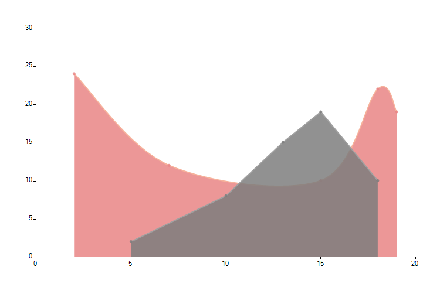
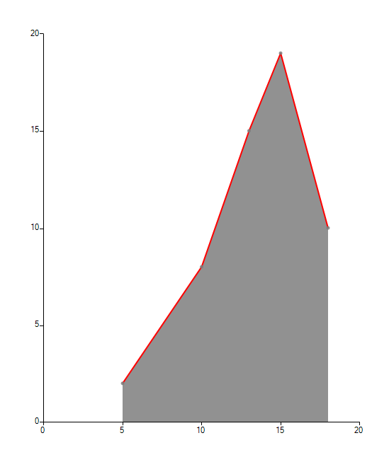

# ScatterArea


## 

__ScatterAreaSeries__ plot their data using two numerical values. Once positioned on a plane the points are connected to form a line. Further, the area enclosed by this line and the categorical axis is filled. Below is a sample snippet that demonstrates how to set up two ScaterArea series: 
 

{{source=..\SamplesCS\ChartView\Series\ScatterAreraCode.cs region=Area}} 
{{source=..\SamplesVB\ChartView\Series\ScatterAreraCode.vb region=Area}} 

````C#
ScatterAreaSeries scatterSeries = new ScatterAreaSeries();
scatterSeries.DataPoints.Add(new ScatterDataPoint(15, 19));
scatterSeries.DataPoints.Add(new ScatterDataPoint(18, 10));
scatterSeries.DataPoints.Add(new ScatterDataPoint(13, 15));
scatterSeries.DataPoints.Add(new ScatterDataPoint(10, 8));
scatterSeries.DataPoints.Add(new ScatterDataPoint(5, 2));
this.radChartView1.Series.Add(scatterSeries);
ScatterAreaSeries scatterSeries2 = new ScatterAreaSeries();
scatterSeries2.DataPoints.Add(new ScatterDataPoint(2, 24));
scatterSeries2.DataPoints.Add(new ScatterDataPoint(7, 12));
scatterSeries2.DataPoints.Add(new ScatterDataPoint(15, 10));
scatterSeries2.DataPoints.Add(new ScatterDataPoint(18, 22));
scatterSeries2.DataPoints.Add(new ScatterDataPoint(19, 19));
scatterSeries2.Spline = true;
this.radChartView1.Series.Add(scatterSeries2);

````
````VB.NET
Dim scatterSeries As New ScatterAreaSeries()
scatterSeries.DataPoints.Add(New ScatterDataPoint(15, 19))
scatterSeries.DataPoints.Add(New ScatterDataPoint(18, 10))
scatterSeries.DataPoints.Add(New ScatterDataPoint(13, 15))
scatterSeries.DataPoints.Add(New ScatterDataPoint(10, 8))
scatterSeries.DataPoints.Add(New ScatterDataPoint(5, 2))
Me.radChartView1.Series.Add(scatterSeries)
Dim scatterSeries2 As New ScatterAreaSeries()
scatterSeries2.DataPoints.Add(New ScatterDataPoint(2, 24))
scatterSeries2.DataPoints.Add(New ScatterDataPoint(7, 12))
scatterSeries2.DataPoints.Add(New ScatterDataPoint(15, 10))
scatterSeries2.DataPoints.Add(New ScatterDataPoint(18, 22))
scatterSeries2.DataPoints.Add(New ScatterDataPoint(19, 19))
scatterSeries2.Spline = True
Me.radChartView1.Series.Add(scatterSeries2)

````

{{endregion}} 


## Properties

The following list shows the most important properties of the ScaterArea series

* __XValueMember:__ If a DataSource is set, the property determines the name of the field that holds the XValue.

* __YValueMember:__ If a DataSource is set, the property determines the name of the field that holds the YValue.

* __Spline:__ Boolean property, which indicates whether the series will draw straight lines of smooth curves.

* __SplineTension:__ The property sets the tension of the spline. The property will have effect only if the Spline property is set to true.

* __StrokeMode:__ This property controls what part of the area border should be marked with line. 

	


{{source=..\SamplesCS\ChartView\Series\ScatterAreraCode.cs region=Stroke}} 
{{source=..\SamplesVB\ChartView\Series\ScatterAreraCode.vb region=Stroke}} 

````C#
scatterSeries.StrokeMode = AreaSeriesStrokeMode.Points;

````
````VB.NET
scatterSeries2.StrokeMode = AreaSeriesStrokeMode.Points

````

{{endregion}} 


