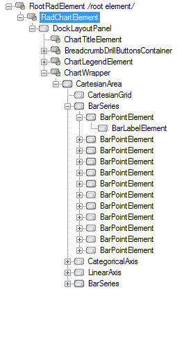
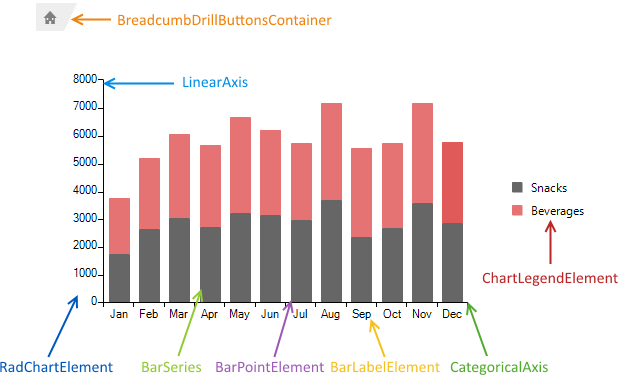
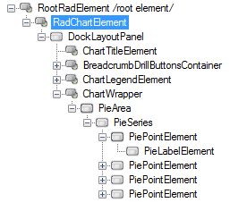
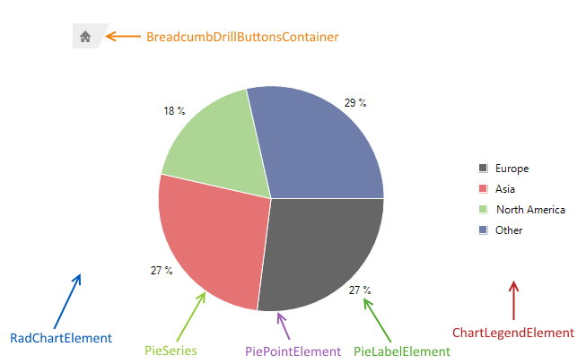

# Structure

This article describes the inner structure and organization of the elements which build the __RadChartView__ control.

* [Cartesian Area](#cartesian-area)

* [Polar Area](#polar-area)

* [Pie Area](#pie-area)

>tip The element hierarchy and structure will vary depending on the area and series types displayed in __RadChartView__.
>

## Cartesian Area

The featured example illustrates the hierarchy defined by two [BarSeries](%slug winforms/chartview-/series-types/bar%}) added to __RadChartView__.

>caption Figure 1: RadChartView`s Element Hierarchy

>caption Figure 2: RadChartViews`s Structure

* __RadChartElement:__ Represents the main element of __RadChartView__.
* __BreadcrumbDrilButtonsContainer:__ Container element of the buttons needed by the __DrillDownController__.
* __ChartLegendElement:__ Element defining the legend of the chart.
* __BarSeries:__ Each of the series displayed in __RadChartView__.
* __BarPointElement:__ A single visual element representing a logical data point.  
* __BarLabelElement:__ A point label.
* __CategoricalAxes:__ The horizontal axis of the chart.
* __LinearAxis:__ The vertical axis of the chart.

## Polar Area

The featured example illustrates the hierarchy defined by one [RadarSeries](%slug winforms/chartview-/series-types/radar%}) added to __RadChartView__.

>caption Figure 3: RadChartView`s Element Hierarchy

>caption Figure 4: RadChartViews`s Structure

* __RadChartElement:__ Represents the main element of __RadChartView__.
* __RadarLineSeries:__ Each of the series displayed in __RadChartView__.
* __RadarLinePointElement:__ A single visual element representing a logical data point.  
* __CategoricalRadialAxis:__ Categorical axis of the series.
* __PolarAxis:__ Polar axis of the series.
* __AxisLabelElement:__ Axis label.

## Pie Area

The featured example illustrates the hierarchy defined by three [PieSeries](%slug winforms/chartview-/series-types/pie%}) added to __RadChartView__.

>caption Figure 5: RadChartView`s Element Hierarchy

>caption Figure 6: RadChartViews`s Structure

* __RadChartElement:__ Represents the main element of __RadChartView__.
* __BreadcrumbDrilButtonsContainer:__ Container element of the buttons needed by the __DrillDownController__.
* __ChartLegendElement:__ Element defining the legend of the chart.
* __PieSeries:__ Each of the series displayed in __RadChartView__.
* __PiePointElement:__ A single visual element representing a logical data point.  
* __PieLabelElement:__ A point label.

## See Also

* [Design Time]()
* [Property Builder]()
* [Getting Started]()
* [Series Types]()