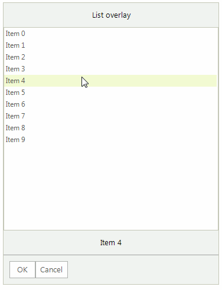
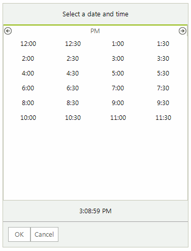

# Overlays

**RadChat** offers different overlays to present the user a selection of choices either as a pop up, or over the messages' view. The overlay is visible until the user selects a certain choice. 


Depending on the information that is presented and the choice that should be made, the overlays can be one of the types listed below. 

When you press the `OK` button, a new message will be automatically added with the selected option. The **SendMessage** event will be fired with the respective message as well. In the event handler you can change the message itself, e.g. modify its text.

## ChatCalendarOverlay

**ChatCalendarOverlay** offers to the user the opportunity to select a date from the calendar. 

>caption Figure 1: ChatCalendarOverlay

 

#### Adding a ChatCalendarOverlay

{{source=..\SamplesCS\Chat\ChatOverlaysActions.cs region=AddCalendarOverlay}} 
{{source=..\SamplesVB\Chat\ChatOverlaysActions.vb region=AddCalendarOverlay}}

````C#
            ChatCalendarOverlay calendarOverlay = new ChatCalendarOverlay("Select a date");
            bool showAsPopup = false;
            Author author = new Author(Properties.Resources.andrew1, "Andrew");
            ChatOverlayMessage overlayMessage = new ChatOverlayMessage(calendarOverlay, showAsPopup, author, DateTime.Now);
            this.radChat1.AddMessage(overlayMessage);   

````
````VB.NET
        Dim calendarOverlay As ChatCalendarOverlay = New ChatCalendarOverlay("Select a date") 
        Dim showAsPopup As Boolean = False
        Dim author As Author = New Author(My.Resources.andrew1, "Andrew")
        Dim overlayMessage As ChatOverlayMessage = New ChatOverlayMessage(calendarOverlay, showAsPopup, author, DateTime.Now)
        Me.radChat1.AddMessage(overlayMessage)

```` 


{{endregion}}

You have access to the calendar itself by the ChatCalendarOverlay.**Calendar** property. 

## ChatDateTimeOverlay

**ChatDateTimeOverlay** offers to the user the opportunity to select date and time from the picker. 

>caption Figure 2: ChatDateTimeOverlay

 

#### Adding a ChatDateTimeOverlay

{{source=..\SamplesCS\Chat\ChatOverlaysActions.cs region=AddDateTimeOverlay}} 
{{source=..\SamplesVB\Chat\ChatOverlaysActions.vb region=AddDateTimeOverlay}}

````C#
            ChatDateTimeOverlay calendarOverlay = new ChatDateTimeOverlay("Select a date and time",DateTime.Now); 
            bool showAsPopup = false;
            Author author = new Author(Properties.Resources.andrew1, "Andrew");
            ChatOverlayMessage overlayMessage = new ChatOverlayMessage(calendarOverlay, showAsPopup, author, DateTime.Now);
            this.radChat1.AddMessage(overlayMessage);     

````
````VB.NET
        Dim calendarOverlay As ChatDateTimeOverlay = New ChatDateTimeOverlay("Select a date and time", DateTime.Now)
        Dim showAsPopup As Boolean = False
        Dim author As Author = New Author(My.Resources.andrew1, "Andrew")
        Dim overlayMessage As ChatOverlayMessage = New ChatOverlayMessage(calendarOverlay, showAsPopup, author, DateTime.Now)
        Me.radChat1.AddMessage(overlayMessage)

```` 


{{endregion}}

## ChatListOverlay

**ChatListOverlay** offers to the user the opportunity to select an item from a predefined list of choices.

>caption Figure 3: ChatListOverlay

 

#### Adding a ChatListOverlay

{{source=..\SamplesCS\Chat\ChatOverlaysActions.cs region=AddListOverlay}} 
{{source=..\SamplesVB\Chat\ChatOverlaysActions.vb region=AddListOverlay}}

````C#
            ChatListOverlay listOverlay = new ChatListOverlay("List overlay");
            for (int i = 0; i < 10; i++)
            {
                listOverlay.ListView.Items.Add("Item " + i);
            }
            bool showAsPopup = false;
            Author author = new Author(Properties.Resources.andrew1, "Andrew");
            ChatOverlayMessage overlayMessage = new ChatOverlayMessage(listOverlay, showAsPopup, author, DateTime.Now);
            this.radChat1.AddMessage(overlayMessage);

````
````VB.NET
        Dim listOverlay As ChatListOverlay = New ChatListOverlay("List overlay")
        For i As Integer = 0 To 10 - 1
            listOverlay.ListView.Items.Add("Item " & i)
        Next

        Dim showAsPopup As Boolean = False
        Dim author As Author = New Author(My.Resources.andrew1, "Andrew")
        Dim overlayMessage As ChatOverlayMessage = New ChatOverlayMessage(listOverlay, showAsPopup, author, DateTime.Now)
        Me.radChat1.AddMessage(overlayMessage)

```` 


{{endregion}}

You have access to the list view by the ChatListOverlay.**ListView** property. 

## ChatTimeOverlay

**ChatTimeOverlay** offers to the user the opportunity to select time from the picker. 

>caption Figure 4: ChatListOverlay

 

#### Adding a ChatTimeOverlay

{{source=..\SamplesCS\Chat\ChatOverlaysActions.cs region=AddTimeOverlay}} 
{{source=..\SamplesVB\Chat\ChatOverlaysActions.vb region=AddTimeOverlay}}

````C#
            ChatTimeOverlay calendarOverlay = new ChatTimeOverlay("Select a date and time",DateTime.Now); 
            bool showAsPopup = false;
            Author author = new Author(Properties.Resources.andrew1, "Andrew");
            ChatOverlayMessage overlayMessage = new ChatOverlayMessage(calendarOverlay, showAsPopup, author, DateTime.Now);
            this.radChat1.AddMessage(overlayMessage);  

````
````VB.NET
        Dim calendarOverlay As ChatTimeOverlay = New ChatTimeOverlay("Select a date and time", DateTime.Now)
        Dim showAsPopup As Boolean = False
        Dim author As Author = New Author(My.Resources.andrew1, "Andrew")
        Dim overlayMessage As ChatOverlayMessage = New ChatOverlayMessage(calendarOverlay, showAsPopup, author, DateTime.Now)
        Me.radChat1.AddMessage(overlayMessage)

```` 


{{endregion}}

 
# See Also

* [Messages]()
* [Cards]()
* [Getting Started]()
 
        
