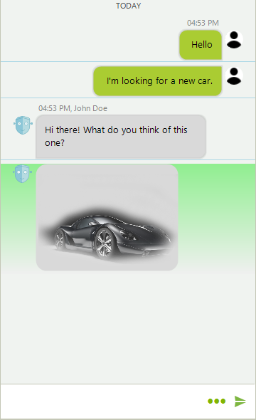
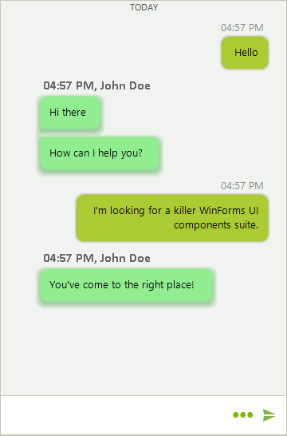

# Accessing and Customizing Elements

**RadChat** is virtualized and the displayed messages can be accessed in the RadChat.**ItemFormatting** formatting event.    

>note The [structure]() articles provides detailed information about the element hierarchy building the visual tree of the control.

**RadChat** is working with four different elements visually representing a message:

* **TextMessageItemElement**: Represents a single message item consisting of text.

* **MediaMessageItemElement**: Represents a single message item consisting of an image.

* **CardMessageItemElement**: A single message item presented in a card. The card item can have:

  * **ChatImageCardElement**: A card element with an image
  
  * **ChatFlightCardElement**: Predefined card element providing flight information.

  * **ChatProductCardElement**: Predefined card element providing product information.
  
  * **ChatWeatherCardElement**: Predefined card element providing weather information.
  
* **CarouselMessageItemElement**: Item element consisting of a horizontal stack which can be populated with *Image*, *Flight*, *Product*, and *Weather* cards. 

The chat toolbar and input text box are exposed as properties and they can be accessed through the **RadChatElement** object: RadChat.ChatElement.**InputTextBox**, RadChat.ChatElement.**ToolbarElement**.

# ItemFormatting Event

The **ItemFormatting** event can be used to access and change the styling of the message item elements.

>note Due to the virtualization, the event needs to be handled with an *if-else* statement so that the applied settings are reset for elements which will not be customized. 
>

#### Customizing The Main Item Elements

{{source=..\SamplesCS\Chat\ChatFormatting.cs region=RadChatItemFormatting}} 
{{source=..\SamplesVB\Chat\ChatFormatting.vb region=RadChatItemFormatting}}
````C#
private void RadChat1_ItemFormatting(object sender, ChatItemElementEventArgs e)
{
    if (e.ItemElement is TextMessageItemElement)
    {
        e.ItemElement.DrawBorder = true;
        e.ItemElement.BorderBoxStyle = Telerik.WinControls.BorderBoxStyle.FourBorders;
        e.ItemElement.BorderLeftColor = Color.Transparent;
        e.ItemElement.BorderTopColor = Color.Transparent;
        e.ItemElement.BorderRightColor = Color.Transparent;
        e.ItemElement.BorderBottomColor = Color.LightBlue;
    }
    else if (e.ItemElement is MediaMessageItemElement)
    {
        e.ItemElement.DrawFill = true;
        e.ItemElement.BackColor = Color.LightGreen;
    }
    else if (e.ItemElement is CardMessageItemElement)
    {
        e.ItemElement.DrawFill = true;
        e.ItemElement.BackColor = Color.LightBlue;
    }
    else if (e.ItemElement is CarouselMessageItemElement)
    {
        e.ItemElement.DrawFill = true;
        e.ItemElement.BackColor = Color.LightCoral;
    }
    else
    {
        e.ItemElement.ResetValue(LightVisualElement.DrawBorderProperty, Telerik.WinControls.ValueResetFlags.Local);
        e.ItemElement.ResetValue(LightVisualElement.BorderBoxStyleProperty, Telerik.WinControls.ValueResetFlags.Local);
        e.ItemElement.ResetValue(LightVisualElement.BorderLeftColorProperty, Telerik.WinControls.ValueResetFlags.Local);
        e.ItemElement.ResetValue(LightVisualElement.BorderRightColorProperty, Telerik.WinControls.ValueResetFlags.Local);
        e.ItemElement.ResetValue(LightVisualElement.BorderTopColorProperty, Telerik.WinControls.ValueResetFlags.Local);
        e.ItemElement.ResetValue(LightVisualElement.BorderBottomColorProperty, Telerik.WinControls.ValueResetFlags.Local);
        e.ItemElement.ResetValue(LightVisualElement.DrawFillProperty, Telerik.WinControls.ValueResetFlags.Local);
        e.ItemElement.ResetValue(LightVisualElement.BackColorProperty, Telerik.WinControls.ValueResetFlags.Local);
    }
}

````
````VB.NET
Private Sub RadChat1_ItemFormatting(ByVal sender As Object, ByVal e As ChatItemElementEventArgs)
    If TypeOf e.ItemElement Is TextMessageItemElement Then
        e.ItemElement.DrawBorder = True
        e.ItemElement.BorderBoxStyle = Telerik.WinControls.BorderBoxStyle.FourBorders
        e.ItemElement.BorderLeftColor = Color.Transparent
        e.ItemElement.BorderTopColor = Color.Transparent
        e.ItemElement.BorderRightColor = Color.Transparent
        e.ItemElement.BorderBottomColor = Color.LightBlue
    ElseIf TypeOf e.ItemElement Is MediaMessageItemElement Then
        e.ItemElement.DrawFill = True
        e.ItemElement.BackColor = Color.LightGreen
    ElseIf TypeOf e.ItemElement Is CardMessageItemElement Then
        e.ItemElement.DrawFill = True
        e.ItemElement.BackColor = Color.LightBlue
    ElseIf TypeOf e.ItemElement Is CarouselMessageItemElement Then
        e.ItemElement.DrawFill = True
        e.ItemElement.BackColor = Color.LightCoral
    Else
        e.ItemElement.ResetValue(LightVisualElement.DrawBorderProperty, Telerik.WinControls.ValueResetFlags.Local)
        e.ItemElement.ResetValue(LightVisualElement.BorderBoxStyleProperty, Telerik.WinControls.ValueResetFlags.Local)
        e.ItemElement.ResetValue(LightVisualElement.BorderLeftColorProperty, Telerik.WinControls.ValueResetFlags.Local)
        e.ItemElement.ResetValue(LightVisualElement.BorderRightColorProperty, Telerik.WinControls.ValueResetFlags.Local)
        e.ItemElement.ResetValue(LightVisualElement.BorderTopColorProperty, Telerik.WinControls.ValueResetFlags.Local)
        e.ItemElement.ResetValue(LightVisualElement.BorderBottomColorProperty, Telerik.WinControls.ValueResetFlags.Local)
        e.ItemElement.ResetValue(LightVisualElement.DrawFillProperty, Telerik.WinControls.ValueResetFlags.Local)
        e.ItemElement.ResetValue(LightVisualElement.BackColorProperty, Telerik.WinControls.ValueResetFlags.Local)
    End If
End Sub

````


{{endregion}}

>caption Figure 1: Text and Media Items 



>caption Figure 2: Card Items


>caption Figure 3: Carousel Item


#### Customizing the Child Items

{{source=..\SamplesCS\Chat\ChatFormatting.cs region=ItemFormattingCildren}} 
{{source=..\SamplesVB\Chat\ChatFormatting.vb region=ItemFormattingCildren}}
````C#
Font f = new Font("Calibri", 12f, FontStyle.Bold);
private void RadChat1_ItemFormattingCildren(object sender, ChatItemElementEventArgs e)
{
    ChatMessageAvatarElement avatar = e.ItemElement.AvatarPictureElement;
    ChatMessageNameElement name = e.ItemElement.NameLabelElement;
    ChatMessageStatusElement status = e.ItemElement.StatusLabelElement;
    LightVisualElement bubble = e.ItemElement.MainMessageElement;
    if (!e.ItemElement.IsOwnMessage && e.ItemElement is TextMessageItemElement)
    {
        avatar.DrawImage = false;
        name.Font = f;
        bubble.DrawFill = true;
        bubble.BackColor = Color.LightGreen;
        bubble.ShadowDepth = 3;
        bubble.ShadowColor = Color.Green;
    }
    else
    {
        avatar.ResetValue(LightVisualElement.ImageProperty, Telerik.WinControls.ValueResetFlags.Local);
        name.ResetValue(LightVisualElement.FontProperty, Telerik.WinControls.ValueResetFlags.All);
        status.ResetValue(LightVisualElement.VisibilityProperty, Telerik.WinControls.ValueResetFlags.Local);
        bubble.ResetValue(LightVisualElement.DrawFillProperty, Telerik.WinControls.ValueResetFlags.Local);
        bubble.ResetValue(LightVisualElement.BackColorProperty, Telerik.WinControls.ValueResetFlags.Local);
        bubble.ResetValue(LightVisualElement.ShadowDepthProperty, Telerik.WinControls.ValueResetFlags.Local);
        bubble.ResetValue(LightVisualElement.ShadowColorProperty, Telerik.WinControls.ValueResetFlags.Local);
    }
}

````
````VB.NET
Private f As Font = New Font("Calibri", 12.0F, FontStyle.Bold)
Private Sub RadChat1_ItemFormattingCildren(ByVal sender As Object, ByVal e As ChatItemElementEventArgs)
    Dim avatar As ChatMessageAvatarElement = e.ItemElement.AvatarPictureElement
    Dim name As ChatMessageNameElement = e.ItemElement.NameLabelElement
    Dim status As ChatMessageStatusElement = e.ItemElement.StatusLabelElement
    Dim bubble As LightVisualElement = e.ItemElement.MainMessageElement
    If Not e.ItemElement.IsOwnMessage AndAlso TypeOf e.ItemElement Is TextMessageItemElement Then
        avatar.DrawImage = False
        name.Font = f
        bubble.DrawFill = True
        bubble.BackColor = Color.LightGreen
        bubble.ShadowDepth = 3
        bubble.ShadowColor = Color.Green
    Else
        avatar.ResetValue(LightVisualElement.ImageProperty, Telerik.WinControls.ValueResetFlags.Local)
        name.ResetValue(LightVisualElement.FontProperty, Telerik.WinControls.ValueResetFlags.All)
        status.ResetValue(LightVisualElement.VisibilityProperty, Telerik.WinControls.ValueResetFlags.Local)
        bubble.ResetValue(LightVisualElement.DrawFillProperty, Telerik.WinControls.ValueResetFlags.Local)
        bubble.ResetValue(LightVisualElement.BackColorProperty, Telerik.WinControls.ValueResetFlags.Local)
        bubble.ResetValue(LightVisualElement.ShadowDepthProperty, Telerik.WinControls.ValueResetFlags.Local)
        bubble.ResetValue(LightVisualElement.ShadowColorProperty, Telerik.WinControls.ValueResetFlags.Local)
    End If
End Sub

````


{{endregion}}

>caption Figure 4: Customizing the Child Elements


# See Also

* [Structure]()
* [Getting Started]()
* [Toolbar]()
 
        
