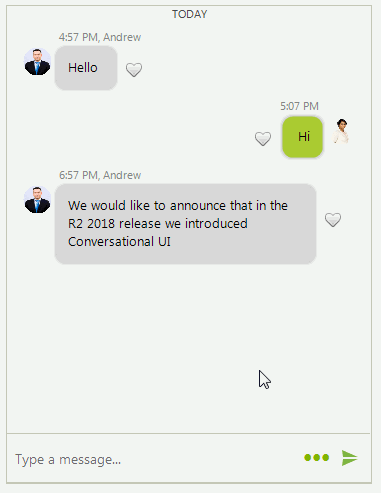

# Custom Items

By using the [ChatFactory](), it is possible to customize all visual elements and data items in the Chat UI. It is just necessary to create your own factory, override the relevant method where the element/item you want to replace is created and create your custom class. 

Each **BaseChatItemElement** can be customized according to any specific requirements. There are different methods which can be overridden according to inner element you want to modify:

* **CreateAvatarElement** - it creates the **ChatMessageAvatarElement**.
* **CreateNameLabel** - it creates the **ChatMessageNameElement**.
* **CreateStatusLabel** - it creates the **ChatMessageStatusElement**.
* **CreateMainMessageElement** - it creates the **ChatMessageBubbleElement**.
* **CreateChildElements** - it calls all of the above methods to create all internal elements of the message.

The following example demonstrates a sample code snippet how to add a button element next to the message indicating whether you like a certain message:

>caption Figure 1. Custom message

 

#### Creating a custom message

{{source=..\SamplesCS\Chat\ChatItemFactory.cs region=CustomMessage}} 
{{source=..\SamplesVB\Chat\ChatItemFactory.vb region=CustomMessage}}

````C#
private void CustomMessage()
{
    this.radChat1.ChatElement.ChatFactory = new MyChatFactory();
    this.radChat1.Author = new Author(Properties.Resources.nancy1, "Nancy");
    Author author2 = new Author(Properties.Resources.andrew1,"Andrew");
    ChatTextMessage message1 = new ChatTextMessage("Hello", author2,DateTime.Now.AddHours(1));
    this.radChat1.AddMessage(message1);
    ChatTextMessage message2 = new ChatTextMessage("Hi",  this.radChat1.Author,DateTime.Now.AddHours(1).AddMinutes(10));
    this.radChat1.AddMessage(message2);
    ChatTextMessage message3 = new ChatTextMessage("We would like to announce that in the R2 2018 release we introduced Conversational UI", author2,DateTime.Now.AddHours(3));
    this.radChat1.AddMessage(message3);
}
public class MyChatFactory : ChatFactory
{
    public override BaseChatItemElement CreateItemElement(BaseChatDataItem item)
    {
        if (item.GetType() == typeof(TextMessageDataItem))
        {
            return new MyTextMessageItemElement();
        }
        return base.CreateItemElement(item);
    }
}
public class MyTextMessageItemElement : TextMessageItemElement
{
    LightVisualButtonElement likeButton = new LightVisualButtonElement();
    protected override void CreateChildElements()
    {
        base.CreateChildElements();
        likeButton.NotifyParentOnMouseInput = true;
        likeButton.Image = Properties.Resources.heart_empty;
        likeButton.Click += likeButton_Click;
        likeButton.EnableElementShadow = false;
        likeButton.Margin = new Padding(10, 0, 10, 0);
        this.Children.Add(likeButton);
    }
    private void likeButton_Click(object sender, EventArgs e)
    {
        if (this.Data.Tag == null)
        {
            this.Data.Tag = true;
        }
        else
        {
            bool isLiked = (bool)this.Data.Tag;
            this.Data.Tag = !isLiked;
        } 
    }
    public override void Synchronize()
    {
        base.Synchronize();
        if (this.Data.Tag != null && (bool)this.Data.Tag == true)
        {
            this.likeButton.Image = Properties.Resources.heart_filled;
        }
        else
        {
            this.likeButton.Image = Properties.Resources.heart_empty;
        }
    }
    protected override SizeF ArrangeOverride(SizeF finalSize)
    {
         SizeF baseSize = base.ArrangeOverride(finalSize);
        RectangleF likeButtonRect;
        RectangleF clientRect = this.GetClientRectangle(finalSize);
        if (this.Data.ChatMessagesViewElement.ShowAvatars)
        {
            if (this.Data.ChatMessagesViewElement.ShowMessagesOnOneSide || !this.Data.IsOwnMessage)
            {
                likeButtonRect = new RectangleF(clientRect.X+this.AvatarPictureElement.DesiredSize.Width + this.MainMessageElement.DesiredSize.Width,
                    clientRect.Y + this.NameLabelElement.DesiredSize.Height+this.MainMessageElement.DesiredSize.Height/3,
                    this.likeButton.Image.Width, this.likeButton.Image.Height);
            }
            else
            {
                likeButtonRect = new RectangleF(clientRect.Right - likeButton.DesiredSize.Width - this.AvatarPictureElement.DesiredSize.Width - this.MainMessageElement.DesiredSize.Width,
                    clientRect.Y + this.NameLabelElement.DesiredSize.Height+this.MainMessageElement.DesiredSize.Height/3,
                    this.likeButton.Image.Width, this.likeButton.Image.Height);
            }
        }
        else
        { 
         if (this.Data.ChatMessagesViewElement.ShowMessagesOnOneSide || !this.Data.IsOwnMessage)
            {
                likeButtonRect = new RectangleF(clientRect.X+ this.MainMessageElement.DesiredSize.Width,
                    clientRect.Y + this.NameLabelElement.DesiredSize.Height+this.MainMessageElement.DesiredSize.Height/3,
                   this.likeButton.Image.Width, this.likeButton.Image.Height);
            }
            else
            {
                 likeButtonRect = new RectangleF(clientRect.Right - likeButton.DesiredSize.Width -  this.MainMessageElement.DesiredSize.Width,
                     clientRect.Y + this.NameLabelElement.DesiredSize.Height+this.MainMessageElement.DesiredSize.Height/3,
                     this.likeButton.Image.Width, this.likeButton.Image.Height);
            }
        }
        this.likeButton.Arrange(likeButtonRect);
         return baseSize;
    } 
}

````
````VB.NET
Private Sub CustomMessage()
    Me.radChat1.ChatElement.ChatFactory = New MyChatFactory()
    Me.radChat1.Author = New Author(My.Resources.nancy1, "Nancy")
    Dim author2 As Author = New Author(My.Resources.andrew1, "Andrew")
    Dim message1 As ChatTextMessage = New ChatTextMessage("Hello", author2, DateTime.Now.AddHours(1))
    Me.radChat1.AddMessage(message1)
    Dim message2 As ChatTextMessage = New ChatTextMessage("Hi", Me.radChat1.Author, DateTime.Now.AddHours(1).AddMinutes(10))
    Me.radChat1.AddMessage(message2)
    Dim message3 As ChatTextMessage = New ChatTextMessage("We would like to announce that in the R2 2018 release we introduced Conversational UI", author2, DateTime.Now.AddHours(3))
    Me.radChat1.AddMessage(message3)
End Sub
Public Class MyChatFactory
    Inherits ChatFactory
    Public Overrides Function CreateItemElement(ByVal item As BaseChatDataItem) As BaseChatItemElement
        If item.[GetType]() = GetType(TextMessageDataItem) Then
            Return New MyTextMessageItemElement()
        End If
        Return MyBase.CreateItemElement(item)
    End Function
End Class
Public Class MyTextMessageItemElement
    Inherits TextMessageItemElement
    Private likeButton As LightVisualButtonElement
    Protected Overrides Sub CreateChildElements()
        MyBase.CreateChildElements()
        likeButton = New LightVisualButtonElement()
        likeButton.NotifyParentOnMouseInput = True
        likeButton.Image = My.Resources.heart_empty
        AddHandler likeButton.Click, AddressOf likeButton_Click
        likeButton.EnableElementShadow = False
        likeButton.Margin = New Padding(10, 0, 10, 0)
        Me.Children.Add(likeButton)
    End Sub
    Private Sub likeButton_Click(ByVal sender As Object, ByVal e As EventArgs)
        If Me.Data.Tag Is Nothing Then
            Me.Data.Tag = True
        Else
            Dim isLiked As Boolean = CBool(Me.Data.Tag)
            Me.Data.Tag = Not isLiked
        End If
    End Sub
    Public Overrides Sub Synchronize()
        MyBase.Synchronize()
        If Me.Data.Tag IsNot Nothing AndAlso CBool(Me.Data.Tag) = True Then
            Me.likeButton.Image = My.Resources.heart_filled
        Else
            Me.likeButton.Image = My.Resources.heart_empty
        End If
    End Sub
    Protected Overrides Function ArrangeOverride(ByVal finalSize As SizeF) As SizeF
        Dim baseSize As SizeF = MyBase.ArrangeOverride(finalSize)
        Dim likeButtonRect As RectangleF
        Dim clientRect As RectangleF = Me.GetClientRectangle(finalSize)
        If Me.Data.ChatMessagesViewElement.ShowAvatars Then
            If Me.Data.ChatMessagesViewElement.ShowMessagesOnOneSide OrElse Not Me.Data.IsOwnMessage Then
                likeButtonRect = New RectangleF(clientRect.X + Me.AvatarPictureElement.DesiredSize.Width + Me.MainMessageElement.DesiredSize.Width, clientRect.Y + Me.NameLabelElement.DesiredSize.Height + Me.MainMessageElement.DesiredSize.Height / 3, Me.likeButton.Image.Width, Me.likeButton.Image.Height)
            Else
                likeButtonRect = New RectangleF(clientRect.Right - likeButton.DesiredSize.Width - Me.AvatarPictureElement.DesiredSize.Width - Me.MainMessageElement.DesiredSize.Width, clientRect.Y + Me.NameLabelElement.DesiredSize.Height + Me.MainMessageElement.DesiredSize.Height / 3, Me.likeButton.Image.Width, Me.likeButton.Image.Height)
            End If
        Else
            If Me.Data.ChatMessagesViewElement.ShowMessagesOnOneSide OrElse Not Me.Data.IsOwnMessage Then
                likeButtonRect = New RectangleF(clientRect.X + Me.MainMessageElement.DesiredSize.Width, clientRect.Y + Me.NameLabelElement.DesiredSize.Height + Me.MainMessageElement.DesiredSize.Height / 3, Me.likeButton.Image.Width, Me.likeButton.Image.Height)
            Else
                likeButtonRect = New RectangleF(clientRect.Right - likeButton.DesiredSize.Width - Me.MainMessageElement.DesiredSize.Width, clientRect.Y + Me.NameLabelElement.DesiredSize.Height + Me.MainMessageElement.DesiredSize.Height / 3, Me.likeButton.Image.Width, Me.likeButton.Image.Height)
            End If
        End If
        Me.likeButton.Arrange(likeButtonRect)
        Return baseSize
    End Function
End Class

```` 


{{endregion}}


# See Also

* [Overview]()
* [Messages]()
* [Cards]()
* [Overlays]()
* [Suggested Actions]()
* [ChatElementFactory]()

 
        
