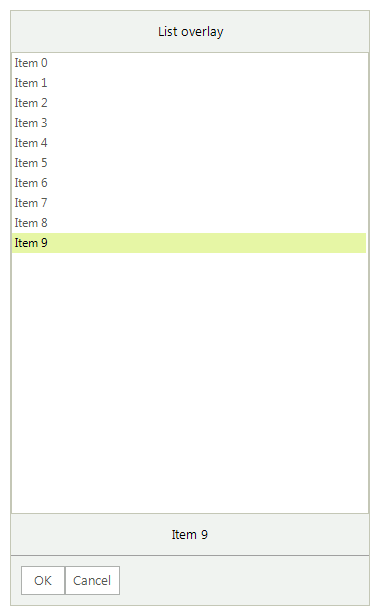
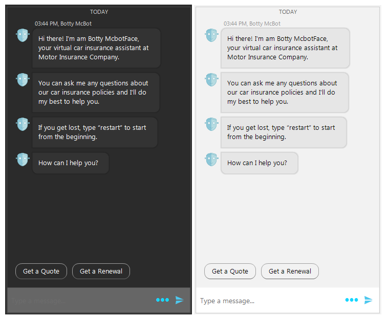

# RadChat

Since **R2 2018** Telerik UI for WinForms suite offers **RadChat**. This control provides rich conversational experience that goes beyond the natural language understanding and personality of your chatbot. This allows developers to easily implement conversational UI in their applications by utilizing AI powered framework that works with natural language processing, by following a predefined logical tree, or just for integrating P2P chat capabilities in their applications. 

>caption Figure 1: RadChat

 

## Key Features

- Integration with all the major conversational UI APIs or services available today – Microsoft Bot, Google’s API.AI, Amazon LEX, and more. 
- A variety of chat items for better user experience:
	* Messages: simple message, media message, time separator
	>caption Figure 2: Messages

	 
	* Cards: product cards, flight cards, weather cards, etc.
	>caption Figure 3: Cards

	 
	* Overlays: calendar, time picker, list, etc.
	>caption Figure 4: Overlays

	 
	* Suggested actions
	>caption Figure 5: Suggested Actions

	 
- Highly customizable message and card content
- Predefined themes
	>caption Figure 6: Themes

	 
	 

# See Also

* [Structure]()
* [Getting Started]()
 
        
