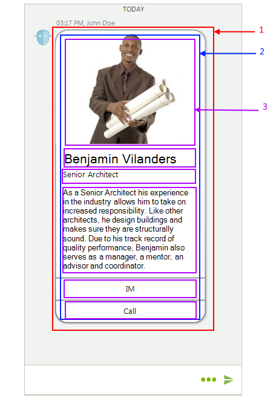
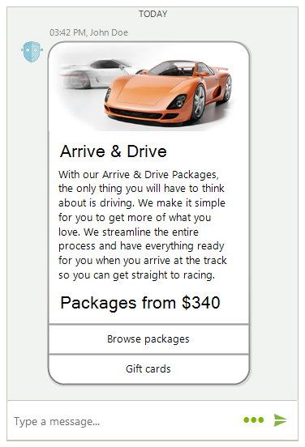
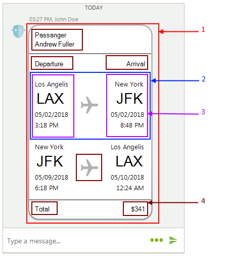

# Structure 

This article will get you familiar with the internal elements structure of **RadChat**.

>caption Figure 1: RadChat's elements hierarchy

 

>caption Figure 2: RadChat's visual structure

 

1. **RadChatElement** - the main element in **RadChat**.
2. **ChatMessagesViewElement** - the main container that hosts the messages.
3. **RadTextBoxElement** - the text box which handles user's input.
4. **ChatMessageNameElement** - represents the author's name and time of the message. 
5. **ChatMessageBubbleElement** - contains the message's content.
6. **ChatMessageAvatarElement** - represents the author's avatar. 
7. **TextMessageItemElement** - represents a single text message.
8. **MediaMessageItemElement** - represents a single image message.
9. **ChatTimeSeparatorItemElement** - time separator between the messages in different days.

>caption Figure 3: ChatImageCardElement's visual structure

 

1. **ChatImageCardElement** - represents an image card.
2. **StackLayoutPanel** - the container that host all information elements.
3. **LightVisualElement** - represents a single text/image element in the card.

**ChatProductCardElement** and **ChatWeatherCardElement** have identical visual structure: one **StackLayoutPanel** that hosts several **LightVisualElement** s.

>caption Figure 4: ChatProductCardElement's visual structure

 

>caption Figure 5: ChatWeatherCardElement's visual structure

 

>caption Figure 6: ChatFlightCardElement's visual structure

 

 1. **ChatFlightCardElement** - represents a flight card.
 2. **FlightStackLayoutPanel** - the container that hosts the flight information elements.
 3. **FlightCardAirportInfo** - represents a single flight information element.
 4. **LightVisualElement** - represents a single text/image element in the card.

# See Also

* [Overview]()
* [Getting Started]()
 
        
