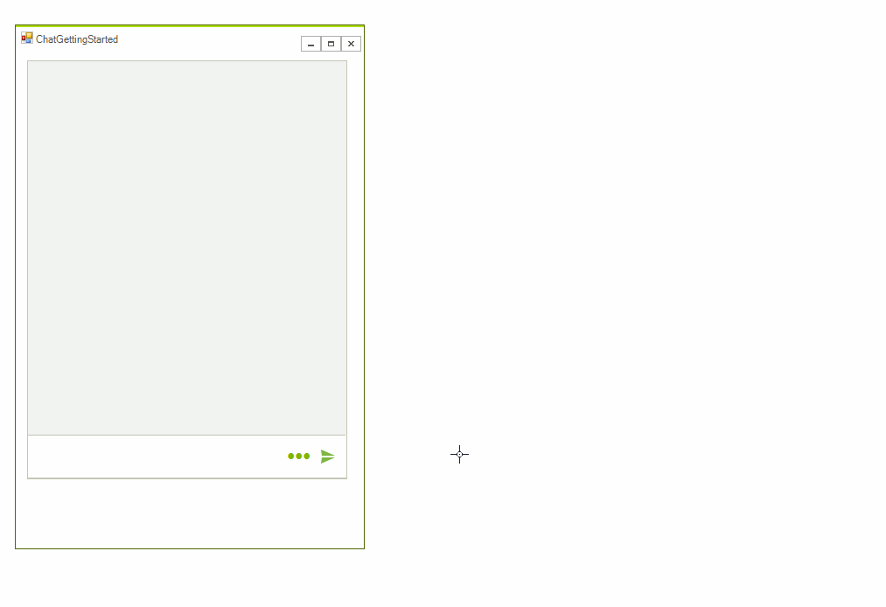

# Toolbar 

**ChatToolbarElement** allows adding different toolbar actions for achieving more user friendly conversational UI. It is placed below the text box and it can be shown/hidden by clicking the toolbar icon in the editable part:

>caption Figure 1. ChatToolbarElement

 
 
The below sample code demonstrates how to add a toolbar action that inserts an image selected from the File Explorer:

#### Adding ToolbarActionDataItem

{{source=..\SamplesCS\Chat\ChatGettingStarted.cs region=Toolbar}} 
{{source=..\SamplesVB\Chat\ChatGettingStarted.vb region=Toolbar}}

````C#
        
private void Toolbar()
{
    ToolbarActionDataItem imageAction = new ToolbarActionDataItem(Properties.Resources.file,"image");
    this.radChat1.ChatElement.ToolbarElement.AddToolbarAction(imageAction);
    this.radChat1.ToolbarActionClicked += radChat1_ToolbarActionClicked;
}
        
private void radChat1_ToolbarActionClicked(object sender, ToolbarActionEventArgs e)
{
    ToolbarActionDataItem action = e.DataItem;
    if (action.UserData + "" == "image")
    {
        OpenFileDialog dlg = new OpenFileDialog();
        dlg.Title = "Open Image";
        dlg.Filter = "png files (*.png)|*.png";
        if (dlg.ShowDialog() == DialogResult.OK)
        {
            Image img = Image.FromFile(dlg.FileName);
            ChatMediaMessage mediaMessage = new ChatMediaMessage(img, new Size(300, 200), null, this.radChat1.Author, DateTime.Now);
            this.radChat1.AddMessage(mediaMessage);    
        }
        dlg.Dispose();
    }
}

````
````VB.NET
```` 


{{endregion}}

>caption Figure 2. Inserting an image from a toolbar action

 

# See Also

* [Overview]()
* [Messages]()
* [Cards]()
* [Overlays]()
* [Suggested Actions]()