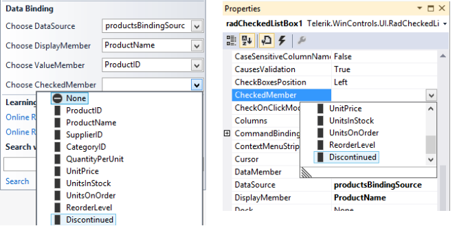
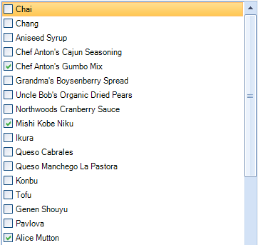
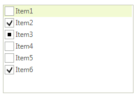

# Data Biniding


## Supported Bindable Types

As an inheritor of __RadListView__, __RadCheckedListBox__ extends its functionality and provides a way to bind your __RadCheckedListBox__ check boxes to a data source. There are several types of data that __CheckedMember__ can be bound to:

* __Boolean__ – True represents ToggleState.On and False – ToggleState.Off.
            

* __Numeric__ – 0 represents ToggleState.Off, any other value is calculated as ToggleState.On.
            

* __ToggleState__ enumeration.
            

* __CheckState__ enumeration.
            

* __String__ – representing CheckBox ToggleState.On state with values like: "True", "On" and "T", ToggleState.Indeterminate state with value "indeterminate", ToggleState.Off state with any other value.
            

>note Information about __RadListView__ data binding is available here:[RadListView Data Binding]().
>


## Design Time

To data bind the checkboxes of __RadCheckedListBox__ you need to set __CheckedMember__ using the smart tag or the properties window. 



The result is data bound __CheckedListBox__



## Binding Programmatically

The following example demonstrates how you can bind the control by using the __CheckedMember__ property. This example uses the __CheckState__ property of the business object.
          

1\. Initially let’s create collection of objects.

{{source=..\SamplesCS\ListView\CheckedListBox\CheckedListBoxDataBinding.cs region=SimpleObject}} 
{{source=..\SamplesVB\ListView\CheckedListBox\CheckedListBoxDataBinding.vb region=SimpleObject}} 

````C#
public class SimpleObject
{
    public int Id { get; set; }
    public string Name { get; set; }
    public CheckState CheckState { get; set; }
}

````
````VB.NET
Public Class SimpleObject
    Public Property Id() As Integer
        Get
            Return m_Id
        End Get
        Set(value As Integer)
            m_Id = value
        End Set
    End Property
    Private m_Id As Integer
    Public Property Name() As String
        Get
            Return m_Name
        End Get
        Set(value As String)
            m_Name = value
        End Set
    End Property
    Private m_Name As String
    Public Property CheckState() As CheckState
        Get
            Return m_CheckState
        End Get
        Set(value As CheckState)
            m_CheckState = value
        End Set
    End Property
    Private m_CheckState As CheckState
End Class

````

{{endregion}} 
 
{{source=..\SamplesCS\ListView\CheckedListBox\CheckedListBoxDataBinding.cs region=CreateSimpleObjects}} 
{{source=..\SamplesVB\ListView\CheckedListBox\CheckedListBoxDataBinding.vb region=CreateSimpleObjects}} 

````C#
private IEnumerable<SimpleObject> CreateSimpleObjects()
{
    List<SimpleObject> data = new List<SimpleObject>()
        {
            new SimpleObject() { Id = 1, Name = "Item1", CheckState = CheckState.Unchecked },
            new SimpleObject() { Id = 2, Name = "Item2", CheckState = CheckState.Checked },
            new SimpleObject() { Id = 3, Name = "Item3", CheckState = CheckState.Indeterminate },
            new SimpleObject() { Id = 4, Name = "Item4", CheckState = CheckState.Unchecked },
            new SimpleObject() { Id = 5, Name = "Item5", CheckState = CheckState.Unchecked },
            new SimpleObject() { Id = 6, Name = "Item6", CheckState = CheckState.Checked }
        };
    return data;
}

````
````VB.NET
Private Function CreateSimpleObjects() As IEnumerable(Of SimpleObject)
    Dim data As New List(Of SimpleObject)() From { _
        New SimpleObject() With { _
            .Id = 1, _
            .Name = "Item1", _
            .CheckState = CheckState.Unchecked _
        }, _
        New SimpleObject() With { _
            .Id = 2, _
            .Name = "Item2", _
            .CheckState = CheckState.Checked _
        }, _
        New SimpleObject() With { _
            .Id = 3, _
            .Name = "Item3", _
            .CheckState = CheckState.Indeterminate _
        }, _
        New SimpleObject() With { _
            .Id = 4, _
            .Name = "Item4", _
            .CheckState = CheckState.Unchecked _
        }, _
        New SimpleObject() With { _
            .Id = 5, _
            .Name = "Item5", _
            .CheckState = CheckState.Unchecked _
        }, _
        New SimpleObject() With { _
            .Id = 6, _
            .Name = "Item6", _
            .CheckState = CheckState.Checked _
        } _
    }
    Return data
End Function

````

{{endregion}} 

2\. To support three state check boxes we need to set the __ThreeStateMode__ property:
            

{{source=..\SamplesCS\ListView\CheckedListBox\CheckedListBoxDataBinding.cs region=ThreeStateMode}} 
{{source=..\SamplesVB\ListView\CheckedListBox\CheckedListBoxDataBinding.vb region=ThreeStateMode}} 

````C#
this.radCheckedListBox1.ThreeStateMode = true;

````
````VB.NET
Me.RadCheckedListBox1.ThreeStateMode = True

````

{{endregion}} 
 
3\. And finally set programmatically the <b>DataSource</b>, <b>DisplayMember</b>, <b>ValueMember</b> and __CheckedMember__ properties. 

{{source=..\SamplesCS\ListView\CheckedListBox\CheckedListBoxDataBinding.cs region=ProgramaticallyDatabind}} 
{{source=..\SamplesVB\ListView\CheckedListBox\CheckedListBoxDataBinding.vb region=ProgramaticallyDatabind}} 

````C#
this.radCheckedListBox1.DataSource = this.CreateSimpleObjects();
this.radCheckedListBox1.DisplayMember = "Name";
this.radCheckedListBox1.ValueMember = "Id";
this.radCheckedListBox1.CheckedMember = "CheckState";

````
````VB.NET
Me.RadCheckedListBox1.DataSource = Me.CreateSimpleObjects()
Me.RadCheckedListBox1.DisplayMember = "Name"
Me.RadCheckedListBox1.ValueMember = "Id"
Me.RadCheckedListBox1.CheckedMember = "CheckState"

````

{{endregion}} 



