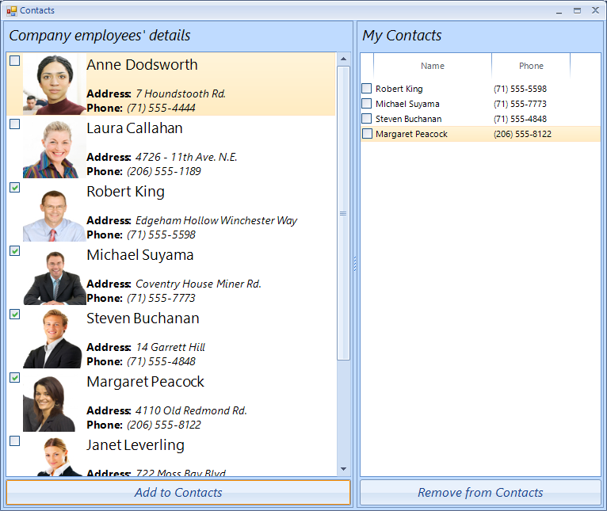

# Getting Started

## 

The bellow example demonstrates the main capabilities of __RadCheckedListBox__.
        

1\. Drop a __RadSplitContainer__ on your form and set its __Dock__ property to *Fill* .
            

2\. Add two panels to the split container. For example by using the smart tag.
            

3\. Add  __RadLabel__, __RadCheckedListBox__ and a __RadButton__ to each of the panels. At this point the form should look like this: 

4\. Now you are ready to bind the control. Open the code behind and add the following:  


{{source=..\SamplesCS\ListView\CheckedListBox\CheckedListBoxGettingStarted.cs region=Initialization}} 
{{source=..\SamplesVB\ListView\CheckedListBox\CheckedListBoxGettingStarted.vb region=Initialization}} 

````C#
this.radCheckedListBox1.DataSource = this.CreatePhoneBookEntries();
this.radCheckedListBox1.VisualItemFormatting += radCheckedListBox1_VisualItemFormatting;
ListViewDetailColumn nameColumn = new ListViewDetailColumn("Name");
nameColumn.Width = 150;
this.radCheckedListBox2.Columns.Add(nameColumn);
ListViewDetailColumn phoneColumn = new ListViewDetailColumn("Phone");
phoneColumn.Width = 100;
this.radCheckedListBox2.Columns.Add(phoneColumn);
this.radButtonAddToContacts.Click += radButtonAddToContacts_Click;
this.radButtonRemoveFromContacts.Click += radButtonRemoveFromContacts_Click;

````
````VB.NET
Me.RadCheckedListBox1.DataSource = Me.CreatePhoneBookEntries()
AddHandler Me.RadCheckedListBox1.VisualItemFormatting, AddressOf radCheckedListBox1_VisualItemFormatting
Dim nameColumn As New ListViewDetailColumn("Name")
nameColumn.Width = 150
Me.RadCheckedListBox2.Columns.Add(nameColumn)
Dim phoneColumn As New ListViewDetailColumn("Phone")
phoneColumn.Width = 100
Me.RadCheckedListBox2.Columns.Add(phoneColumn)
AddHandler Me.radButtonAddToContacts.Click, AddressOf radButtonAddToContacts_Click
AddHandler Me.radButtonRemoveFromContacts.Click, AddressOf radButtonRemoveFromContacts_Click

````

{{endregion}} 


5\. The example uses the following sample business object: 
	

{{source=..\SamplesCS\ListView\CheckedListBox\CheckedListBoxGettingStarted.cs region=PhonebookEntry}} 
{{source=..\SamplesVB\ListView\CheckedListBox\CheckedListBoxGettingStarted.vb region=PhonebookEntry}} 

````C#
public class PhonebookEntry
{
    public string FirstName { get; set; }
    public string LastName { get; set; }
    public string PhoneNumber { get; set; }
    public string Address { get; set; }
    public Image Image { get; set; }
}

````
````VB.NET
Public Class PhonebookEntry
    Public Property FirstName() As String
        Get
            Return m_FirstName
        End Get
        Set(value As String)
            m_FirstName = value
        End Set
    End Property
    Private m_FirstName As String
    Public Property LastName() As String
        Get
            Return m_LastName
        End Get
        Set(value As String)
            m_LastName = value
        End Set
    End Property
    Private m_LastName As String
    Public Property PhoneNumber() As String
        Get
            Return m_PhoneNumber
        End Get
        Set(value As String)
            m_PhoneNumber = value
        End Set
    End Property
    Private m_PhoneNumber As String
    Public Property Address() As String
        Get
            Return m_Address
        End Get
        Set(value As String)
            m_Address = value
        End Set
    End Property
    Private m_Address As String
    Public Property Image() As Image
        Get
            Return m_Image
        End Get
        Set(value As Image)
            m_Image = value
        End Set
    End Property
    Private m_Image As Image
End Class

````

{{endregion}} 


6\. Now you can create a collection of PhonebookEntry business objects:

{{source=..\SamplesCS\ListView\CheckedListBox\CheckedListBoxGettingStarted.cs region=CreatePhonebookEntries}} 
{{source=..\SamplesVB\ListView\CheckedListBox\CheckedListBoxGettingStarted.vb region=CreatePhonebookEntries}} 

````C#
private IEnumerable<PhonebookEntry> CreatePhoneBookEntries()
{
    List<PhonebookEntry> entries = new List<PhonebookEntry>() 
    {
        new PhonebookEntry() { FirstName = "Anne", LastName = "Dodsworth", PhoneNumber = "(71) 555-4444", Address = "7 Houndstooth Rd.", Image = Resources.anne},
        new PhonebookEntry() { FirstName = "Laura", LastName = "Callahan", PhoneNumber = "(206) 555-1189", Address = "4726 - 11th Ave. N.E.", Image = Resources.laura },
        new PhonebookEntry() { FirstName = "Robert", LastName = "King", PhoneNumber = "(71) 555-5598", Address = "Edgeham Hollow Winchester Way", Image = Resources.robert },
        new PhonebookEntry() { FirstName = "Michael", LastName = "Suyama", PhoneNumber = "(71) 555-7773", Address = "Coventry House Miner Rd.", Image = Resources.michael},
        new PhonebookEntry() { FirstName = "Steven", LastName = "Buchanan", PhoneNumber = "(71) 555-4848", Address = "14 Garrett Hill", Image = Resources.steven },
        new PhonebookEntry() { FirstName = "Margaret", LastName = "Peacock", PhoneNumber = "(206) 555-8122", Address = "4110 Old Redmond Rd.", Image = Resources.margaret1 },
        new PhonebookEntry() { FirstName = "Janet", LastName = "Leverling", PhoneNumber = "(206) 555-3412", Address = "722 Moss Bay Blvd.", Image = Resources.janet1 },
        new PhonebookEntry() { FirstName = "Andrew", LastName = "Fuller", PhoneNumber = "(206) 555-9482", Address = "908 W. Capital Way", Image = Resources.andrew1 },
        new PhonebookEntry() { FirstName = "Nancy", LastName = "Davolio", PhoneNumber = "(206) 555-9857", Address = "507 - 20th Ave. E. Apt. 2A", Image = Resources.nancy1 }
    };
    return entries;
}

````
````VB.NET
Private Function CreatePhoneBookEntries() As IEnumerable(Of PhonebookEntry)
    Dim entries As New List(Of PhonebookEntry)() From { _
        New PhonebookEntry() With { _
            .FirstName = "Anne", _
            .LastName = "Dodsworth", _
            .PhoneNumber = "(71) 555-4444", _
            .Address = "7 Houndstooth Rd.", _
            .Image = My.Resources.anne _
        }, _
        New PhonebookEntry() With { _
            .FirstName = "Laura", _
            .LastName = "Callahan", _
            .PhoneNumber = "(206) 555-1189", _
            .Address = "4726 - 11th Ave. N.E.", _
            .Image = My.Resources.laura _
        }, _
        New PhonebookEntry() With { _
            .FirstName = "Robert", _
            .LastName = "King", _
            .PhoneNumber = "(71) 555-5598", _
            .Address = "Edgeham Hollow Winchester Way", _
            .Image = My.Resources.robert _
        }, _
        New PhonebookEntry() With { _
            .FirstName = "Michael", _
            .LastName = "Suyama", _
            .PhoneNumber = "(71) 555-7773", _
            .Address = "Coventry House Miner Rd.", _
            .Image = My.Resources.michael _
        }, _
        New PhonebookEntry() With { _
            .FirstName = "Steven", _
            .LastName = "Buchanan", _
            .PhoneNumber = "(71) 555-4848", _
            .Address = "14 Garrett Hill", _
            .Image = My.Resources.steven _
        }, _
        New PhonebookEntry() With { _
            .FirstName = "Margaret", _
            .LastName = "Peacock", _
            .PhoneNumber = "(206) 555-8122", _
            .Address = "4110 Old Redmond Rd.", _
            .Image = My.Resources.Margaret _
        }, _
        New PhonebookEntry() With { _
            .FirstName = "Janet", _
            .LastName = "Leverling", _
            .PhoneNumber = "(206) 555-3412", _
            .Address = "722 Moss Bay Blvd.", _
            .Image = My.Resources.Janet _
        }, _
        New PhonebookEntry() With { _
            .FirstName = "Andrew", _
            .LastName = "Fuller", _
            .PhoneNumber = "(206) 555-9482", _
            .Address = "908 W. Capital Way", _
            .Image = My.Resources.Andrew _
        }, _
        New PhonebookEntry() With { _
            .FirstName = "Nancy", _
            .LastName = "Davolio", _
            .PhoneNumber = "(206) 555-9857", _
            .Address = "507 - 20th Ave. E. Apt. 2A", _
            .Image = My.Resources.nancy _
        } _
    }
    Return entries
End Function

````

{{endregion}} 


7\. The next step is to create click event handlers for the buttons:

{{source=..\SamplesCS\ListView\CheckedListBox\CheckedListBoxGettingStarted.cs region=ClickEvents}} 
{{source=..\SamplesVB\ListView\CheckedListBox\CheckedListBoxGettingStarted.vb region=ClickEvents}} 

````C#
void radButtonAddToContacts_Click(object sender, EventArgs e)
{
    foreach (ListViewDataItem item in this.radCheckedListBox1.CheckedItems)
    {
        ListViewDataItem contactItem = new ListViewDataItem();
        this.radCheckedListBox2.Items.Add(contactItem);
        //here you can add logic to avoid duplicating contacts
        PhonebookEntry entry = item.Value as PhonebookEntry;
        contactItem["Name"] = entry.FirstName + " " + entry.LastName;
        contactItem["Phone"] = entry.PhoneNumber;
    }
}
void radButtonRemoveFromContacts_Click(object sender, EventArgs e)
{
    while (this.radCheckedListBox2.CheckedItems.Count > 0)
    {
        this.radCheckedListBox2.Items.Remove(this.radCheckedListBox2.CheckedItems[0]);
    }
}

````
````VB.NET
Private Sub radButtonAddToContacts_Click(sender As Object, e As EventArgs)
    For Each item As ListViewDataItem In Me.RadCheckedListBox1.CheckedItems
        Dim contactItem As New ListViewDataItem()
        Me.RadCheckedListBox2.Items.Add(contactItem)
        'here you can add logic to avoid duplicating contacts
        Dim entry As PhonebookEntry = TryCast(item.Value, PhonebookEntry)
        contactItem("Name") = entry.FirstName & " " & entry.LastName
        contactItem("Phone") = entry.PhoneNumber
    Next
End Sub
Private Sub radButtonRemoveFromContacts_Click(sender As Object, e As EventArgs)
    While Me.RadCheckedListBox2.CheckedItems.Count > 0
        Me.RadCheckedListBox2.Items.Remove(Me.RadCheckedListBox2.CheckedItems(0))
    End While
End Sub

````

{{endregion}} 


8\. The final step is to use the VisualItemFormatting event to style the items in the first __RadCheckedListBox__. Please note that the checkbox position is changed.
            
{{source=..\SamplesCS\ListView\CheckedListBox\CheckedListBoxGettingStarted.cs region=VisualItemFormatting}} 
{{source=..\SamplesVB\ListView\CheckedListBox\CheckedListBoxGettingStarted.vb region=VisualItemFormatting}} 
	
````C#
BaseListViewVisualItem item = e.VisualItem;
PhonebookEntry entry = item.Data.Value as PhonebookEntry;
item.Image = entry.Image.GetThumbnailImage(80, 80, null, IntPtr.Zero);
item.Text = "<html>" +
       "<span style=\"font-size:14pt;font-family:Segoe UI;\">" + entry.FirstName + " " + entry.LastName + "</span>" +
       "<br><br><span style=\"font-size:10.5pt;\"><b>Address:</b> <i>" + entry.Address + "</i>" +
       "<br><b>Phone:</b> <i>" + entry.PhoneNumber + "</i></span>";
if (item.Children.Count > 0)
{
    ListViewItemCheckbox checkBoxItem = item.Children[0] as ListViewItemCheckbox;
    checkBoxItem.Margin = new Padding(2);
}

````
````VB.NET
Dim item As BaseListViewVisualItem = e.VisualItem
Dim entry As PhonebookEntry = TryCast(item.Data.Value, PhonebookEntry)
item.Image = entry.Image.GetThumbnailImage(80, 80, Nothing, IntPtr.Zero)
item.Text = "<html><span style=""font-size:14pt;font-family:Segoe UI;"">" & entry.FirstName & " " & entry.LastName & "</span><br><br><span style=""font-size:10.5pt;""><b>Address:</b> <i>" & entry.Address & "</i><br><b>Phone:</b> <i>" & entry.PhoneNumber + "</i></span>"
If item.Children.Count > 0 Then
    Dim checkBoxItem As ListViewItemCheckbox = TryCast(item.Children(0), ListViewItemCheckbox)
    checkBoxItem.Margin = New Padding(2)
End If

````

{{endregion}} 



