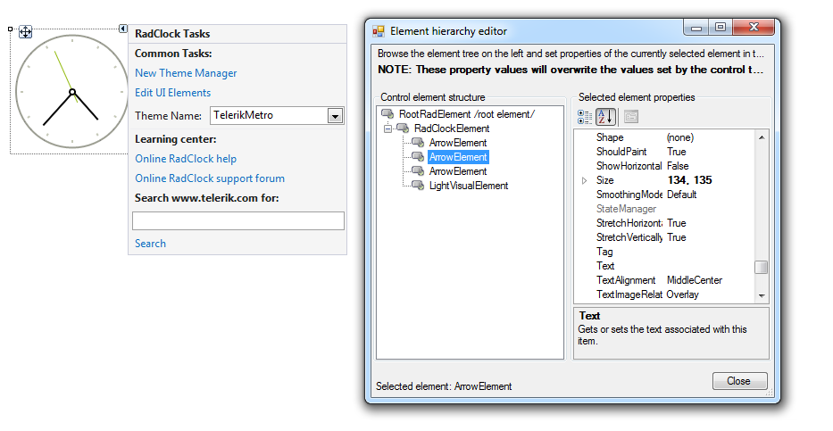
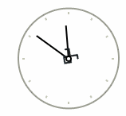

# Accessing and Customizing Elements
 
Accessing and customizing elements can be performed either at design time, or at run time. Before proceeding with this topic, it is recommended to get familiar with the [visual structure]() of the __RadClock__.
      

## Design time

You can access and modify the style for different elements in __RadClock__ by using the Element hierarchy editor. It can be accessed by selecting the *Edit UI Elements* item from the Smart Tag.

>caption Fig.1 Element hierarchy editor



>note The background for __RadClockElement__ and the __ArrowElement__ use images to introduce the style for a given theme. If you need to customize the arrows for example, it is necessary to apply the desired image to the respective __ArrowPrimitive__.

## Programmatically

You can customize the nested elements at run time as well:
>caption Fig.2 Customize elements



#### Customize elements 

{{source=..\SamplesCS\Clock\ClockGettingStarted.cs region=AccessingCustomizingElements}} 
{{source=..\SamplesVB\Clock\ClockGettingStarted.vb region=AccessingCustomizingElements}} 

````C#
radClock1.ClockElement.SecondsArrow.Image = Properties.Resources.telerikLogo1;

````
````VB.NET
radClock1.ClockElement.SecondsArrow.Image = My.Resources.telerikLogo1

````

{{endregion}} 
 
