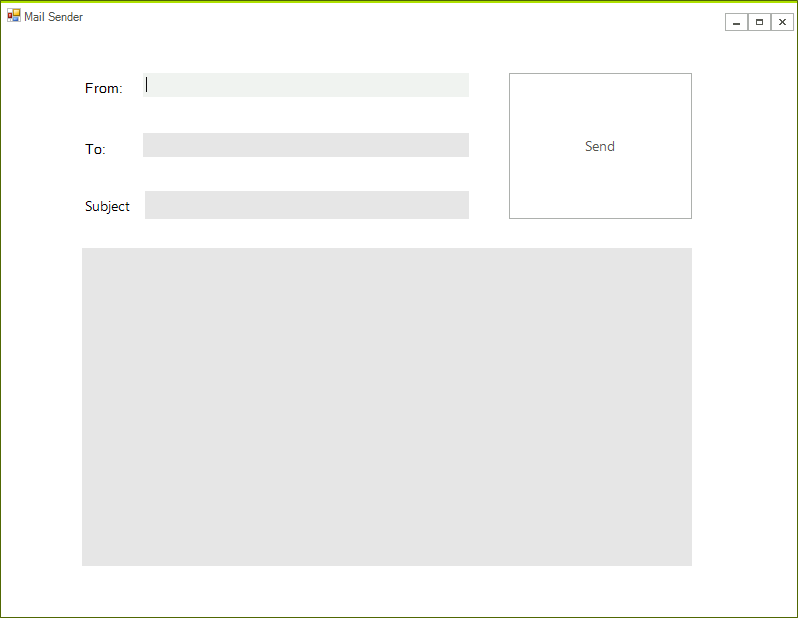
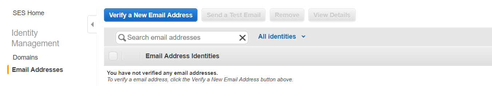

# Simple Email Service

Amazon SES is a email service that provides you with a way to send and receive emails using your own email addresses and domains.

This article will demonstrate how one can use this service from a WinForms application and send an email to a specific address.


## Step 1: Create the WinForms Application

First create a new Telerik UI for WinForms application using the default template. Drop a two labels, two text-boxes, a button, and a RadRichTextBox editor on the form. Your layout should look like this:




## Step 2: Add the SES assemblies

Open the NuGet Package Manager and install the **AWSSDK Simple Email** package.


In addition you need to add the following to your App.config file:

````XML

<?xml version="1.0" encoding="utf-8" ?>
<configuration>
  <appSettings>
    <add key="AWSProfileName" value="Telerik"/>
    <add key="AWSRegion" value="eu-west-3" />
  </appSettings>
</configuration>

````

>note If you do not have an AWS account in Visual Studio please check the[Getting Started]() article.

## Step 3: Add the code to the application

THe following spinet shows how you can use send a mail using the content from the previously added controls:

````C#
private void radButton1_Click(object sender, EventArgs e)
{
    using (var client = new AmazonSimpleEmailServiceClient())
    {
        var provider = new HtmlFormatProvider();
        var formattedContent = provider.Export(radRichTextEditorContent.Document);

        var sendRequest = new SendEmailRequest
        {
            Source = radTextBoxFrom.Text,
            Destination = new Destination { ToAddresses = new List<string> { radTextBoxTo.Text } },
            Message = new Amazon.SimpleEmail.Model.Message
            {
                Subject = new Content(radTextBoxSubject.Text),
                Body = new Body { Text = new Content(formattedContent) }
            }
        };
        try
        {
            var response = client.SendEmail(sendRequest);
        }
        catch (Exception ex)
        {
            RadMessageBox.Show(ex.Message);
        }
    }
}
````
````VB .NET
Private Sub radButton1_Click(ByVal sender As Object, ByVal e As EventArgs)
    Using client = New AmazonSimpleEmailServiceClient()
        Dim provider = New HtmlFormatProvider()
        Dim formattedContent = provider.Export(radRichTextEditorContent.Document)

        Dim sendRequest = New SendEmailRequest With {
            .Source = radTextBoxFrom.Text,
            .Destination = New Destination With {
                .ToAddresses = New List(Of String) From {radTextBoxTo.Text}
            },
            .Message = New Amazon.SimpleEmail.Model.Message With {
                .Subject = New Content(radTextBoxSubject.Text),
                .Body = New Body With {.Text = New Content(formattedContent)}
            }
        }
        Try
            Dim response = client.SendEmail(sendRequest)
        Catch ex As Exception
            RadMessageBox.Show(ex.Message)
        End Try
    End Using
End Sub
````

## Step 4: Add verified email addresses

Before using the application you must verify some email addresses. If you are using the test environment both sender and receiver addresses must be verified. This should be done from the AWS console.



>note Please note that the addresses are verified for each region and the regions in the console and the application must be the same. 

After the addresses are added you are ready to test your application. 

# See Also

* [DynamoDB]()
* [Relational Database Service]() 