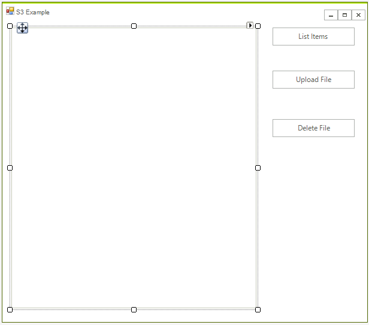
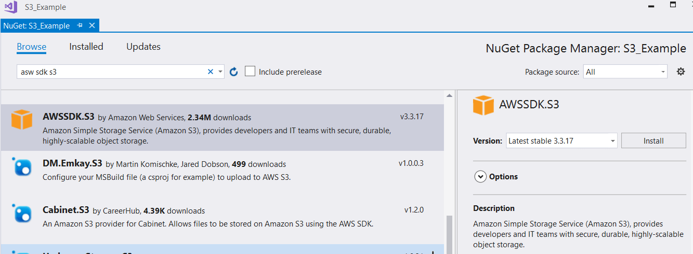

# Storage (S3) 

The **Amazon Simple Storage Service** (Amazon S3) is storage service that allows you to upload any kind of data at any time, from anywhere. This article will demonstrate how one can use this service from a WinForms application and manage the uploaded files.

## Step 1: Create the WinForms Application

Create a standard [Telerik WinForms]() application and add 3 buttons and a [RadListView]() to it. The layout should look like this:



## Step 2: Install the NuGet package

Open the NuGet Package Manager and install the **AWSSDK.S3** package.



In addition you need to add the following to your App.config file:

````XML

<?xml version="1.0" encoding="utf-8" ?>
<configuration>
  <appSettings>
    <add key="AWSProfileName" value="Telerik"/>
    <add key="AWSRegion" value="eu-west-3" />
  </appSettings>
</configuration>

````

>tip If you do not have an AWS account in Visual Studio please check the [Getting Started]() article.

## Step 3: Create the IAmazonS3 client

Now you are ready to create the *IAmazonS3* client object. This object will be used later form managing the data.

````C#

string bucketName = "telerik1";
IAmazonS3 client;
public RadForm1()
{
    InitializeComponent();
    client = new AmazonS3Client();
}

````
````VB.NET
Private bucketName As String = "telerik1"
Private client As IAmazonS3

Public Sub New()
    InitializeComponent()
    client = New AmazonS3Client()
End Sub
````

The S3 API is intuitive and you just need to create a proper request. The following spinet shows the event handlers of all buttons.

````C#

private void listItems_Click(object sender, EventArgs e)
{
    var objects = client.ListObjects(bucketName);

    radListView1.Items.Clear();

    foreach (S3Object item in objects.S3Objects)
    {
        radListView1.Items.Add(item.Key);
    }
}

private void UploadFileButton_Click(object sender, EventArgs e)
{
    OpenFileDialog choofdlog = new OpenFileDialog();
    choofdlog.Filter = "All Files (*.*)|*.*";
    choofdlog.FilterIndex = 1;
    choofdlog.Multiselect = false;
   
    if (choofdlog.ShowDialog() == DialogResult.OK)
    {
        string sFileName = choofdlog.FileName;
        PutObjectRequest request = new PutObjectRequest()
        {                  
            BucketName = bucketName,
            Key = sFileName
        };

        PutObjectResponse response = client.PutObject(request);
    }
   
}

private void deleteFileButton_Click(object sender, EventArgs e)
{
    if (radListView1.SelectedIndex <0)
    {
        RadMessageBox.Show("Please select an Item");
        return;
    }

    string keyName = radListView1.SelectedItem.Text;
    DeleteObjectRequest request = new DeleteObjectRequest()
    {
        BucketName = bucketName,
        Key = keyName
    };

    client.DeleteObject(request);

}
````
````VB.NET
Private Sub listItems_Click(ByVal sender As Object, ByVal e As EventArgs)
    Dim objects = client.ListObjects(bucketName)

    radListView1.Items.Clear()

    For Each item As S3Object In objects.S3Objects
        radListView1.Items.Add(item.Key)
    Next item
End Sub

Private Sub UploadFileButton_Click(ByVal sender As Object, ByVal e As EventArgs)
    Dim choofdlog As New OpenFileDialog()
    choofdlog.Filter = "All Files (*.*)|*.*"
    choofdlog.FilterIndex = 1
    choofdlog.Multiselect = False

    If choofdlog.ShowDialog() = DialogResult.OK Then
        Dim sFileName As String = choofdlog.FileName
        Dim request As New PutObjectRequest() With {
            .BucketName = bucketName,
            .Key = sFileName
        }

        Dim response As PutObjectResponse = client.PutObject(request)
    End If

End Sub

Private Sub deleteFileButton_Click(ByVal sender As Object, ByVal e As EventArgs)
    If radListView1.SelectedIndex <0 Then
        RadMessageBox.Show("Please select an Item")
        Return
    End If

    Dim keyName As String = radListView1.SelectedItem.Text
    Dim request As New DeleteObjectRequest() With {
        .BucketName = bucketName,
        .Key = keyName
    }

    client.DeleteObject(request)

End Sub
````

That is all, now you are ready to start using the application.


# See Also

* [DynamoDB]()
* [Relational Database Service]()
* [Simple Email Service]()


