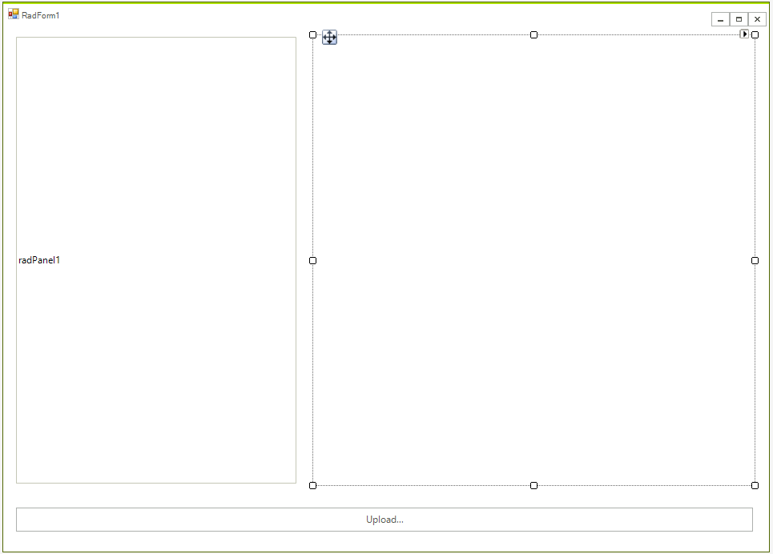
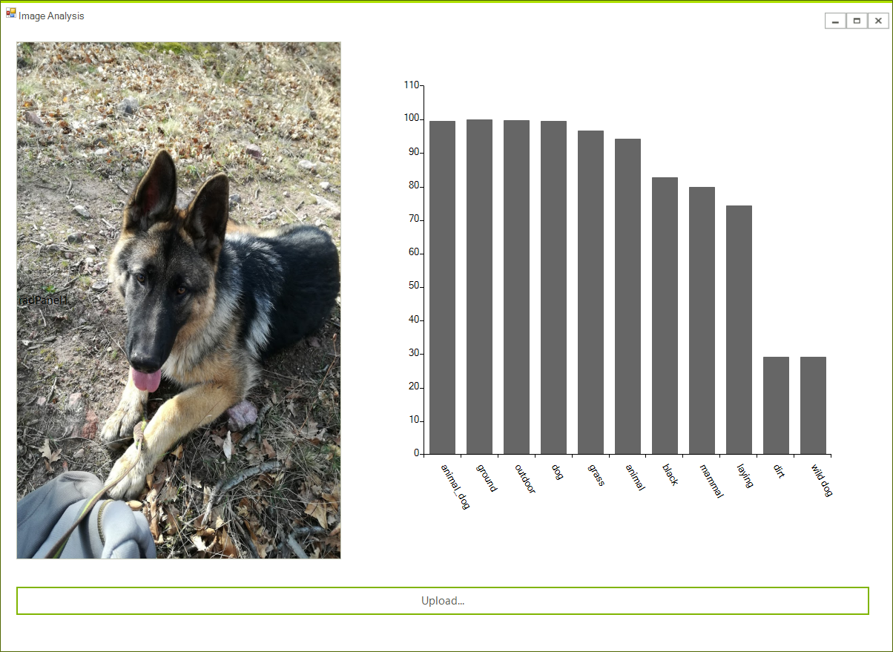

# Image Analysis

This article will guide you through the process of integrating Azure's [Computer Vision API](https://azure.microsoft.com/en-us/services/cognitive-services/computer-vision/) with the controls from the UI for WinForms suite. You will be able to upload an image which will be analyzed by the service.

## Step 1: Create a Computer Vision API Account

Before creating the application, you need to create a new Computer Vision API account through the Azure portal. This is explained in great detail [here]](https://docs.microsoft.com/en-us/azure/cognitive-services/cognitive-services-apis-create-account).


Once you've created the account, you have to obtain the subscription keys. You will need them later on in order to make API calls from your application.

## Step 2: Add the Newtonsoft.Json NuGet Package

Now add the **Newtonsoft.Json** NuGet package which will allow you to deserialize the returned result.

You need to add a reference to **System.Net.Http** which holds the API required to make requests to the service's REST API as well.

## Step 3: Create the Application

Create a standard [Telerik WinForms]() application and add a button, a RadPanel, and a [RadChartView]() to it. The layout should look like this:




## Step 4: Add the Code Behind

First as the following variables to the form:

````C#
private static string subscriptionKey = "your own code";
const string uriBase = "https://westeurope.api.cognitive.microsoft.com/vision/v1.0/analyze";


````


Then the code that makes the request along with the business object required for parsing the results (the results are returned in JSON format).

````C#

async Task<string> MakeAnalysisRequest(string imageFilePath)
{
    HttpClient client = new HttpClient();
    client.DefaultRequestHeaders.Add("Ocp-Apim-Subscription-Key", subscriptionKey);

    string requestParameters = "visualFeatures=Categories,Faces,Tags&language=en";

    string uri = uriBase + "?" + requestParameters;

    HttpResponseMessage response;


    byte[] byteData = GetImageAsByteArray(imageFilePath);

    using (ByteArrayContent content = new ByteArrayContent(byteData))
    {
        content.Headers.ContentType = new MediaTypeHeaderValue("application/octet-stream");
        response = await client.PostAsync(uri, content);

        return await response.Content.ReadAsStringAsync();
    }
}

byte[] GetImageAsByteArray(string imageFilePath)
{
    FileStream fileStream = new FileStream(imageFilePath, FileMode.Open, FileAccess.Read);
    BinaryReader binaryReader = new BinaryReader(fileStream);
    return binaryReader.ReadBytes((int)fileStream.Length);
}

public class ImageResponse
{
    public IList<Category> Categories { get; set; }
    public IList<Tag> Tags { get; set; }
}
public class Tag
{
    public string Name { get; set; }
    public double Confidence { get; set; }
}

public class Category
{
    public string Name { get; set; }
    public double Score { get; set; }
}
```` 


The final step is to handle the click event and show the image and the results.

````C#
private async void radButtonUpload_Click(object sender, EventArgs e)
{
    OpenFileDialog dlg = new OpenFileDialog();
 
    if (dlg.ShowDialog() == DialogResult.OK)
    {
        var result = await MakeAnalysisRequest(dlg.FileName);
        var res = JsonConvert.DeserializeObject<ImageResponse>(result);
        BarSeries series = new BarSeries();
        foreach (var item in res.Categories)
        {
            series.DataPoints.Add(new CategoricalDataPoint(item.Score * 100, item.Name));
        }
        foreach (var item in res.Tags)
        {
            series.DataPoints.Add(new CategoricalDataPoint(item.Confidence * 100, item.Name));
        }
        radChartView1.Series.Clear();
        radChartView1.Axes.Purge();
        radChartView1.Series.Add(series);

        var axis = radChartView1.Axes[0] as CategoricalAxis;
        axis.LabelFitMode = AxisLabelFitMode.Rotate;
        axis.LabelRotationAngle = 60;

        radPanel1.BackgroundImage = Image.FromFile(dlg.FileName).GetThumbnailImage(radPanel1.Width, radPanel1.Height, null, IntPtr.Zero);
    }
}

````


That is all, you are ready to start and test the application.

