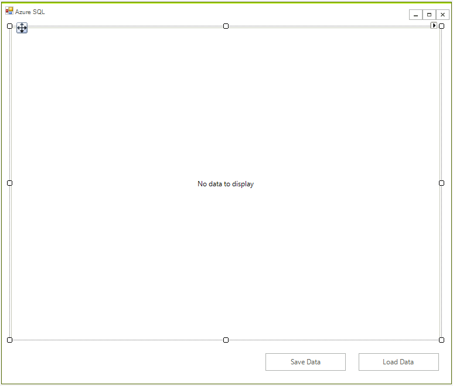
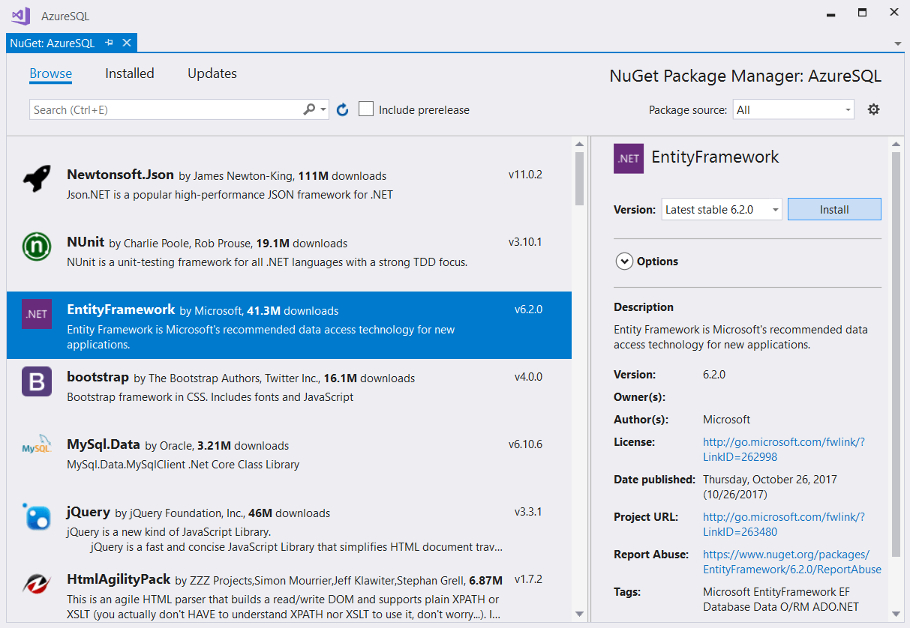
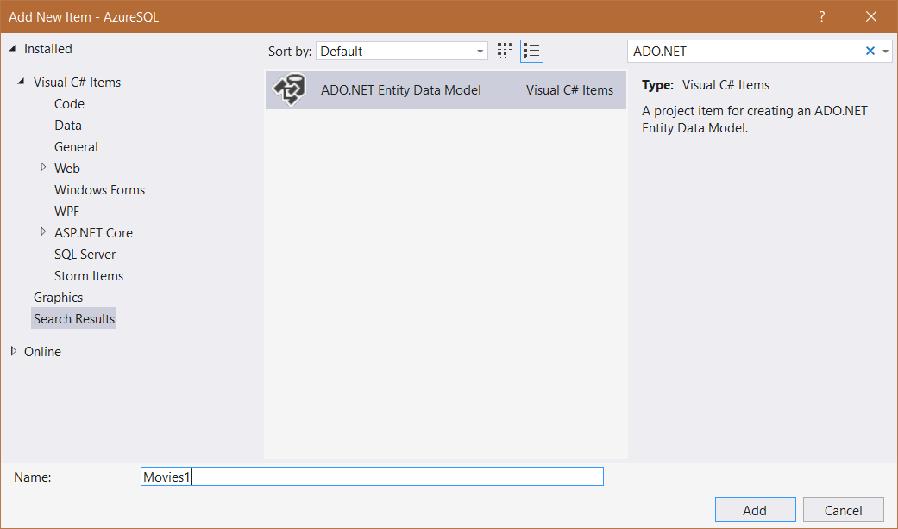
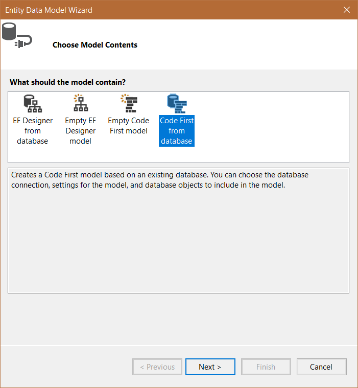
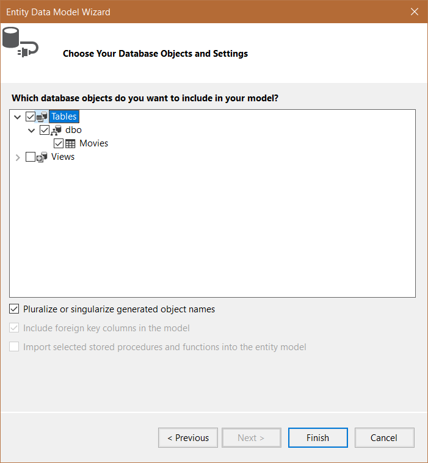
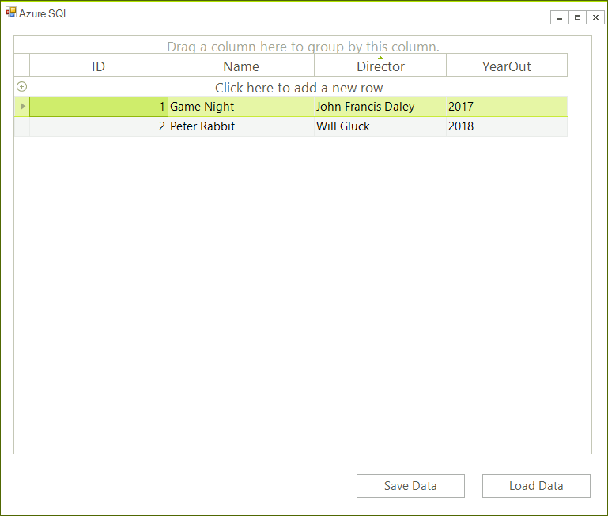

# SQL Database

This article will show you to create a WinForms application and access data stored in the cloud. 

It shows how you can connect to the __Azure SQL database__ instance from a blank WinForms project as well. 

## Step 1: Setup a Database

Go to your Azure portal, then SQL Databases > Add, and fill all required information.


The process is fairly easy, however if you need detailed information you can check [this article](https://docs.microsoft.com/en-us/azure/sql-database/sql-database-get-started-portal).

>important You will need to add a firewall rule for your IP Address. Otherwise you will be not able to connect. Detailed information is available [here](https://docs.microsoft.com/en-us/azure/sql-database/sql-database-get-started-portal#create-a-server-level-firewall-rule).

## Step 2: Create the Table

Once the database is created you can connect from Microsoft SQL server Management Studio. You need to take the server name from the database overview page in the azure portal. Use the name and password from step 1.


Once you are connected you can interact like with any other database. For this example execute the following query in order to create a table.

````SQL
CREATE TABLE Movies (
    ID int,
    Name varchar(255),
    Director varchar(255),
    YearOut varchar(255),
);
````

## Step 3: Creating the Winforms Application

First create the WinForms project, to do that create a blank [Telerik UI for WinForms]() project and add a [RadGridView]() and two buttons to it. The application design should look like this:



## Step 4: Create Entity Framework Model.

1. Install the Entity Framework from the Nuget manager.  
    

1. Add a new item to your project and choose **ADO.NET Entity Data Model** from the list of available items.
    

1. Choose __Code First__ from database from the __Choose Model Contents__ dialog.
    .

1. Click on New Connection... and input the server name and credentials which you can obtain from the Azure portal. Choose the SQL Server Authentication option to log on to the server.

1. Choose whether or not to include the sensitive data in the connection string, choose a name for it and click Next.

1. Pick the database object you wish to include and click Finish.
    .

## Step 5: Define the Context Object

Entity Framework will create the context object but you need to modify it and include the business object. Your code should look like this:

````C#
public partial class MoviesModel : DbContext
{
    public MoviesModel()
        : base("name=MoviesModel")
    {
    }


    protected override void OnModelCreating(DbModelBuilder modelBuilder)
    {
    }
    public IDbSet<Movie> Movies { get; set; }
    public new IDbSet<T> Set<T>() where T : class
    {
        return base.Set<T>();
    }
}
public class Movie 
{
    public int ID { get; set; }

    public string Name { get; set; }

    public string Director { get; set; }

    public string YearOut { get; set; }
}
````
```` VB.NET
Partial Public Class MoviesModel
    Inherits DbContext

    Public Sub New()
        MyBase.New("name=MoviesModel")
    End Sub


    Protected Overrides Sub OnModelCreating(ByVal modelBuilder As DbModelBuilder)
    End Sub
    Public Property Movies() As IDbSet(Of Movie)
    Public Shadows Function [Set](Of T As Class)() As IDbSet(Of T)
        Return MyBase.Set(Of T)()
    End Function
End Class
Public Class Movie
    Public Property ID() As Integer

    Public Property Name() As String

    Public Property Director() As String

    Public Property YearOut() As String
End Class

````

The final step is to create a context object which will allow you to load and save the data.

````C#
MoviesModel dbContext;
public RadForm1()
{
    InitializeComponent();
    dbContext = new MoviesModel();
}

private void radButtonLoad_Click(object sender, EventArgs e)
{
    dbContext.Movies.Load();
    radGridView1.DataSource = dbContext.Movies.Local.ToBindingList();
}

private void radButtonSave_Click(object sender, EventArgs e)
{
    dbContext.SaveChanges();
}

````
```` VB.NET
Private dbContext As MoviesModel
 
Public Sub New()
    InitializeComponent()
    dbContext = New MoviesModel()
End Sub

Private Sub radButtonLoad_Click(ByVal sender As Object, ByVal e As EventArgs)
    dbContext.Movies.Load()
    radGridView1.DataSource = dbContext.Movies.Local.ToBindingList()
End Sub

Private Sub radButtonSave_Click(ByVal sender As Object, ByVal e As EventArgs)
    dbContext.SaveChanges()
End Sub

````

Now you can manage the data directly in the grid. 




# See Also
 
* [Cosmos DB]()
* [Image Analysis]()
* [Text Analysis]()
* [Blob Storage]()