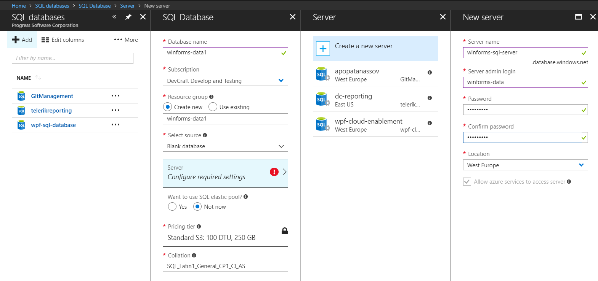
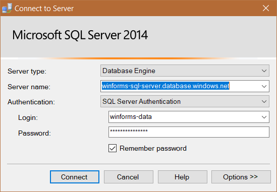

# SQL Database

This article will show you to create a WinForms application and access data stored in the cloud. 

It shows how you can connect to the __Azure SQL database__ instance from a blank WinForms project as well. 

## Step 1: Setup a Database

Go to your Azure portal, then SQL Databases > Add, and fill all required information.



The process is fairly easy, however if you need detailed information you can check [this article](https://docs.microsoft.com/en-us/azure/sql-database/sql-database-get-started-portal).

>important You will need to add a firewall rule for your IP Address. Otherwise you will be not able to connect. Detailed information is available [here](https://docs.microsoft.com/en-us/azure/sql-database/sql-database-get-started-portal#create-a-server-level-firewall-rule).

## Step 2: Create the Table

Once the database is created you can connect from Microsoft SQL server Management Studio. You need to take the server name from the database overview page in the azure portal. Use the name and password from step 1.



Once you are connected you can interact like with any other database. For this example execute the following query in order to create a table.

````SQL
CREATE TABLE Movies (
    ID int,
    Name varchar(255),
    Director varchar(255),
    YearOut varchar(255),
);
````

