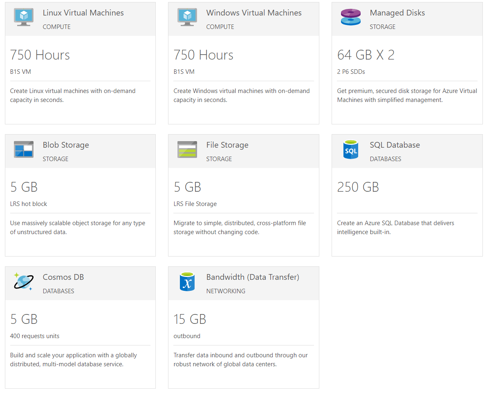

# Azure Overview

**Microsoft Azure** is a cloud computing service created by Microsoft for building, testing, deploying, and managing applications and services through a global network of Microsoft-managed data centers. It provides software as a service (SaaS), platform as a service (PaaS) and infrastructure as a service (IaaS) and supports many different programming languages, tools and frameworks, including both Microsoft-specific and third-party software and systems.

You can create a free account and take advantage of a number of free services such as CosmosDB, Blob/File Storage, serverless functions and many more. This section show how you can integrate them with the controls from the  Telerik UI for WinForms suite.

Here are the currently available topics:

* [Getting Started]()

* Connect to Data in the Cloud

     * [Cosmos DB]()

     * [SQL Database]()

* [Blob Storage]()

* [Cognitive Services]()