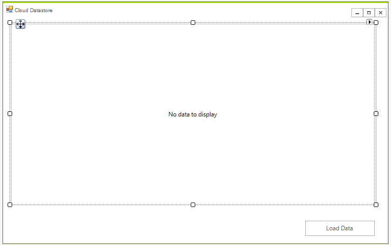
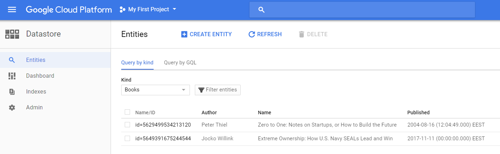
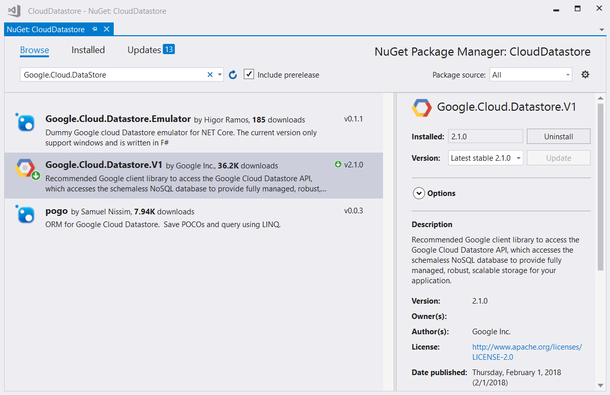
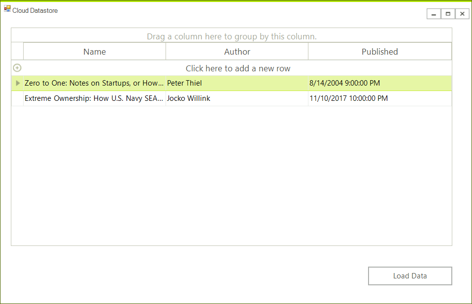

# Datastore (NoSQL database)

Cloud Datastore is a highly-scalable NoSQL database which Google promotes for scenarios that require high-availability and durability, and is capable of multiple features such as ACID transactions, SQL-like queries, indexes and many more. This in combination with the characteristic for the NoSQL database solutions of being able to handle different data types, great scalability and the great performance makes it a choice you should have in mind when considering the architecture of your application. 


# Step 1: Create the Application

First create the WinForms project, to do that create a blank [Telerik UI for WinForms]() project and add a [RadGridView]() and a button to it. The application design should look like this:



# Step 2: Create the Database

The following tutorial show how you can create the **Datastore** instance - [Datastore Quickstart](https://cloud.google.com/datastore/docs/quickstart). 

The process is strait forward and easy. You need to add some data as well. When ready your database should look like this.



## Step 3: Install the NuGet package.

In order to use the classes needed for manipulating the database, you need to install the __Google.Cloud.DataStore.V1__ NuGet package. It can be found on Nuget's official package source server.  



## Step 4: Connect from the Application

Once you have the library installed, modifying the database is very straightforward. Here is how you set up a connection to your NoSql database:

````C#
DatastoreDb db;
public RadForm1()
{
    InitializeComponent();

    string projectId = "natural-oxygen-200712";
    db = DatastoreDb.Create(projectId);
}
````
````VB.NET
Private db As DatastoreDb

Public Sub New()
    InitializeComponent()

    Dim projectId As String = "natural-oxygen-200712"
    db = DatastoreDb.Create(projectId)
End Sub

````

>important This would not work if you have not added the __GOOGLE_APPLICATION_CREDENTIALS__ environment variable. This variable should point to your JSON credential file.   

As a first step, you need to create the business object. Here is an example: 

````C#
public class Book
{
    public Key Key { get; set; }
    public string Name { get; set; }
    public string Author { get; set; }
    public DateTime Published { get; set; }

}

````
````VB.NET
Public Class Book
    Public Property Key() As Key
    Public Property Name() As String
    Public Property Author() As String
    Public Property Published() As Date

End Class
````
Now you you can use the above object to store the data from the database. The following code shows how you can retrieve the data:

````C#
private void radButtonLoad_Click(object sender, EventArgs e)
{
    radGridView1.DataSource = GetBooks();             
}
public List<Book> GetBooks()
{
    List<Book> books = new List<Book>();
    Query query = new Query("Books");
  
    DatastoreQueryResults tasks = db.RunQuery(query);

    foreach (var entity in tasks.Entities)
    {
        Book book = new Book();
        book.Author = (string)entity["Author"];
        book.Name = (string)entity["Name"];
        book.Published = (DateTime)entity["Published"];
        book.Key = entity.Key;
        books.Add(book);
    }
    return books;
}

````
````VB.NET
Private Sub radButtonLoad_Click(ByVal sender As Object, ByVal e As EventArgs)
    radGridView1.DataSource = GetBooks()
End Sub
Public Function GetBooks() As List(Of Book)
    Dim books As New List(Of Book)()
    Dim query As New Query("Books")

    Dim tasks As DatastoreQueryResults = db.RunQuery(query)

    For Each entity In tasks.Entities
        Dim book As New Book()
        book.Author = CStr(entity("Author"))
        book.Name = CStr(entity("Name"))
        book.Published = CDate(entity("Published"))
        book.Key = entity.Key
        books.Add(book)
    Next entity
    Return books
End Function
````
Now you can view the data in your application:



## Step 5: Update the database.

A proper place to handle and save any changes is the RpwsChanged event. This way you will be able to handle the add, remove and edit operations. The main part is that you need to keep the key of the entity object in order to get the existing items from the database.  

````C#
private void RadGridView1_RowsChanged(object sender, Telerik.WinControls.UI.GridViewCollectionChangedEventArgs e)
{
    if (e.Action == Telerik.WinControls.Data.NotifyCollectionChangedAction.Add)
    {
        Book newBook = ((GridViewDataRowInfo)e.NewItems[0]).DataBoundItem as Book;

        string kind = "Books";
        string name = "samplebook1";
        KeyFactory keyFactory = db.CreateKeyFactory(kind);
        Key key = keyFactory.CreateKey(name);

        var item = new Entity
        {
            Key = key,
            ["Author"] = newBook.Author,
            ["Published"] = newBook.Published.ToUniversalTime(),
            ["Name"] = newBook.Name

        };
        using (DatastoreTransaction transaction = db.BeginTransaction())
        {
            transaction.Upsert(item);
            transaction.Commit();
        }
    }
    else if (e.Action == Telerik.WinControls.Data.NotifyCollectionChangedAction.Remove)
    {
        Query query = new Query("Books");

        DatastoreQueryResults tasks = db.RunQuery(query);
        var book = ((GridViewDataRowInfo)e.NewItems[0]).DataBoundItem as Book;

        Entity itemToDelete = db.Lookup(book.Key);

        if (itemToDelete != null)
        {
            db.Delete(itemToDelete);
        }
    }
    else if (e.Action == Telerik.WinControls.Data.NotifyCollectionChangedAction.ItemChanged)
    {
        var book = ((GridViewDataRowInfo)e.NewItems[0]).DataBoundItem as Book;
        Entity editedItem = db.Lookup(book.Key);

        editedItem["Author"] = book.Author;
        editedItem["Published"] = book.Published.ToUniversalTime();
        editedItem["Name"] = book.Name;
        db.Update(editedItem);
    }
}

````
````VB.NET
Private Sub RadGridView1_RowsChanged(ByVal sender As Object, ByVal e As Telerik.WinControls.UI.GridViewCollectionChangedEventArgs)
    If e.Action = Telerik.WinControls.Data.NotifyCollectionChangedAction.Add Then
        Dim newBook As Book = TryCast(CType(e.NewItems(0), GridViewDataRowInfo).DataBoundItem, Book)

        Dim kind As String = "Books"
        Dim name As String = "samplebook1"
        Dim keyFactory As KeyFactory = db.CreateKeyFactory(kind)
        Dim key As Key = keyFactory.CreateKey(name)

        Dim item = New Entity With {
            .Key = key,
            ("Author") = newBook.Author,
            ("Published") = newBook.Published.ToUniversalTime(),
            ("Name") = newBook.Name
        }
        Using transaction As DatastoreTransaction = db.BeginTransaction()
            transaction.Upsert(item)
            transaction.Commit()
        End Using
    ElseIf e.Action = Telerik.WinControls.Data.NotifyCollectionChangedAction.Remove Then
        Dim query As New Query("Books")

        Dim tasks As DatastoreQueryResults = db.RunQuery(query)
        Dim book = TryCast(CType(e.NewItems(0), GridViewDataRowInfo).DataBoundItem, Book)

        Dim itemToDelete As Entity = db.Lookup(book.Key)

        If itemToDelete IsNot Nothing Then
            db.Delete(itemToDelete)
        End If
    ElseIf e.Action = Telerik.WinControls.Data.NotifyCollectionChangedAction.ItemChanged Then
        Dim book = TryCast(CType(e.NewItems(0), GridViewDataRowInfo).DataBoundItem, Book)
        Dim editedItem As Entity = db.Lookup(book.Key)

        editedItem("Author") = book.Author
        editedItem("Published") = book.Published.ToUniversalTime()
        editedItem("Name") = book.Name
        db.Update(editedItem)
    End If
End Sub
````
 

## See Also

* [Getting Started]()
* [Storage]()
* [Translation]()
 