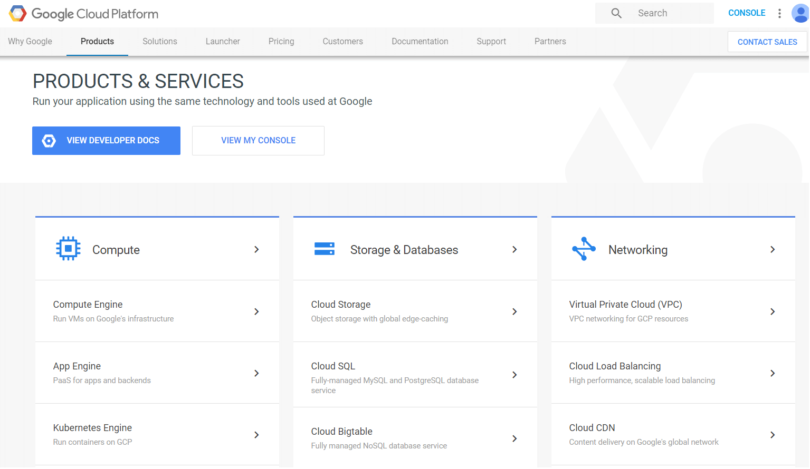

## Google Cloud Overview

[Google Cloud Platform](https://cloud.google.com/) is a solution which allows businesses to leverage Google's infrastructure. The platform provides different services similar to those of the other most famous and widely-used providers such as Microsoft and Amazon. This section aims to provide an overview of some of the available services and show simple scenarios on how the platform can be integrated with the **Telerik UI for WinForms** controls.
 

Here is a short list of some of the most useful services:

- **Computing**: The platform provides a large set of computing services which can be customized according to your specific scenario. Some of the available services are Virtual Machines, App Engine for building web applications,  Google Kubernetes Engine which serves as an automated container management, cloud computing which makes it easy for you to execute specific logic without the need of maintaining servers. 

- **Storage & Databases**: Google Cloud Platform provides multiple storage options. According to the needs of your application, you can utilize the Cloud Storage which is great for world-wide retrieval of all kinds of data, Cloud SQL which is a fully-managed SQL database, Cloud Datastore which is highly-scalable NoSQL database, etc. 

- **Cloud AI**: Google Cloud's AI provides modern machine learning services such as the Google Cloud Vision API, Google Cloud Speech API, the Google Cloud Video Intelligence API and many others.

You can find out more detailed information by navigating to the desired service in [Google Cloud's Products & Services page](https://cloud.google.com/products/).

## See Also

* [Datastore]()
* [Storage]()
* [Translation]()