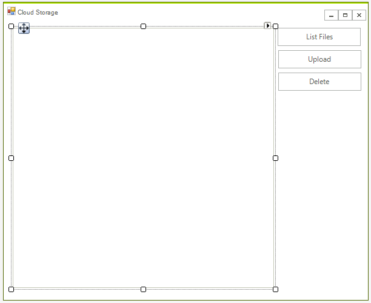
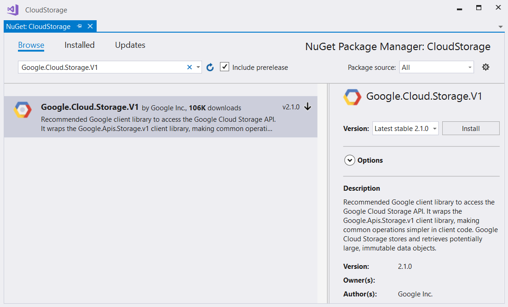

# Storage

Google Cloud Storage allows world-wide storage and retrieval of any amount of data at any time. It can be used for a range of scenarios including serving website content, storing data for archival and disaster recovery, or distributing large data objects to users via direct download.

## Enable APIs

For the purposes of this article, you will have to enable the Google Cloud Storage API and Google Cloud Storage JSON API. Please read the [Getting Started]() for more information on how you can achieve that.

## Step 1: Create the  WinForms Application

Create a standard [Telerik WinForms]() application and add 3 [RadButtons]() and a [RadListView]() to it. The first button will list all of the files uploaded in our storage. The second button will upload a file and the third one will delete the selected file. The layout should look like this:



## Step 2: Install the NuGet package

Open the NuGet Package Manager and install the **Google.Cloud.Storage.V1** package.



## Step 3: Connect the Application to the Storage

The next step is to create the [StorageClient](https://googlecloudplatform.github.io/google-cloud-dotnet/docs/Google.Cloud.Storage.V1/api/Google.Cloud.Storage.V1.StorageClient.html) object which will be used for uploading, deleting and listing files.

````C#
private StorageClient storageClient;

private const string BucketName =  "telerik-bucket";

public RadForm1()
{
    InitializeComponent();
    this.storageClient = StorageClient.Create();
}

````
````VB.NET
Private storageClient As StorageClient

Private Const BucketName As String = "telerik-bucket"

Public Sub New()
    InitializeComponent()
    Me.storageClient = StorageClient.Create()
End Sub

````

>tip In order this to work you need to add the __GOOGLE_APPLICATION_CREDENTIALS__ environment variable. It must point to the JSSON file that contains the license information. This file is can be obtained by creating a [service account](https://cloud.google.com/docs/authentication/). 

Now you can use the above object to mange the files. Here is how you can handle the buttons' Click events and perform the respective operations:

````C#
private void radButtonListFiles_Click(object sender, EventArgs e)
{
    var items = storageClient.ListObjects(BucketName);

    this.radListView1.Items.Clear();

    foreach (Google.Apis.Storage.v1.Data.Object item in items)
    {
        this.radListView1.Items.Add(item.Name);
    }
}

private void radButtonUpload_Click(object sender, EventArgs e)
{
    OpenFileDialog dlg = new OpenFileDialog();
    if (dlg.ShowDialog() == DialogResult.OK)
    {
        var fileName = Path.GetFileName(dlg.FileName);

        Stream fileStream = File.OpenRead(dlg.FileName);

        var test = storageClient.UploadObject(BucketName, fileName, null, fileStream);
        this.radListView1.Items.Add(fileName);
    }

}

private void radButtonDelete_Click(object sender, EventArgs e)
{
    var item = this.radListView1.SelectedItem.Text;
    storageClient.DeleteObject(BucketName, item);

    radListView1.Items.Remove(radListView1.SelectedItem);
}

````
````VB.NET

Private Sub radButtonListFiles_Click(ByVal sender As Object, ByVal e As EventArgs)
    Dim items = storageClient.ListObjects(BucketName)

    Me.radListView1.Items.Clear()

    For Each item As Google.Apis.Storage.v1.Data.Object In items
        Me.radListView1.Items.Add(item.Name)
    Next item
End Sub

Private Sub radButtonUpload_Click(ByVal sender As Object, ByVal e As EventArgs)
    Dim dlg As New OpenFileDialog()
    If dlg.ShowDialog() = DialogResult.OK Then
        Dim fileName = Path.GetFileName(dlg.FileName)

        Dim fileStream As Stream = File.OpenRead(dlg.FileName)

        Dim test = storageClient.UploadObject(BucketName, fileName, Nothing, fileStream)
        Me.radListView1.Items.Add(fileName)
    End If

End Sub

Private Sub radButtonDelete_Click(ByVal sender As Object, ByVal e As EventArgs)
    Dim item = Me.radListView1.SelectedItem.Text
    storageClient.DeleteObject(BucketName, item)

    radListView1.Items.Remove(radListView1.SelectedItem)
End Sub

````

Now you are ready to start using the application:


## See Also

* [Getting Started]()
* [Datastore]()
* [Translation]()