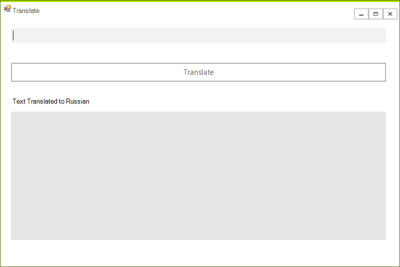
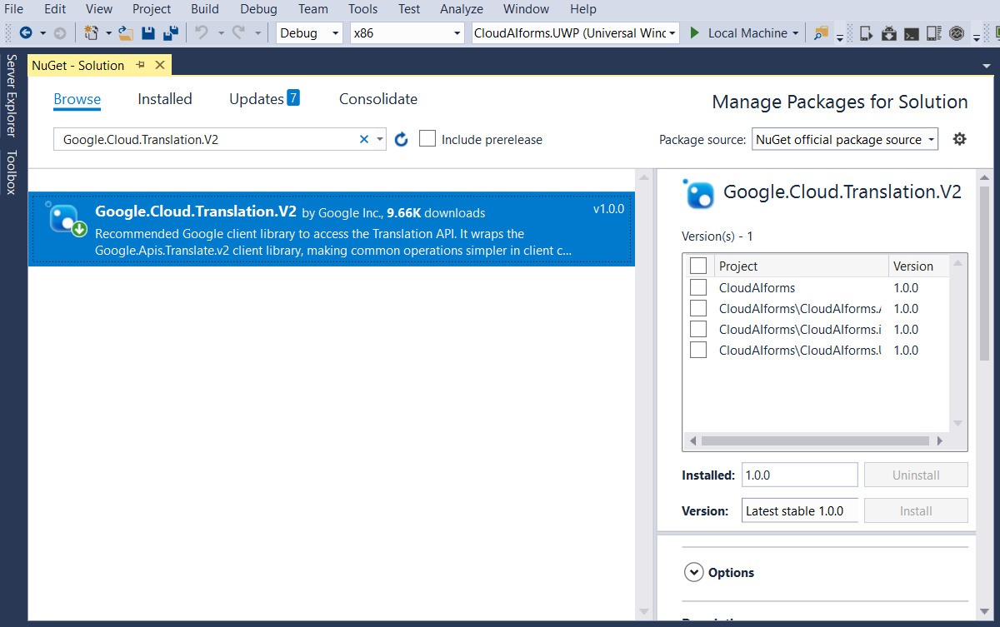
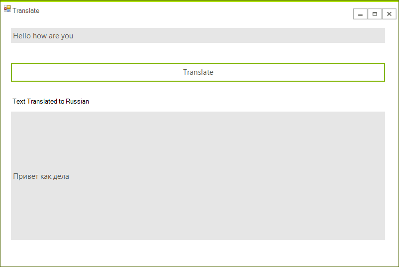

# Translation API

In this article we are going to show you how to use Google's Translation API. The process of embedding the functionality in your .NET application is very easy once you have enabled the feature from your GCP console.

## Step 1: Create the WinForms Application
 
Create a standard [Telerik WinForms]() application and add 2 [RadTextboxes]() and a [Button]() to it. The layout should look like this:



## Step 2: Adding the NuGet Package

In order to proceed with adding the functionality in your application, you should first enable the feature from your GCP console.

Once you have done so, you can add the **Google.Cloud.Translation.V2 NuGet** package to your application as shown in the image below:



Once you have all the required packages installed, you can use it within your application by utilizing the **TranslationClient** class.

## Step 3: Using the Translation API 

The typed message will be translated on a click of a RadButton. The following snippet shows how to access the translation API and translate the specific text:

````C#
private async void TranslateMessage(object sender, EventArgs e)
{
    string textToTranslate = this.inputEntry.Text;

    if (!String.IsNullOrEmpty(textToTranslate))
    {
        //authJson represents the unique json issue by Google Cloud used for authentication
        var credentials = GoogleCredential.FromJson(authJson);
        TranslationClient client = TranslationClient.Create(credentials);
        var response = client.TranslateText(textToTranslate, "ru") as TranslationResult;
        this.outputLabel.Text = response.TranslatedText;
    }
}
````
````VB.NET
Private Async Sub TranslateMessage(ByVal sender As Object, ByVal e As EventArgs)
    Dim textToTranslate As String = Me.inputEntry.Text

    If Not String.IsNullOrEmpty(textToTranslate) Then
        'authJson represents the unique json issue by Google Cloud used for authentication
        Dim credentials = GoogleCredential.FromJson(authJson)
        Dim client As TranslationClient = TranslationClient.Create(credentials)
        Dim response = TryCast(client.TranslateText(textToTranslate, "ru"), TranslationResult)
        Me.outputLabel.Text = response.TranslatedText
    End If
End Sub

````

>tip The example shows how to create the TranslationClient by feeding it with your credentials. However, you can also set up the authentication on your machine and there will be no need of such steps. You can refer to Google's [Authentication Overview](https://cloud.google.com/docs/authentication/) section.

Here is the result of the operation:



## See Also

* [Getting Started]()
* [Datastore]()
* [Storage]()
