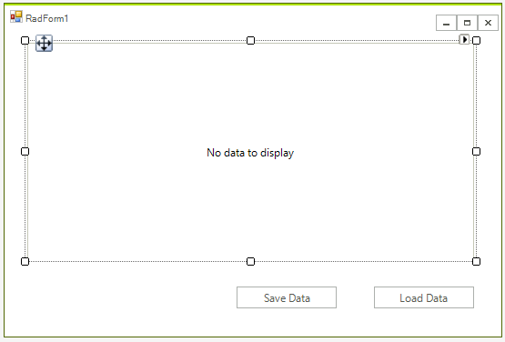

# Dynamo DB

## Overview

This article will show you to create a Winforms application and access data stored in a DynamoDB table. It shows how you can connect to the AWS from a blank Winforms project as well. 

Please note that you can use the local version of DynamoDB to setup and test your application. This article shows a real example.  


## Step 1: Create a WinForms project.

First create the WinForms project, to do that create a blank Telerik UI for WinForms and add a grid and two buttons to it. The application design should look like this:




## Step 2: Install the NuGet package

In Visual Studio open the NuGet package manager and install the DynamoDB module:


Another option is to to type the following command in the **NuGet Package Manager Console**: *PM> Install-Package AWSSDK.DynamoDBv2*

In addition you need to add the following to your App.config file:

````XML

<?xml version="1.0" encoding="utf-8" ?>
<configuration>
  <appSettings>
    <add key="AWSProfileName" value="Telerik"/>
    <add key="AWSRegion" value="eu-west-3" />
  </appSettings>
</configuration>

````

>note If you do not have a account in Visual Studio please check [Getting Started]()

## Step 3: Create the AWS manager class

Add a class called AWS_Manager to the example. You will use this class to add all functionality for managing the DynomeDB database. For now you can create the method that crates the table:

````C#

class AWS_Manager
{
    AmazonDynamoDBClient client;
    public AWS_Manager()
    {
        try
        {
            client = new AmazonDynamoDBClient();
        }
        catch (Exception ex)
        {
            RadMessageBox.Show("Error: failed to create a DynamoDB client; " + ex.Message);
        }
    }

    public void CreateTable() 
    {
        List<string> currentTables = client.ListTables().TableNames;

        if (!currentTables.Contains("Customers"))
        {
            CreateTableRequest createRequest = new CreateTableRequest
            {
                TableName = "Customers",
                AttributeDefinitions = new List<AttributeDefinition>()
        {
            new AttributeDefinition
            {
                AttributeName = "Id",
                AttributeType = "N"
            },
            new AttributeDefinition
            {
                AttributeName = "Name",
                AttributeType = "S"
            }
        },
                KeySchema = new List<KeySchemaElement>()
        {
            new KeySchemaElement
            {
                AttributeName = "Id",
                KeyType = "HASH"
            },
            new KeySchemaElement
            {
                AttributeName = "Name",
                KeyType = "RANGE"
            }
        },
            };

            createRequest.ProvisionedThroughput = new ProvisionedThroughput(1, 1);

            CreateTableResponse createResponse;
            try
            {
                createResponse = client.CreateTable(createRequest);
            }
            catch (Exception ex)
            {
                RadMessageBox.Show("Error: failed to create the new table; " + ex.Message);

                return;
            }
        }
    }
}
````


Now when the table is ready you can add some data add the following method to the AWS_Manager class

````C#

public void AddData()
{
    Table table = Table.LoadTable(client, "Customers");
    if (table.Keys.Count == 0)
    {
        Document dataObj1 = new Document();
        dataObj1["Name"] = "Telerik";
        dataObj1["Id"] = 2;
        dataObj1["Employees"] = 46;
        dataObj1["State"] = "NY";
        table.PutItem(dataObj1);

        Document dataObj2 = new Document();
        dataObj2["Name"] = "Progress";
        dataObj2["Id"] = 13;
        dataObj2["Employees"] = 54;
        dataObj2["State"] = "IL";
        table.PutItem(dataObj2);
    }
}


````


If you run the code at this point you will be able to see the data in your AWS console:


