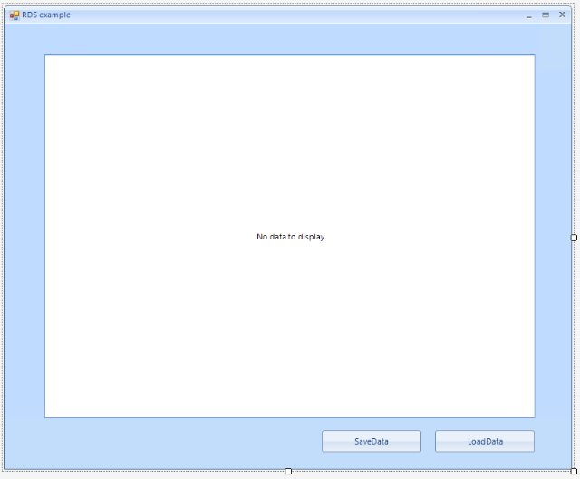

# Relational Database Service (RDS)

## Overview

This article will show you to create a Winforms application and access data stored in the cloud. 

It shows how you can connect to the AWS RDS instance from a blank Winforms project as well. 

## Step 1: Setup a Database

Go to the AWS console and click the RDS link and then click the __Get Started Now__. 


This will lead you to the Selected Engine page. Select *SQL server Express Edition* and click Next. 


On the next screen choose any options you want. For this example we are using the free tier options. Make sure that **Publicly Accessible** option is set to *Yes*.  At the bottom of the page choose database name and specify the user name an password.


Click next and choose any options. Then Click __Launch DB Instance__ and wait until the database is created. Detailed information is available [here](https://docs.aws.amazon.com/AmazonRDS/latest/UserGuide/CHAP_GettingStarted.CreatingConnecting.SQLServer.html).


At this point you are ready to connect to the instance using Microsoft SQL Server Management Studio. Detailed information is available [here](https://docs.aws.amazon.com/AmazonRDS/latest/UserGuide/USER_ConnectToMicrosoftSQLServerInstance.html). 

Once you are connected create a new Database and a new table called *Movies* in it.


## Step 2: Create a WinForms project.

First create the WinForms project, to do that create a blank Telerik UI for WinForms and add a grid and two buttons to it. The application design should look like this:



## Step 3: Install the NuGet package

In Visual Studio open the NuGet package manager and install the RDS module:


## Step 4: Connect from the application

In this example we will use __Entity Framework__. In order to download Entity Framework you can follow this MSDN article - [Get Entity Framework](https://msdn.microsoft.com/en-us/data/ee712906.aspx)  


Now you will need a business object. In this example we will use the following class:

````C#

public class MoviesModel
{
    public int Id { get; set; }

    public string Name{ get; set; }

    public string Director { get; set; }

    public string YearOut { get; set; }
}
````

The main part is creating a DbContext class. For this example you need to inherit the class and create a method that returns the connection string and a property that resembles the data. Here is a sample implementation:

````C#

public class RadGridViewMoviesContext : DbContext
{
    public RadGridViewMoviesContext() : base(GetRDSConnectionString())
    {
       
    }

    public static string GetRDSConnectionString()
    {
        string dbname = "Movies";
        if (string.IsNullOrEmpty(dbname)) return null;

        string username = "user";
        string password = "pass";
        string hostname = "sample-instance.************rds.amazonaws.com";
        string port = "1433";

        return "Data Source=" + hostname + ";Initial Catalog=" + dbname + ";User ID=" + username + ";Password=" + password + ";";
    }

    public IDbSet<MoviesModel> Movies { get; set; }
    public new IDbSet<T> Set<T>() where T : class
    {
        return base.Set<T>();
    }
}

````

Now you are ready to add some data:

````C#

RadGridViewMoviesContext dbContext = new RadGridViewMoviesContext();

dbContext.Movies.Add(new MoviesModel() { Director = "John Francis Daley", Id = 0, Name = "Game Night", YearOut = "2018" });
dbContext.Movies.Add(new MoviesModel() { Director = "Will Gluck", Id = 0, Name = "Peter Rabbit", YearOut = "2018" });


dbContext.SaveChanges();

````


Once this is done you can bind the grid.

````C#
private void loadDataButton_Click(object sender, EventArgs e)
{
    RadGridViewMoviesContext dbContext = new RadGridViewMoviesContext();
    dbContext.Movies.Load();
    this.radGridView1.DataSource = dbContext.Movies.Local.ToBindingList();
}

````

Saving the data is easy just call the __SaveChanges__ method:

````C#
private void saveDataButton_Click(object sender, EventArgs e)
{
    dbContext.SaveChanges();
}
````

You can now view and edit the data from the grid:

