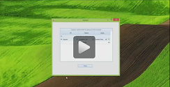

# CodedUI

## 

| RELATED VIDEOS |  |
| ------ | ------ |
|[What is new in Q3 2012 Telerik UI for WinForms](http://www.telerik.com/videos/winforms/what-is-new-in-q3-2012-radcontrols-for-winforms) This webinar examines the new features found in Telerik UI for WinForms. Included in the Q3 2012 release is RadPivotGrid (Beta), Coded UI Testing Support, touch, legend and financial charts for RadChartView, Visual Studio 2012 compliance and much much more. Get started with Coded UI Test and Telerik UI for WinForms now! (25:02 - 31:32)||
|[Getting Started with Coded UI for WinForms](http://tv.telerik.com/watch/radcontrols-for-winforms/getting-started-with-coded-ui-for-winforms) RadControls for WinForms Q3 2012 introduces full support for Coded UI Tests implementing all four Coded UI Test levels. These enhancements are available not only in Visual Studio 2010, but also in the new Visual Studio 2012. Today, we will take a look at Getting started with CodedUI testing using RadControls for WinForms.||

The CodedUI Extension for Telerik UI for WinForms controls is an extension for Microsoft Visual Studio, which runs in the Visual Studio Coded UI Test process and captures information about the Rad Controls that it encounters during a test recording and then generates code to replay that test session.
        
CodedUI tests can test your application through the user interface (UI). Coded UI Tests are particularly useful where there is validation of the control properties or other logic in the user interface. If the control property value is invalid, the test fails.

Creating a coded UI test is easy. You simply perform the test manually while the CUIT Test Builder runs in the background. You can also specify what values should appear in specific control properties. The CUIT Test Builder records your actions and generates code from them. You can add an assertion during the recording. After the test is created, you can edit it in a Visual Studio editor and modify the sequence of the actions.

There are four levels of Microsoft Coded UI Test (CUIT) support:

* __Level 1 – Basic Record and Playback__ via Microsoft Active Accessibility (MSAA) - CUIT Recorder records coordinate click to identify the control, click it, select it, open it, type in it or drag and drop it.

* __Level 2 – Rich Property Validation__ – Gets or Sets a specific properties defined for each RadControl. Users can add custom assertions for these properties. For example this level allows getting or setting BackColor / ForeColor / Text properties for a cell in RadGridView.

* __Level 3 – Code Generation__ – adds a specialized test class with some custom properties for the recorded controls.

* __Level 4 – Intent Aware Actions__ -  Aggregates simple actions in one cumulative action.
