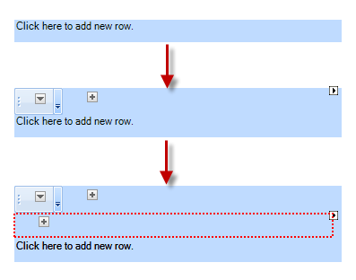
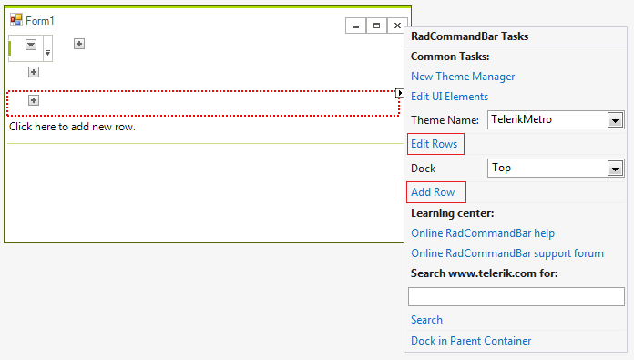
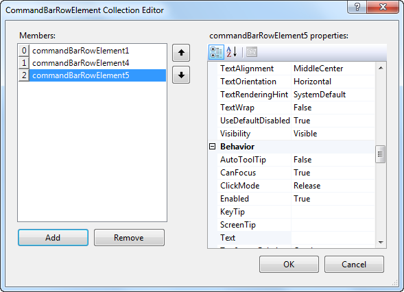
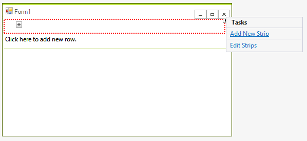
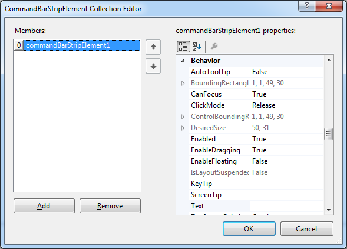
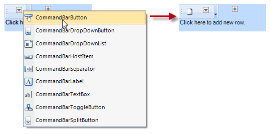
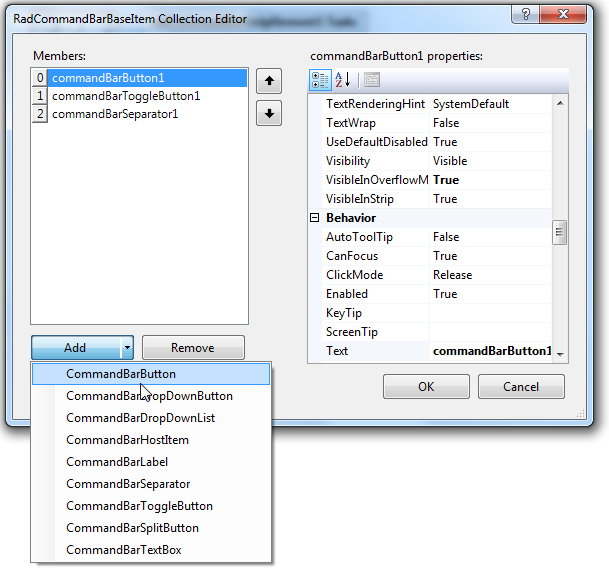

# Design-Time

## Adding a Telerik RadCommandBar to a Form

To add a RadCommandBar to a form, drag it from the toolbox and drop it on the form. By default the control is oriented horizontally and docked to the top of the form. You can the orientation, dock style and size from the property grid.

## Adding a RadCommandBarRowElement to RadCommandBarElement

To add a row element to a RadCommandBarElement, click in the blank area of the RadCommandBar control, above the shaded band. You can repeat the process to create multiple rows.

Alternatively, follow these steps to edit line elements:

1. Select the RadCommandBar control.

1. Open its Smart Tag menu.

1. Select Add Row to immediately add a row or Edit Rows to open Collection Editor.

1. Click the Add button in the RadElement Collection Editor to add a new row element.

1. Click OK.

## Adding a RadCommandBarStripElement to a RadCommandBarRowElement

To add a strip element to a row element, click on the button marked with +.

Alternatively, follow these steps to edit strip elements:

* Select a RadCommandBarRowElement.

* Open its Smart Tag menu.

* Select Add New Strip to immediately add a strip element or Edit Strips to open Collection Editor.

* Click the Add button in the RadElement Collection Editor to add a new strip element.

* Click OK.

## Adding an item to a RadCommandBarStripElement

To add an item to a strip element, click on the down arrow button, placed in the strip and choose the item type to add.

Alternatively, follow these steps to edit items:

1. Select a RadCommandBarStripElement.

1. Open its Smart Tag menu.

1. Select Edit Items to open Collection Editor.

1. Click the Add button in the RadElement Collection Editor to add one of the possible items.

1. Click OK.
