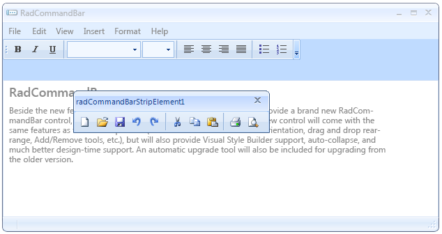

# Floating Strips

A CommandBarStripElement object can be docked to the commandbar or floated 
      above the form. In addition, a CommandBarStripElement can be dragged from
      the RadCommandBar control that currently hosts it and docked to another.

## Basics

The ability of a CommandBarStripElement object to float is controlled by the commandbar's 
        __EnableDragging__ and __EnableFloating__ properties. 
        In order to allow a CommandBarStripElement to float,
        both the __EnableDragging__ and __EnableFloating__ properties
        must be set to *True*. Setting only the
        __EnableFloating__ property to *True* has no effect on 
        the floating behavior.
        The image below shows a RadCommandBar with two strips one of which is floating:
        

A CommandBarStrip element is made floating when it is dragged outside the area of its control. 
        You can dock it again by moving it with mouse over any RadCommandBar control.

## Events

There are some events that provide you with control over the floating/docking process.
       

* __FloatingStripCreating__ event is fired when a strip is about to be made floating.
       The following example shows how to prevent the strip “OptionsStrip” from becoming floating.
 	 

#### __[C#]__

{{region floatingStripCreating}}
	        void radCommandBar1_FloatingStripCreating(object sender, CancelEventArgs e)
	        {
	            if ((sender as CommandBarStripElement).Name == "OptionsStrip")
	            {
	                e.Cancel = true;
	            }
	        }
	{{endregion}}

#### __[VB.NET]__

{{region floatingStripCreating}}
	    Private Sub radCommandBar1_FloatingStripCreating(ByVal sender As Object, ByVal e As CancelEventArgs)
	        If TryCast(sender, CommandBarStripElement).Name = "OptionsStrip" Then
	            e.Cancel = True
	        End If
	    End Sub
	{{endregion}}

* __FloatingStripCreated__ event is fired when the floating form is shown.
  The following example shows how to set the caption text of the floating form:

#### __[C#]__

{{region floatingStripCreated}}
	        void radCommandBar1_FloatingStripCreated(object sender, EventArgs e)
	        {
	            (sender as CommandBarStripElement).FloatingForm.Text = "Just a floating form";
	        }
	{{endregion}}

#### __[VB.NET]__

{{region floatingStripCreated}}
	    Private Sub radCommandBar1_FloatingStripCreated(ByVal sender As Object, ByVal e As EventArgs)
	        TryCast(sender, CommandBarStripElement).FloatingForm.Text = "Just a floating form"
	    End Sub
	{{endregion}}

* __FloatingStripDocking__ event is fired when a floating strip is about to be docked to a RadCommandBar control. 
The following example shows how to prevent the strip with name “OptionsStrip” from being docked.

#### __[C#]__

{{region floatingStripDocking}}
	        void radCommandBar1_FloatingStripDocking(object sender, CancelEventArgs e)
	        {
	            if ((sender as CommandBarStripElement).Name == "OptionsStrip")
	            {
	                e.Cancel = true;
	            }
	        }
	{{endregion}}

#### __[VB.NET]__

{{region floatingStripDocking}}
	    Private Sub radCommandBar1_FloatingStripDocking(ByVal sender As Object, ByVal e As CancelEventArgs)
	        If TryCast(sender, CommandBarStripElement).Name = "OptionsStrip" Then
	            e.Cancel = True
	        End If
	    End Sub
	{{endregion}}

* __FloatingStripDocked__ event is fired when a floating strip has docked to a RadCommandBar control.
 The following example shows a sample usage of this event.
  

#### __[C#]__

{{region floatingStripDocked}}
	        void radCommandBar1_FloatingStripDocked(object sender, EventArgs e)
	        {
	            CommandBarStripElement dockedStrip = sender as CommandBarStripElement;
	            if (dockedStrip != null)
	            {
	                MessageBox.Show(dockedStrip.Name + " has docked to " + dockedStrip.ElementTree.Control.Name);
	            }
	        }
	{{endregion}}

#### __[VB.NET]__

{{region floatingStripDocked}}
	    Private Sub radCommandBar1_FloatingStripDocked(ByVal sender As Object, ByVal e As EventArgs)
	        Dim dockedStrip As CommandBarStripElement = TryCast(sender, CommandBarStripElement)
	        If dockedStrip IsNot Nothing Then
	            MessageBox.Show(dockedStrip.Name & " has docked to " & dockedStrip.ElementTree.Control.Name)
	        End If
	    End Sub
	{{endregion}}

