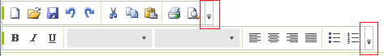
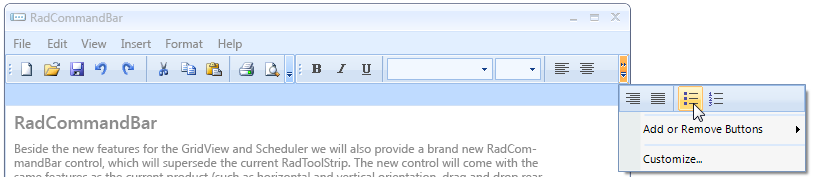
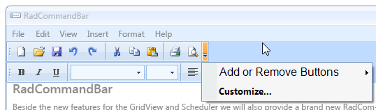
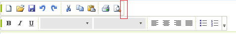

# Customize the overflow button

This article will demonstrate how to access the __Overflow__ button in __RadCommandBar__ and how to customize its items.
 


Each [CommandBarStripElement]() has its own __Overflow__ button. This button has a drop down, which contains of __"Add or Remove Buttons"__ menu item, __"Customize..."__ menu item and  __RadMenuSeparatorItems__ items. Additionally, if there is not enough space on the control to fit all the items, they will be displayed in the drop down menu as well.
 


The following example, demonstrates how to access the __RadMenuItems__ of the __Overflow__ button. For your convenience we have exposed the __CustomizeButtonMenuItem__ and the __AddRemoveButtonsMenuItem__. 

{{source=..\SamplesCS\CommandBar\SaveAndLoadLayout1.cs region=HideMenuItems}} 
{{source=..\SamplesVB\CommandBar\SaveAndLoadLayout.vb region=HideMenuItems}} 

````C#
//Change the font of the AddRemoveButtonMenuItem
radCommandBarStripElement1.OverflowButton.AddRemoveButtonsMenuItem.Font = new System.Drawing.Font("Arial", 12f);
//Change the font of the CustomizeButtonMenuItem
radCommandBarStripElement1.OverflowButton.CustomizeButtonMenuItem.Font = new System.Drawing.Font("Segoe UI", 10f, FontStyle.Bold);
//hide the separators
foreach (var item in radCommandBarStripElement1.OverflowButton.DropDownMenu.Items)
{
    RadMenuSeparatorItem separator = item as RadMenuSeparatorItem;
    if (separator != null)
    {
        separator.Visibility = Telerik.WinControls.ElementVisibility.Collapsed;
    }
}

````
````VB.NET
'Change the font of the AddRemoveButtonMenuItem
CommandBarStripElement1.OverflowButton.AddRemoveButtonsMenuItem.Font = New System.Drawing.Font("Arial", 12.0F)
'Change the font of the CustomizeButtonMenuItem
CommandBarStripElement1.OverflowButton.CustomizeButtonMenuItem.Font = New System.Drawing.Font("Segoe UI", 10.0F, FontStyle.Bold)
'hide the separators
For Each item In CommandBarStripElement1.OverflowButton.DropDownMenu.Items
    Dim separator As RadMenuSeparatorItem = TryCast(item, RadMenuSeparatorItem)
    If separator IsNot Nothing Then
        separator.Visibility = Telerik.WinControls.ElementVisibility.Collapsed
    End If
Next

````

{{endregion}} 




Alternatively, if you need to hide the whole __Overflow__ button, simply set its Visibility property to *Collapsed* 
 

{{source=..\SamplesCS\CommandBar\SaveAndLoadLayout1.cs region=HideTheOverFlowButton}} 
{{source=..\SamplesVB\CommandBar\SaveAndLoadLayout.vb region=HideTheOverFlowButton}} 

````C#
radCommandBarStripElement1.OverflowButton.Visibility = Telerik.WinControls.ElementVisibility.Collapsed;

````
````VB.NET
CommandBarStripElement1.OverflowButton.Visibility = Telerik.WinControls.ElementVisibility.Collapsed

````

{{endregion}} 



