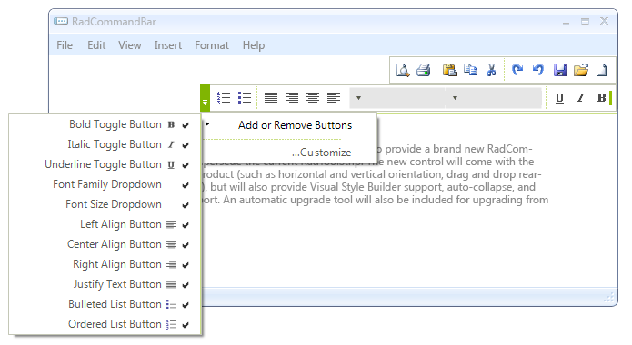

# Right-to-left support


## 

You can present the content of your commandbar instance in a right-to-left direction by setting the __RightToLeft__ property to *Yes*: 

{{source=..\SamplesCS\CommandBar\FloatingStrips.cs region=rtl}} 
{{source=..\SamplesVB\CommandBar\FloatingStrips.vb region=rtl}} 

````C#
this.radCommandBar1.RightToLeft = RightToLeft.Yes;

````
````VB.NET
Me.RadCommandBar1.RightToLeft = Windows.Forms.RightToLeft.Yes

````

{{endregion}} 



