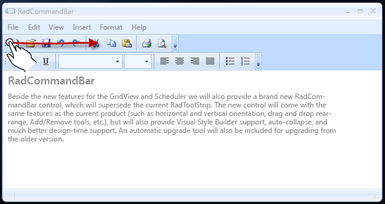

# Touch Support

RadCommandBar allows you to drag its Strips horizontally

## 

To drag a strip, perform a drag operation started at the he beginning of the desired strip and drag to the desired position

Here is the result of dragging the top strip to the right

# See Also

 * [Windows Touch Gestures](http://msdn.microsoft.com/en-us/library/windows/desktop/dd940543(v=vs.85).aspx)
