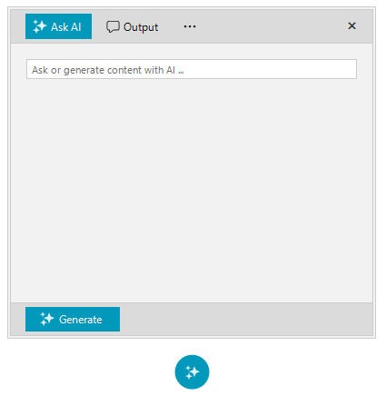

# AIPrompt Button

The AIPrompt component can also be displayed as a button that will show a `RadAIPrompt` in a popup container when interacted with it. To use it, you can drag-drop the __RadAIPromptButton__ from Visual Studio ToolBox into your form. 

