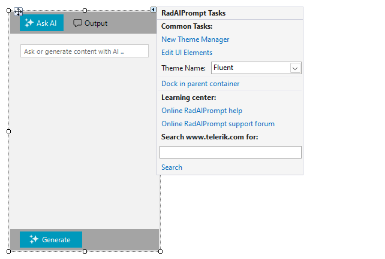

# Design Time

To start using __RadAIPrompt__, just drag it from the toolbox and drop it onto the form. The **Smart Tag** for __RadAIPrompt__ lets you quickly access common tasks involved with accessing control elements.

## Smart Tag

Select __RadAIPrompt__ and click the small arrow on the top right position in order to open the Smart Tag.

>caption Figure 1: Smart Tag

* __New Theme Manager__: Adds a new __RadThemeManager__ component to the form.

* __Edit UI Elements__: Allows setting properties at multiple levels of the class hierarchy.

>caption Figure 2: Element Hierarchy Editor

* __Theme Name__: select a theme name from the drop down list of themes available for that control. Selecting a theme allows you to change all aspects of the control's visual style at one time.

* __Learning Center__: Navigate to the Telerik help, code library projects or support forum.

* __Search__: Search the Telerik site for a given string.

