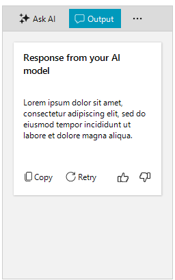

# Getting Started with WinForms AIPrompt

This article shows how you can start using RadAIPrompt. The following result will be achieved at the end of this tutorial:



>note The design may vary according to the applied theme to the application. 

## Adding Telerik Assemblies Using NuGet


## Adding Assembly References Manually

When dragging and dropping a control from the Visual Studio (VS) Toolbox onto the Form Designer, VS automatically adds the necessary assemblies. However, if you're adding the control programmatically, you'll need to manually reference the following assemblies:

* __Telerik.Licensing.Runtime__
* __Telerik.WinControls__
* __Telerik.WinControls.UI__
* __TelerikCommon__


## Defining the RadAIPrompt

Follow the steps:

1\. Go ahead and add a __RadAIPrompt__ from the Visual Studio Toolbox.

2\. Subscribe to the **PromptRequest** event: When the user press the **Generate** input button, the PromptRequest event will be triggered. In the event handler, you can connect to a AI model API to generate a response. The event arguments in the event handler provide information about the input text and if the request is generate for the first time or initiated to retry an already generated response. 

You can create a new __AIPromptOutputItem__ instance and fill it with returned response from the AI model. Then, you can populate the __OutputItems__ collection of RadAIPrompt. This will create a new AIPromptOutputVisualItem in the Output view where you can interact with the response.


<snippet id='aiprompt-getting-started-promptrequest-cs' />
<snippet id='aiprompt-getting-started-promptrequest-vb' />

## User Interaction

The __AIPromptOutputItem__ element gives the end user ability to interact with the response of the AI model. The end user can copy the response, generate again the response or vote for it. When the user use one of these interaction options, the __OutputItemAction__ event will be called. Thus allowing the developer to catch the moment of the user interaction and pass it to the AI model.

````C#
private void AIPrompt_OutputItemAction(object sender, OutputItemActionEventArgs e)
{
    if (e.OutputItem.Rating != 0)
	{
		MyAIService.UpVoteResponse(e.OutputItem.Rating);
	}
}

````
````VB.NET

Private Sub AIPrompt_OutputItemAction(ByVal sender As Object, ByVal e As OutputItemActionEventArgs)
    If e.OutputItem.Rating <> 0 Then
        MyAIService.UpVoteResponse(e.OutputItem.Rating)
    End If
End Sub

````


