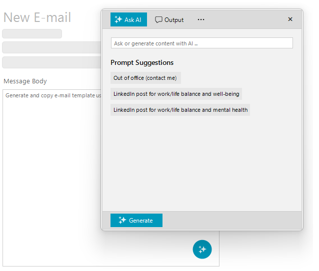

# WinForms AIPrompt Overview
#### WinForms AIPrompt component bridges the gap between an app and the next-generation AI language model applications.

The AIPrompt component allows you to write prompts and execute predefined commands as well as look and interact with the output from the AI. Use the AIPrompt to provide your users with pre-determined ways to interact with a trained language model of your choice.





>caption Figure 1: RadAIPrompt

>tip In the related [Getting Started]() article you can find how to use the control with a sample scenario.

> Download and check out the online demo at [demos.telerik.com](https://telerik-winforms-demos.s3.amazonaws.com/TelerikWinFormsExamplesLauncher.exe)

## Key Features

* __Views__: The component provides different views that you can include in it. This allows the users to have more control over when interacting with the AIPrompt.
* __Prompt button__: The AIPrompt component provides the ability to display it as a button, which when interacted with, will display the prompt. To learn more about the AIPrompt button, check this [article]().
* __Events__: The control exposes two events that give you the ability to populate the different views of the component. 

## Telerik UI for WinForms Learning Resources
* [Telerik UI for WinForms AIPrompt Homepage](https://www.telerik.com/products/winforms/aiprompt.aspx)
* [Get Started with the Telerik UI for WinForms AIPrompt]()
* [Telerik UI for WinForms API Reference](https://docs.telerik.com/devtools/winforms/api/)
* [Getting Started with Telerik UI for WinForms Components]()
* [Telerik UI for WinForms Virtual Classroom (Training Courses for Registered Users)](https://learn.telerik.com/learn/course/external/view/elearning/17/TelerikUIforWinForms) 
* [Telerik UI for WinForms Forum](https://www.telerik.com/forums/winforms)
* [Telerik UI for WinForms Knowledge Base](https://docs.telerik.com/devtools/winforms/knowledge-base)

## Telerik UI for WinForms Additional Resources
* [Telerik UI for WinForms Product Overview](https://www.telerik.com/products/winforms.aspx)
* [Telerik UI for WinForms Blog](https://www.telerik.com/blogs/desktop-winforms)
* [Telerik UI for WinForms Videos](https://www.telerik.com/videos/product/winforms)
* [Telerik UI for WinForms Roadmap](https://www.telerik.com/support/whats-new/winforms/roadmap)
* [Telerik UI for WinForms Pricing](https://www.telerik.com/purchase/individual/winforms.aspx)
* [Telerik UI for WinForms Code Library](https://www.telerik.com/support/code-library/winforms)
* [Telerik UI for WinForms Support](https://www.telerik.com/support/winforms)
* [What’s New in Telerik UI for WinForms](https://www.telerik.com/support/whats-new/winforms)

## See Also

* [Getting Started]()

        
